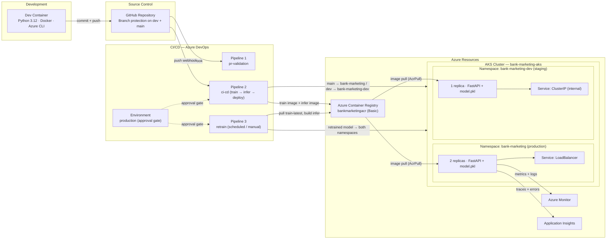
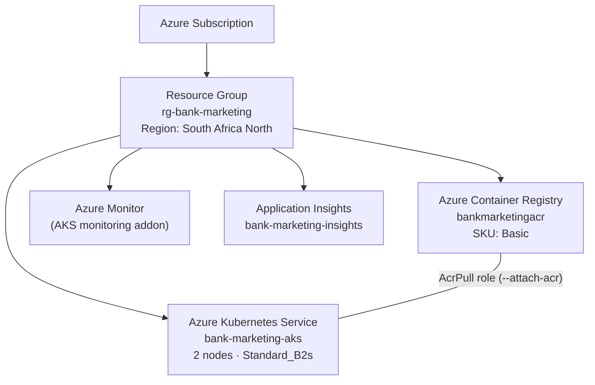
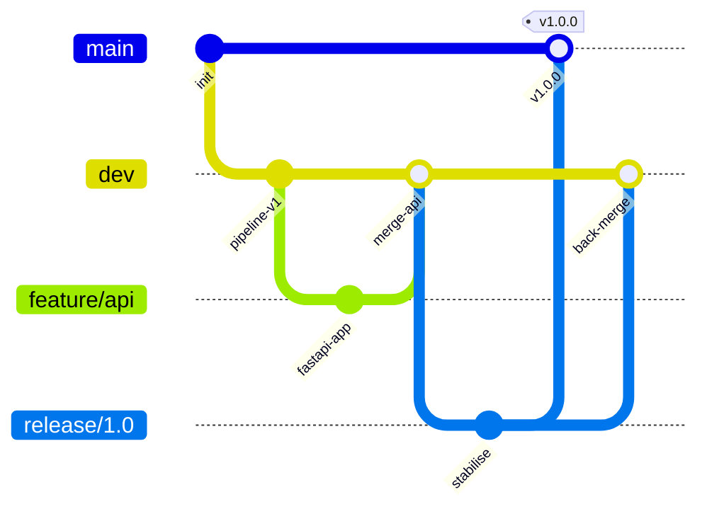
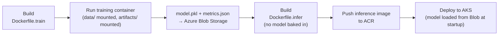
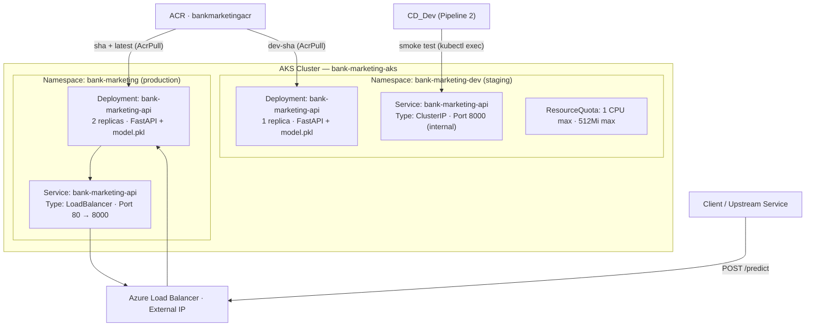
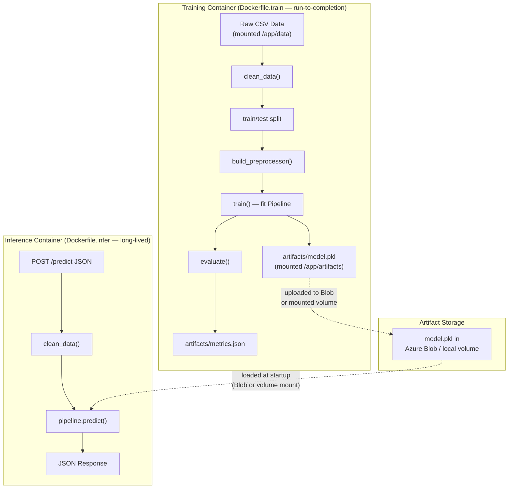

# System Architecture

End-to-end infrastructure and system design for the Bank Marketing MLOps project — covering the development environment, Azure resources, CI/CD pipelines, container and Kubernetes architecture, and production observability.

---

## Table of Contents

1. [Solution Overview](#solution-overview)
2. [Development Environment](#development-environment)
3. [Azure Infrastructure](#azure-infrastructure)
4. [Source Control & Branch Strategy](#source-control--branch-strategy)
5. [CI/CD Pipeline Architecture](#cicd-pipeline-architecture)
6. [Container Architecture](#container-architecture)
7. [Kubernetes Architecture](#kubernetes-architecture)
8. [Observability](#observability)
9. [ML Data Flow](#ml-data-flow)
10. [Key Design Decisions](#key-design-decisions)
11. [Future: AKS-Based Training](#future-aks-based-training)
12. [Key References](#key-references)

---

## Solution Overview



### Component Summary

| Layer | Component | Purpose |
|---|---|---|
| Development | Dev Container | Reproducible local environment (Python 3.12, Docker, Azure CLI) |
| Source Control | GitHub | Code, config, pipeline definitions, branch protection |
| CI/CD | Azure DevOps Pipelines | Three-pipeline architecture — PR validation + push-triggered CI/CD + scheduled retraining |
| Registry | Azure Container Registry | Private Docker image hosting (Basic SKU) |
| Runtime | Azure Kubernetes Service | Managed Kubernetes cluster — two namespaces: `bank-marketing` (production) and `bank-marketing-dev` (staging) |
| Observability | Azure Monitor + App Insights | Metrics, logs, traces, and alerting |

---

## Development Environment

Local development runs inside a VS Code Dev Container. All dependencies, tooling, and CLI access are pre-configured — no host machine setup beyond Docker Desktop and VS Code.

| Concern | Configuration |
|---|---|
| Base image | `mcr.microsoft.com/devcontainers/python:3.12-bookworm` |
| Docker access | Docker-outside-of-Docker feature (uses host Docker daemon) |
| Azure CLI | Pre-installed via Dev Container feature |
| Python deps | Installed automatically via `postCreateCommand: pip install -r requirements-local.txt` |
| ML pipeline | `python main.py train` / `python main.py predict` |
| Tests | `python -m pytest tests/ -v --tb=short` |
| Container build | `docker build` from inside the Dev Container |
| K8s validation | `kubeconform -strict k8s/` (manual install) |

> See [docs/local-development.md](local-development.md) for detailed commands covering the full local development workflow.

---

## Azure Infrastructure

All Azure resources are provisioned via Azure CLI (console-first approach). Migration to Terraform is tracked as a future consideration.



### Resource Inventory

| Resource | Name | SKU / Size | Purpose |
|---|---|---|---|
| Resource Group | `rg-bank-marketing` | — | Logical grouping for all project resources |
| Container Registry | `bankmarketingacr` | Basic | Private Docker image hosting |
| Kubernetes Service | `bank-marketing-aks` | 2× Standard_B2s nodes | Managed cluster running the prediction API |
| Monitor | *(AKS addon)* | — | Cluster-level metrics, logs, and alerts |
| Application Insights | `bank-marketing-insights` | — | Application-level traces, errors, and performance |

### ACR–AKS Integration

AKS is created with `--attach-acr bankmarketingacr`, which grants the AKS managed identity the `AcrPull` role on the registry. This eliminates the need for `imagePullSecrets` in Kubernetes manifests.

> See [docs/todos.md § 2](todos.md#2-azure-infrastructure-setup-console) for the full provisioning checklist.

### RBAC Role Assignments

All role assignments follow the principle of least privilege. The table below documents the minimum required permissions for each principal.

| Principal | Resource | Role | Justification |
|---|---|---|---|
| AKS managed identity | ACR (`bankmarketingacr`) | `AcrPull` | Pull images only — provisioned automatically via `--attach-acr` |
| CI/CD service principal | ACR (`bankmarketingacr`) | `AcrPush` | Push built images during CI/CD pipeline runs |
| CI/CD service principal | AKS (`bank-marketing-aks`) | `Azure Kubernetes Service Cluster User` | Deploy manifests via `kubectl apply` in pipeline stages |
| CI/CD service principal | Blob Storage | `Storage Blob Data Contributor` | Read/write training data and metrics in the retraining pipeline |
| Developers | AKS (`bank-marketing-aks`) | `Azure Kubernetes Service Cluster User` | Debug via `kubectl` — read-only use in production namespace |
| Developers | ACR (`bankmarketingacr`) | `AcrPull` | Pull images for local testing |
| Developers | Resource Group (`rg-bank-marketing`) | `Reader` | View resources in the portal; no modification rights |

#### Provisioning Commands

Replace `<CI_CD_SP_ID>`, `<DEVELOPER_ID>`, and `<STORAGE_ACCOUNT>` with the actual principal object IDs and storage account name.

```bash
# Verify AKS managed identity → ACR AcrPull (already provisioned via --attach-acr)
KUBELET_ID=$(az aks show \
  --resource-group rg-bank-marketing \
  --name bank-marketing-aks \
  --query identityProfile.kubeletidentity.objectId -o tsv)
az role assignment list --assignee "$KUBELET_ID" --all --output table

# CI/CD service principal → ACR: AcrPush
az role assignment create \
  --assignee <CI_CD_SP_ID> \
  --role AcrPush \
  --scope "$(az acr show --name bankmarketingacr --query id -o tsv)"

# CI/CD service principal → AKS: Cluster User
az role assignment create \
  --assignee <CI_CD_SP_ID> \
  --role "Azure Kubernetes Service Cluster User Role" \
  --scope "$(az aks show --resource-group rg-bank-marketing --name bank-marketing-aks --query id -o tsv)"

# CI/CD service principal → Blob Storage: Data Contributor
az role assignment create \
  --assignee <CI_CD_SP_ID> \
  --role "Storage Blob Data Contributor" \
  --scope "$(az storage account show --name <STORAGE_ACCOUNT> --resource-group rg-bank-marketing --query id -o tsv)"

# Developers → Resource Group: Reader
az role assignment create \
  --assignee <DEVELOPER_ID> \
  --role Reader \
  --resource-group rg-bank-marketing

# Developers → ACR: AcrPull
az role assignment create \
  --assignee <DEVELOPER_ID> \
  --role AcrPull \
  --scope "$(az acr show --name bankmarketingacr --query id -o tsv)"

# Developers → AKS: Cluster User
az role assignment create \
  --assignee <DEVELOPER_ID> \
  --role "Azure Kubernetes Service Cluster User Role" \
  --scope "$(az aks show --resource-group rg-bank-marketing --name bank-marketing-aks --query id -o tsv)"
```

> Cross-reference: [docs/GAPS.md § 2 — RBAC & Access Control](GAPS.md#2-rbac--access-control).

---

## Source Control & Branch Strategy

Source code lives on **GitHub**. Azure DevOps connects to the GitHub repo via a service connection — no code is stored in Azure Repos Git.

### Branch Model



| Branch | Purpose | Protected | CI/CD Trigger |
|---|---|---|---|
| `main` | Production-ready code | Yes (GitHub branch protection) | Push → Pipeline 2 (`CD_Main` — production deploy to `bank-marketing`) |
| `dev` | Integration branch | Yes (GitHub branch protection) | Push → Pipeline 2 (`CD_Dev` — staging deploy to `bank-marketing-dev`) |
| `feature/*` | Individual work items | No | PR → Pipeline 1 (validation) |
| `release/*` | Release stabilisation | No | PR → Pipeline 1 (validation) |

### Branch Protection (GitHub)

Both `dev` and `main` have GitHub branch protection rules:

- **Require status checks**: The `pr-validation` pipeline must pass before merge
- **Require PR reviews**: At least 1 approval required
- **Dismiss stale approvals**: Re-review required after new commits
- **Require conversation resolution**: All comments must be resolved

The `pr:` YAML keyword in `pr-validation.yml` controls which target branches trigger the validation pipeline. This works because the repo is on GitHub — Azure Repos Git does not support `pr:` triggers.

> See [docs/git-workflow.md](git-workflow.md) for the full branching strategy and merge conventions.

---

## CI/CD Pipeline Architecture

Two separate Azure DevOps pipelines enforce consistent PR validation while keeping deployment logic isolated. A third pipeline handles scheduled retraining.

```mermaid
flowchart TD
    subgraph Triggers["Trigger Events"]
        PR_EV["PR opened / updated<br/>(targeting dev or main)"]
        PUSH_DEV["Push to dev<br/>(merge)"]
        PUSH_MAIN["Push to main<br/>(merge)"]
        SCHED["Weekly schedule / manual /<br/>drift alert"]
    end

    subgraph P1["Pipeline 1: pr-validation.yml"]
        VAL["Install → pytest → kubeconform<br/>→ Build train image → Run training<br/>→ Build infer image → smoke test"]
    end

    subgraph P2_DEV["Pipeline 2 (dev path)"]
        CI_D["CI: Install → pytest → kubeconform"]
        TRAIN_D["TrainModel: Build + run training container<br/>→ push train image to ACR<br/>→ publish model artifacts"]
        CD_D["CD_Dev: Download artifacts → build infer image<br/>→ push (dev-sha) → deploy bank-marketing-dev<br/>→ in-cluster smoke test"]
        CI_D --> TRAIN_D --> CD_D
    end

    subgraph P2_MAIN["Pipeline 2 (main path)"]
        CI_M["CI: Install → pytest → kubeconform"]
        TRAIN_M["TrainModel: Build + run training container<br/>→ push train image to ACR<br/>→ publish model artifacts"]
        CD_M["CD_Main: Download artifacts → build infer image<br/>→ push (sha + latest) → deploy bank-marketing<br/>→ live smoke test"]
        CI_M --> TRAIN_M --> CD_M
    end

    subgraph P3["Pipeline 3: retrain.yml"]
        RT["Retrain: Pull train-latest from ACR<br/>→ run training on new data"]
        RV["ValidateModel: ROC-AUC quality gate"]
        RS["DeployStaging: Build infer image<br/>→ deploy bank-marketing-dev"]
        RP["DeployProduction: Approval gate<br/>→ deploy bank-marketing"]
        RT --> RV --> RS --> RP
    end

    PR_EV --> P1
    PUSH_DEV --> P2_DEV
    PUSH_MAIN --> P2_MAIN
    SCHED --> P3
```



### Pipeline 1 — PR Validation (`pr-validation.yml`)

Triggered by PRs targeting `dev` or `main` via the `pr:` YAML keyword. Runs identical validation for all PRs — no conditions or branching logic.

| Step | What it catches |
|---|---|
| `pytest` | Logic errors, API contract changes, config mistakes |
| `kubeconform` | K8s manifest schema errors, invalid resource specs |
| Train image build + run | Dockerfile.train errors, training pipeline failures |
| Infer image build | Dockerfile.infer errors, missing model artifact |
| Container smoke test | Model loading failures, startup crashes, port issues |

### Pipeline 2 — CI/CD (`azure-pipelines.yml`)

Triggered by pushes (merges) to `dev` and `main`. Runs a shared CI stage, then a TrainModel stage (build + run training container, push to ACR, publish model artifacts), followed by a branch-conditional CD stage that builds the inference image with the model baked in:

| Target Branch | CD Stage | ACR Push (Inference) | AKS Deploy | Approval Gate |
|---|---|---|---|---|
| `dev` | `CD_Dev` (staging) | Yes (`dev-<buildId>` + `dev-latest`) | `bank-marketing-dev` | No |
| `main` | `CD_Main` (production) | Yes (`<buildId>` + `latest`) | `bank-marketing` | Yes (`production` environment) |

### Pipeline 3 — Retraining (`retrain.yml`)

Scheduled weekly (Sunday 02:00 UTC) or triggered manually / via drift alert. Pulls the stable `train-latest` image from ACR (no rebuild), runs training on new data from Azure Blob Storage, validates model quality via a ROC-AUC comparison gate, and deploys through staging → production with approval.

| Stage | Purpose |
|---|---|
| `Retrain` | Download data from Blob, pull `train-latest` from ACR, run training |
| `ValidateModel` | Compare ROC-AUC to baseline — fail if regression > 2% |
| `DeployStaging` | Build inference image, deploy to `bank-marketing-dev`, smoke test |
| `DeployProduction` | Manual approval gate, deploy to `bank-marketing`, update baseline metrics |

### Why Two Pipelines?

| Concern | Two pipelines + retrain (this project) |
|---|---|
| PR validation consistency | Guaranteed identical — Pipeline 1 has no conditions |
| CD logic isolation | CD logic only exists in Pipeline 2 and Pipeline 3 |
| Failure diagnosis | Pipeline 1 = validation; Pipeline 2 = build/deploy; Pipeline 3 = retraining |

### Service Connections

Azure DevOps authenticates with external services via three service connections:

| Connection | Type | Purpose |
|---|---|---|
| `github-connection` | GitHub | Access repo, receive webhook events |
| `azure-sub-connection` | Azure Resource Manager | AKS access, general Azure operations |
| `acr-connection` | Docker Registry (ACR) | Push/pull container images |

### Environment & Approval Gate

The `CD_Main` stage references `environment: 'production'` in Azure DevOps. This environment is configured with:

- **Approval check** — at least one approver must approve before the production deploy stage runs
- **Exclusive lock** (optional) — prevents concurrent deployments to production

> See [docs/ci-cd-pipeline.md](ci-cd-pipeline.md) for full pipeline YAML definitions and stage-by-stage breakdown.

---

## Container Architecture

This project uses a **dual-container design** — a training container and an inference container — following the [MLOps v2](https://learn.microsoft.com/en-us/azure/architecture/ai-ml/guide/machine-learning-operations-v2) separation of training (inner loop) from serving (outer loop).

### Training Container (`Dockerfile.train`)

A **run-to-completion** job that executes the ML pipeline and writes `model.pkl` + `metrics.json` to a mounted volume.

| Layer | Contents |
|---|---|
| Base | `python:3.12-slim` |
| Dependencies | `requirements.txt` (core ML: pandas, scikit-learn, numpy, joblib, pyyaml) |
| Application | `src/` + `main.py` + `config.yaml` |
| Volumes | `/app/data` (input) + `/app/artifacts` (output) — mounted at runtime |
| Entrypoint | `python main.py train` |

The training image is pushed to ACR as `train-latest` so the retraining pipeline can pull and re-execute it without a code change or image rebuild.

### Inference Container (`Dockerfile.infer`)

A **long-lived** FastAPI service that loads the trained model at runtime — the model is **not** baked into the image.

| Layer | Contents |
|---|---|
| Base | `python:3.12-slim` + `curl` (health probe tool) |
| Dependencies | `requirements-infer.txt` (fastapi, uvicorn, scikit-learn, pandas, pydantic, numpy, joblib, pyyaml, azure-storage-blob, azure-identity) |
| Application | `src/` + `config.yaml` |
| Model artifact | Loaded at startup from: (a) mounted volume (`/app/artifacts/model.pkl`) or (b) Azure Blob Storage (`STORAGE_BACKEND=azure_blob`) |
| Entrypoint | `uvicorn src.api.app:app --host 0.0.0.0 --port 8000` |

#### Model Loading Strategy

The inference container resolves `model.pkl` at startup in this order:

1. `MODEL_PATH` env var (explicit override)
2. `config.yaml → artifacts.model_path` (default: `artifacts/model.pkl`)

The storage backend determines *where* that path is resolved:

| Environment | `STORAGE_BACKEND` | Model source |
|---|---|---|
| Local Docker | `local` (default) | Volume mount: `-v ./artifacts:/app/artifacts:ro` |
| AKS (production) | `azure_blob` | Azure Blob Storage (managed identity) |
| AKS (dev) | `local` | `hostPath` volume or PVC |

This decoupling means **retraining does not require an image rebuild** — restart/rollout the pods and the new model is served.

### CI Artifact Handoff

The CI/CD pipeline orchestrates the handoff between containers. The inference image is model-agnostic — `model.pkl` is loaded at runtime, not baked in.



### Image Tagging Strategy

#### Training Image (`TRAIN_IMAGE_NAME`)

| Tag | When Applied | Purpose |
|---|---|---|
| `<buildId>` | Every CI/CD run (Pipeline 2) on `main` | Immutable build identifier |
| `train-latest` | Every CI/CD run (Pipeline 2) on `main` | Stable tag pulled by the retraining pipeline |
| `dev-<buildId>` | Every CI/CD run (Pipeline 2) on `dev` | Immutable dev build identifier |
| `dev-latest` | Every CI/CD run (Pipeline 2) on `dev` | Dev training image tag |

#### Inference Image (`INFER_IMAGE_NAME`)

| Tag | When Applied | Purpose |
|---|---|---|
| `<buildId>` | ACR push on main merges | Immutable identifier for production traceability |
| `latest` | ACR push on main merges | Convenience tag for rolling production deployments |
| `dev-<buildId>` | ACR push on dev merges | Staging image deployed to `bank-marketing-dev` |
| `dev-latest` | ACR push on dev merges | Rolling staging tag |
| `retrain-staging-<buildId>` | Retrain pipeline — staging deploy | Staging image from retraining run |
| `retrain-<buildId>` | Retrain pipeline — production deploy | Production image from retraining run |

### Build Contexts

| Context | Where | Containers Built | Push to ACR? |
|---|---|---|---|
| Local development | Dev Container (`docker build`) | Both (train + infer) | No |
| PR validation | Pipeline 1 (Microsoft-hosted agent) | Both (train + infer) | No |
| Dev merge | Pipeline 2 / `TrainModel` → `CD_Dev` | Both (train + infer) | Yes |
| Main merge | Pipeline 2 / `TrainModel` → `CD_Main` | Both (train + infer) | Yes |
| Retraining | Pipeline 3 / `Retrain` → `DeployStaging` → `DeployProduction` | Infer only (pulls `train-latest`) | Yes (infer only) |

---

## Kubernetes Architecture

### Cluster Layout



### Resource Sizing

| Resource | Spec | Rationale |
|---|---|---|
| Node pool | 2× Standard_B2s | Cost-effective for lightweight inference workloads |
| Replicas (`bank-marketing`) | 2 | Basic availability — zero-downtime during rolling updates |
| Replicas (`bank-marketing-dev`) | 1 | Single replica sufficient for staging smoke tests |
| CPU request / limit | 250m / 500m | Logistic regression inference is lightweight |
| Memory request / limit | 256Mi / 512Mi | `model.pkl` is small (< 10MB) |
| Dev namespace `ResourceQuota` | 1 CPU, 512Mi | Prevents the staging workload from competing with production on shared nodes |

### Health Probes

| Probe | Endpoint | Timing | Behaviour |
|---|---|---|---|
| Readiness | `GET /health` | initial: 5s, period: 10s | Pod only receives traffic after probe passes |
| Liveness | `GET /health` | initial: 10s, period: 15s | Pod restarted after 3 consecutive failures |

### API Endpoints

| Method | Path | Purpose | Used By |
|---|---|---|---|
| `POST` | `/predict` | Score a single customer record | Upstream services, batch callers |
| `GET` | `/health` | Liveness/readiness probe | Kubernetes, CI smoke tests |
| `GET` | `/docs` | Auto-generated OpenAPI documentation | Developers (FastAPI built-in) |

> See [docs/deployment.md](deployment.md) for full Kubernetes manifest YAML and the container lifecycle.

---

## Observability

### Azure Monitor (AKS Addon)

Enabled via `az aks enable-addons --addons monitoring`. Provides:

- Pod-level CPU and memory utilisation
- Node health and cluster-level metrics
- Container log aggregation
- Alerting rules for resource thresholds

### Application Insights

Provisioned as a standalone resource (`bank-marketing-insights`). Provides:

- Request latency and throughput per endpoint
- Error rates and HTTP status code distribution
- Prediction distribution drift (logged per-request)
- End-to-end transaction traces

---

## ML Data Flow



### Training Flow (Offline)

1. `main.py train` loads `config.yaml` and raw CSV data
2. `clean_data()` applies EDA-driven transformations (leakage column removal, age capping, log transforms, target encoding)
3. Stratified train/test split preserves class distribution
4. `build_preprocessor()` creates an unfitted `ColumnTransformer` (impute → scale for numerics, one-hot for categoricals)
5. `train()` wraps preprocessor + classifier into a single `sklearn.Pipeline` and fits on training data
6. The fitted pipeline is serialised to `artifacts/model.pkl` — self-contained, no external preprocessing needed
7. `evaluate()` scores the held-out test set and writes metrics to `artifacts/metrics.json`

### Serving Flow (Online)

1. FastAPI application loads `model.pkl` once at startup (via lifespan handler)
2. Incoming `POST /predict` requests are validated by Pydantic
3. The request is converted to a single-row DataFrame
4. `clean_data()` applies the same feature engineering as training
5. `pipeline.predict()` and `pipeline.predict_proba()` generate the response
6. JSON response returns `prediction`, `probability`, and `label`

> See [docs/mlops-lifecycle.md](mlops-lifecycle.md) for the full inner loop → outer loop → feedback loop lifecycle.

---

## Key Design Decisions

### Infrastructure

| Decision | Rationale |
|---|---|
| GitHub + Azure DevOps Pipelines | Source control on GitHub (existing repo); ADO provides native Azure service connections and `pr:` YAML triggers for GitHub repos |
| Two-pipeline CI/CD + retraining | Isolates PR validation from deployment logic; retrain pipeline handles data-driven model updates independently of code changes |
| Console-first provisioning | Azure CLI for initial setup; Terraform planned as a future enhancement after the baseline is validated |
| ACR Basic SKU | Sufficient for a single-service project; upgradeable if geo-replication or content trust is needed |
| AKS with `--attach-acr` | Grants `AcrPull` via managed identity — eliminates `imagePullSecrets` and manual credential rotation |
| 2× Standard_B2s nodes | Cost-effective burstable VMs suited to lightweight sklearn inference |
| Namespace-based environment isolation | Two namespaces (`bank-marketing` + `bank-marketing-dev`) within the same AKS cluster — provides a real staging environment without provisioning a second cluster. Follows [Microsoft's AKS isolation guidance](https://learn.microsoft.com/en-us/azure/aks/operator-best-practices-cluster-isolation): *"Separate teams and projects using logical isolation. Minimize the number of physical AKS clusters you deploy."* |
| `production` environment with approval gate | Prevents unreviewed code from reaching production even if branch protection is misconfigured |

### Application

| Decision | Rationale |
|---|---|
| Single sklearn Pipeline artifact | Eliminates preprocessing/model version mismatch at inference time |
| Config-driven pipeline | `config.yaml` is the single source of truth — no hardcoded values |
| FastAPI over Flask | Async-capable, built-in Pydantic validation, auto-generated OpenAPI docs |
| `/health` endpoint | Required for Kubernetes liveness/readiness probes |
| Logistic Regression as default | Interpretable, fast to train, better minority-class F1 than gradient boosting for this dataset |
| Dual-container architecture (train + infer) | Training container runs to completion and produces artifacts; inference container loads the model at runtime from a mounted volume (local) or Azure Blob Storage (AKS). Follows [MLOps v2](https://learn.microsoft.com/en-us/azure/architecture/ai-ml/guide/machine-learning-operations-v2) inner loop / outer loop separation. |
| Model loaded at runtime (not baked in) | Decouples model lifecycle from image lifecycle — retraining only requires a pod restart, not an image rebuild. Supports both local volume mounts and Azure Blob Storage via `STORAGE_BACKEND` env var. |
| Training runs on CI agent (not AKS) | At current scale (< 10 MB dataset, seconds to train, no GPU), running training as a `docker run` on the CI agent is simpler and free. The training image is pushed to ACR for reuse by the retraining pipeline. Model artifacts can be uploaded to Azure Blob Storage via existing `STORAGE_BACKEND` env vars. AKS-based training via Kubernetes Jobs is a potential future enhancement — see [future-enhancements.md § AKS-Based Model Training](future-enhancements.md#aks-based-model-training-kubernetes-job). |

---

## Future: AKS-Based Training

Model training runs on the CI agent as a `docker run` step — the right choice at current scale. The training image is pushed to ACR for reuse by the retraining pipeline, and model artifacts can be uploaded to Azure Blob Storage via the existing `STORAGE_BACKEND` env vars.

If training workloads eventually outgrow the CI agent (GPU requirements, long-running jobs, or decoupled scheduling), training can migrate to AKS as a Kubernetes Job. This is documented as a future enhancement.

> See [future-enhancements.md § AKS-Based Model Training](future-enhancements.md#aks-based-model-training-kubernetes-job) for the full design, manifest examples, and adoption criteria.

---

## Key References

> Reference numbers correspond to [REFERENCES.md](../REFERENCES.md).

### MLOps Architecture

- **[8]** Microsoft. [Machine learning operations (MLOps v2)](https://learn.microsoft.com/en-us/azure/architecture/ai-ml/guide/machine-learning-operations-v2). Canonical Azure MLOps reference defining the inner loop → outer loop lifecycle — the architectural pattern this project implements.
- **[22]** Microsoft/Azure. [MLOps v2 — Classical ML Architecture Diagram](https://github.com/Azure/mlops-v2/blob/main/documentation/architecture/media/AzureML_CML_Architecture.png). Visual benchmark for the AzureML MLOps v2 classical ML architecture — the source model for the GitHub → ADO → ACR → AKS topology.

### Azure Infrastructure

- **[34]** Microsoft. [Azure Kubernetes Service (AKS) documentation](https://learn.microsoft.com/en-us/azure/aks/). Core reference for AKS cluster creation, networking, scaling, and monitoring.
- **[35]** Microsoft. [Azure Container Registry documentation](https://learn.microsoft.com/en-us/azure/container-registry/). ACR setup, authentication, and image management.
- **[36]** Microsoft. [Authenticate with Azure Container Registry from AKS](https://learn.microsoft.com/en-us/azure/aks/cluster-container-registry-integration). Documents the `--attach-acr` integration method and `AcrPull` role assignment used in this project.
- **[37]** Microsoft. [Azure Monitor container insights overview](https://learn.microsoft.com/en-us/azure/azure-monitor/containers/container-insights-overview). AKS monitoring addon configuration and the metrics/logs it provides.

### CI/CD & Deployment

- **[25]** Microsoft. [Build GitHub repositories](https://learn.microsoft.com/en-us/azure/devops/pipelines/repos/github?view=azure-devops&tabs=yaml). Comprehensive reference for connecting GitHub repos to Azure Pipelines — covers service connections, webhook installation, and `pr:` / `trigger:` YAML syntax.
- **[12]** Microsoft. [Build a CI/CD pipeline for microservices on Kubernetes](https://learn.microsoft.com/en-us/azure/architecture/microservices/ci-cd-kubernetes). Architecture guide covering deployment, environment isolation, and the validation builds pattern that informed the two-pipeline design.
- **[17]** Microsoft. [Online Endpoints — Managed vs Kubernetes Online Endpoints](https://learn.microsoft.com/en-us/azure/machine-learning/concept-endpoints-online?view=azureml-api-2#managed-online-endpoints-vs-kubernetes-online-endpoints). Reference for the decision to use direct AKS deployment over AzureML managed online endpoints.
