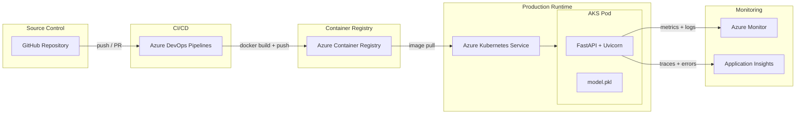
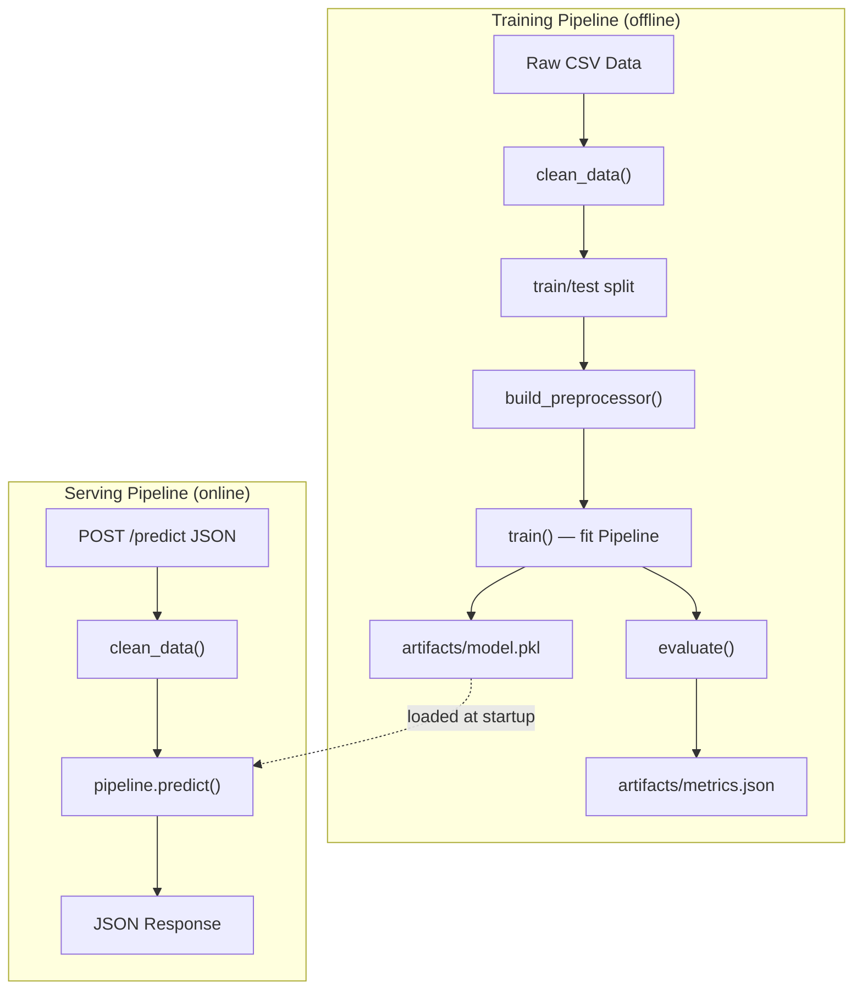

# System Architecture

High-level system design for the Bank Marketing MLOps project — from source control through to production serving and monitoring.

---

## Architecture Overview

---

## Component Breakdown

### GitHub Repository

The single source of truth for all code, configuration, and pipeline definitions.

| Concern | Location |
|---|---|
| ML pipeline source | `src/data.py`, `src/features.py`, `src/train.py`, `src/evaluate.py` |
| API serving layer | `src/api/app.py` |
| Pipeline entry point | `main.py` |
| Configuration | `config.yaml` |
| Tests | `tests/` |
| Documentation | `docs/`, `README.md` |

### Azure DevOps Pipelines

Triggers on pushes and pull requests to protected branches. Runs two pipeline stages:

- **CI (Build)**: Install dependencies → run tests → build Docker image → push to ACR
- **CD (Deploy)**: Pull image from ACR → deploy to AKS → run smoke tests

### Azure Container Registry (ACR)

Private Docker registry hosting versioned container images. Images are tagged with the Git commit SHA and `latest` for traceability.

### Azure Kubernetes Service (AKS)

Managed Kubernetes cluster running the prediction API. The deployment consists of:

- A `Deployment` resource managing replicas of the FastAPI container
- A `Service` resource exposing the API internally (ClusterIP) or externally (LoadBalancer)
- Health checks via the `/health` endpoint for pod liveness/readiness probes

### FastAPI Serving Layer

The `src/api/app.py` application:

- Loads `model.pkl` at startup (once, via lifespan handler)
- Exposes `POST /predict` for single-record scoring
- Exposes `GET /health` for Kubernetes probes
- Applies the same `clean_data()` transforms used during training — no separate preprocessing path

### Azure Monitor + Application Insights

Production observability covering:

- Request latency and throughput
- Error rates and HTTP status codes
- Prediction distribution drift (logged per-request)
- Pod-level resource utilisation (CPU, memory)

---

## Data Flow

### Training Flow (Offline)

1. `main.py train` loads `config.yaml` and raw CSV data
2. `clean_data()` applies EDA-driven transformations (leakage column removal, age capping, log transforms, target encoding)
3. Stratified train/test split preserves class distribution
4. `build_preprocessor()` creates an unfitted `ColumnTransformer` (impute → scale for numerics, one-hot for categoricals)
5. `train()` wraps preprocessor + classifier into a single `sklearn.Pipeline` and fits on training data
6. The fitted pipeline is serialised to `artifacts/model.pkl` — self-contained, no external preprocessing needed
7. `evaluate()` scores the held-out test set and writes metrics to `artifacts/metrics.json`

### Serving Flow (Online)

1. FastAPI application loads `model.pkl` once at startup
2. Incoming `POST /predict` requests are validated by Pydantic
3. The request is converted to a single-row DataFrame
4. `clean_data()` applies the same feature engineering as training
5. `pipeline.predict()` and `pipeline.predict_proba()` generate the response
6. JSON response returns `prediction`, `probability`, and `label`

---

## Key Design Decisions

| Decision | Rationale |
|---|---|
| Single sklearn Pipeline artifact | Eliminates preprocessing/model version mismatch at inference time |
| Config-driven pipeline | `config.yaml` is the single source of truth — no hardcoded values |
| FastAPI over Flask | Async-capable, built-in Pydantic validation, auto-generated OpenAPI docs |
| Docker → ACR → AKS | Standard Azure-native container deployment path |
| `/health` endpoint | Required for Kubernetes liveness/readiness probes |
| Logistic Regression as default | Interpretable, fast to train, better minority-class F1 than gradient boosting for this dataset |

---

## Key References

- Microsoft. [Machine learning operations (MLOps v2)](https://learn.microsoft.com/en-us/azure/architecture/ai-ml/guide/machine-learning-operations-v2). Canonical Azure MLOps reference defining the inner loop → outer loop lifecycle — the architectural pattern this project implements across `src/`, `artifacts/`, and `.github/`.
- Microsoft/Azure. [MLOps v2 — Classical ML Architecture Diagram](https://github.com/Azure/mlops-v2/blob/main/documentation/architecture/media/AzureML_CML_Architecture.png). Visual benchmark for the AzureML MLOps v2 classical ML architecture — the source model for this project's GitHub → ADO → ACR → AKS component topology.
- Microsoft. [Online Endpoints — Managed vs Kubernetes Online Endpoints](https://learn.microsoft.com/en-us/azure/machine-learning/concept-endpoints-online?view=azureml-api-2#managed-online-endpoints-vs-kubernetes-online-endpoints). Reference for the architectural decision to use direct AKS deployment over AzureML managed online endpoints — covers the tradeoffs between Azure-managed and customer-managed Kubernetes inference.
- Microsoft. [Build a CI/CD pipeline for microservices on Kubernetes](https://learn.microsoft.com/en-us/azure/architecture/microservices/ci-cd-kubernetes). Architecture guide describing the side-by-side deployment, environment isolation, and CI/CD pipeline structure that informed the ADO → AKS design.
