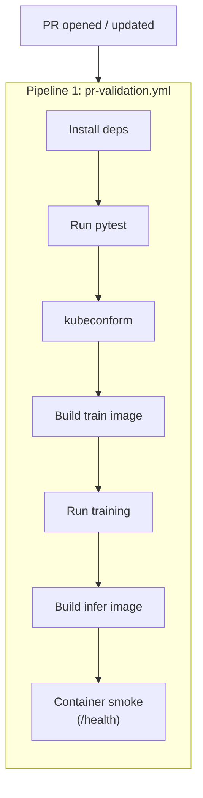
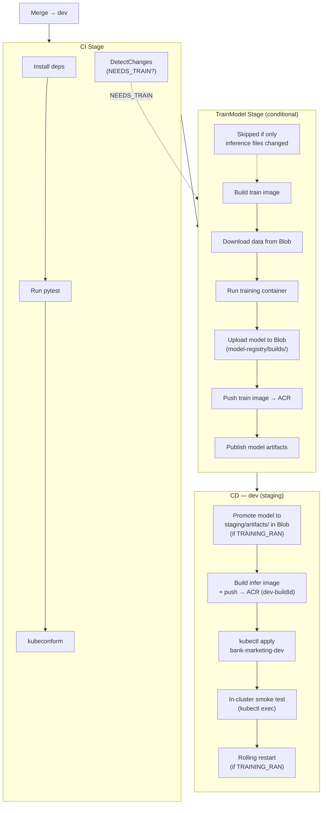
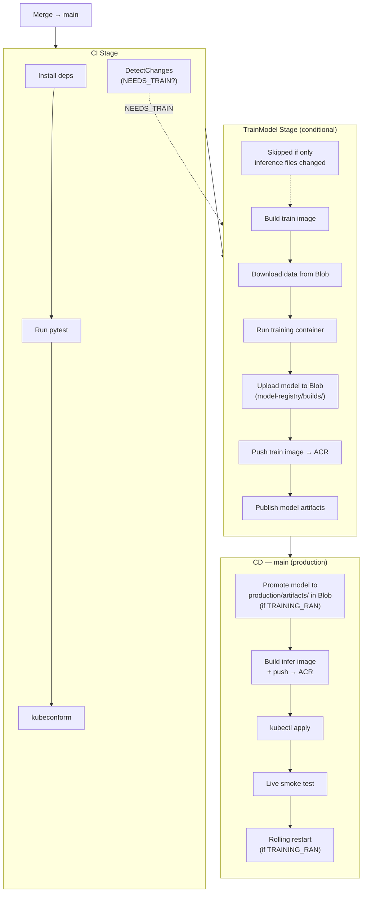
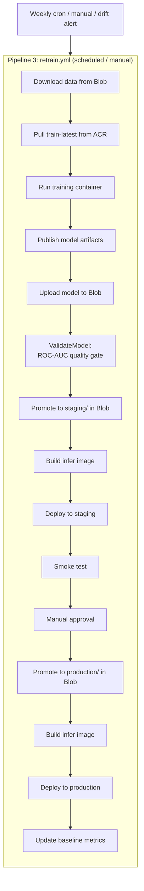
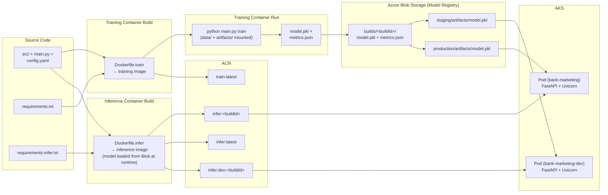

# CI/CD Pipeline

Three-pipeline architecture using Azure DevOps Pipelines — a dedicated PR validation pipeline, a push-triggered CI/CD pipeline with a TrainModel stage and branch-conditional deployment, and a standalone retraining pipeline.

---

## Pipeline Architecture

This project uses **three separate Azure DevOps pipelines**: PR validation (identical gates for all PRs), CI/CD (code-change-driven training + deployment), and retraining (data-driven model updates):



<table>
<tr>
<th>Pipeline 2 — Merge → <code>dev</code> (staging deployment)</th>
<th>Pipeline 2 — Merge → <code>main</code> (production deployment)</th>
</tr>
<tr><td>



</td><td>



</td></tr>
<tr>
<td><strong>Differs:</strong> Inference image pushed as <code>dev-&lt;buildId&gt;</code> + <code>dev-latest</code>. Real deployment to <code>bank-marketing-dev</code> namespace — in-cluster smoke test, no external traffic.</td>
<td><strong>Differs:</strong> Inference image pushed as <code>&lt;buildId&gt;</code> + <code>latest</code>. Real deployment to AKS + live smoke test against external endpoint.</td>
</tr>
</table>



### Why Three Pipelines?

| Concern | Single pipeline | Three pipelines (this project) |
|---|---|---|
| PR validation consistency | Requires `Build.Reason != 'PullRequest'` guards on every CD stage | Guaranteed identical — Pipeline 1 has no conditions |
| CD logic isolation | CD stages must check `Build.Reason` to avoid running on PRs | CD logic only exists in Pipelines 2 and 3 |
| Branch policy config | Complex — one YAML handles PR, dev push, and main push | Clean — Branch Policy points at Pipeline 1; `trigger:` drives Pipeline 2 |
| Failure diagnosis | Unclear whether a failure is a validation or deployment issue | Pipeline 1 = validation; Pipeline 2 = build/deploy; Pipeline 3 = retraining |
| Retraining independence | Retraining logic mixed with CI/CD | Pipeline 3 runs on schedule/manual trigger without code changes |

This follows Microsoft's [validation builds](https://learn.microsoft.com/en-us/azure/architecture/microservices/ci-cd-kubernetes#validation-builds) pattern: *"Once the feature is ready to merge into main, the developer opens a PR. This triggers another CI build that performs additional checks: build the code, run unit tests, build the runtime container image."* The validation build (Pipeline 1) is separate from the full CI/CD build (Pipeline 2).

---

## Pipeline 1: PR Validation (`pr-validation.yml`)

The PR validation pipeline runs **identical steps** for PRs targeting `dev` and PRs targeting `main`. No conditions, no branching logic — every PR is held to the same standard before merge.

### Azure Repos Git: Branch Policy, Not `pr:`

In Azure Repos Git, PR validation triggers **must be configured through branch policies**, not the `pr:` YAML keyword. The `pr:` trigger [only works with GitHub repositories](https://learn.microsoft.com/en-us/azure/devops/pipelines/repos/azure-repos-git#pr-triggers).

To configure Pipeline 1 as a PR gate:

1. Navigate to **Project Settings → Repos → Branch Policies**
2. Select the `dev` branch → **Build Validation** → **Add build policy**
3. Select `pr-validation` as the build pipeline
4. Set **Trigger** to "Automatic" and **Policy requirement** to "Required"
5. Repeat for the `main` branch with identical settings

Both branches point at the same pipeline definition. The steps are identical.

### Pipeline Definition

> **Pipeline file:** [`.ado/pr-validation.yml`](../.ado/pr-validation.yml)

The PR validation pipeline builds **both containers** locally (no ACR push) to validate the full training → inference flow:

1. Install Python dependencies (`requirements-local.txt` — includes pytest)
2. Run `pytest`
3. Validate K8s manifests with `kubeconform`
4. Build the training image (`Dockerfile.train`)
5. Run the training container — produces `model.pkl` on the agent
6. Build the inference image (`Dockerfile.infer`) — model is NOT baked in; loaded from Blob Storage (production) or volume mount (local)
7. Ephemeral container smoke test — `GET /health` against the inference container (model mounted from agent filesystem)

### What This Validates

| Check | What it catches | Why it matters at PR stage |
|---|---|---|
| `pytest` | Logic errors, API contract changes, config mistakes | Fastest feedback loop — developer fixes before review |
| `kubeconform` | K8s manifest schema errors, invalid resource specs | Catches YAML issues before they enter the integration branch |
| Train image build + run | Dockerfile.train errors, training pipeline failures | Training failures caught before merge |
| Infer image build | Dockerfile.infer errors, missing model artifact | Build failures caught before merge, not after |
| Container smoke test | Model loading failures, startup crashes, port issues | Runtime errors caught locally, not after AKS deployment |

---

## Pipeline 2: CI/CD (`azure-pipelines.yml`)

The CI/CD pipeline is triggered by **pushes** (merges) to `dev` and `main`. It runs a shared CI stage (tests + change detection), then a **conditional** TrainModel stage (skipped when only inference-relevant files changed), followed by a **branch-conditional CD stage** that always runs — promoting the model only when training produced a new artifact:

- **Merge → `dev`**: Staging deployment — conditionally promotes model to `staging/artifacts/` in Blob Storage, builds inference image, pushes to ACR, deploys to the `bank-marketing-dev` namespace, runs an in-cluster smoke test, and triggers a rolling restart when a new model was promoted. Pods load `model.pkl` from Blob Storage at runtime via `MODEL_BLOB_PREFIX=staging`.
- **Merge → `main`**: Production deployment — conditionally promotes model to `production/artifacts/` in Blob Storage, builds inference image, pushes to ACR, deploys to AKS `bank-marketing` namespace, runs a live smoke test, and triggers a rolling restart when a new model was promoted. Pods load `model.pkl` from Blob Storage at runtime via `MODEL_BLOB_PREFIX=production`.

This means **inference-only changes** (API code, K8s manifests, Dockerfiles) skip the expensive training stage and deploy immediately — training and inference images can be updated independently.

### CI Stage — Test, Validate & Detect Changes

The CI stage runs on every push to both branches. It contains two parallel jobs:

- **Test & Validate** — repeats test and manifest validation from Pipeline 1 (the merge commit differs from the PR head commit, so re-validation is needed)
- **DetectChanges** — diffs `HEAD~1` to determine whether training-relevant files changed, outputting `NEEDS_TRAIN=true|false`

> **Pipeline file:** [`.ado/azure-pipelines.yml`](../.ado/azure-pipelines.yml)

**Test & Validate job:**
1. Install Python dependencies (`requirements-local.txt`)
2. Run `pytest`
3. Validate K8s manifests with `kubeconform`

**DetectChanges job:**
1. Shallow checkout (`fetchDepth: 2`)
2. `git diff --name-only HEAD~1` to identify changed files
3. Compare against training-relevant paths: `src/data.py`, `src/features.py`, `src/train.py`, `src/evaluate.py`, `src/config.py`, `src/storage.py`, `config.yaml`, `requirements.txt`, `main.py`, `Dockerfile.train`
4. Force training if: git diff fails, or commit message contains `[train]`
5. Output `NEEDS_TRAIN` as a stage-level variable for downstream stages

### TrainModel Stage — Build, Train, Push, Publish (Conditional)

The TrainModel stage runs **only when `NEEDS_TRAIN=true`** (output from the DetectChanges job). When only inference-relevant files changed (API code, K8s manifests, Dockerfile.infer), this stage is skipped entirely — saving build time and avoiding unnecessary model rebuilds.

When it runs, it builds the training container, runs training to produce `model.pkl`, pushes the training image to ACR (for reuse by the retrain pipeline), uploads model artifacts to Azure Blob Storage (model registry), and publishes them as a pipeline artifact for audit trail.

1. Log in to ACR
2. Build training image (`Dockerfile.train`)
3. Download training data from Azure Blob Storage
4. Run training container — mounts `data/` and `artifacts/` from the agent
5. Verify `model.pkl` and `metrics.json` exist
6. Upload model artifacts to Blob Storage (`model-registry/builds/<buildId>/`)
7. Push training image to ACR (`<buildId>` + `train-latest`)
8. Publish `artifacts/` as a pipeline artifact (`model-artifacts`)

### CD Stage — Staging Deployment (Merge → `dev`)

On merge to `dev`, the CD stage **always runs** — regardless of whether TrainModel was skipped. It uses a `TRAINING_RAN` stage variable (derived from `dependencies.TrainModel.result`) to conditionally execute model promotion and rolling restart steps.

Pods load `model.pkl` from Blob Storage at runtime via `MODEL_BLOB_PREFIX=staging` — the model is **not** baked into the Docker image.

1. **Conditional:** Promote model to `staging/artifacts/` in Blob Storage (copy from `builds/<buildId>/`) — only when `TRAINING_RAN=True`
2. Build and push inference image (`Dockerfile.infer`) to ACR as `dev-<buildId>` + `dev-latest`
3. Deploy to `bank-marketing-dev` namespace via `KubernetesManifest@1`
4. In-cluster smoke test — `kubectl exec` → `GET /health`
5. **Conditional:** Rolling restart — `kubectl rollout restart` to pick up the new model from Blob Storage — only when `TRAINING_RAN=True`

**What the staging deployment validates:**

| Check | `--dry-run=server` (former approach) | Staging deploy to `bank-marketing-dev` (current) |
|---|---|---|
| YAML schema compliance | Yes | Yes |
| Admission controller policies | Yes | Yes |
| Resource quota violations | Yes | Yes |
| Namespace existence | Yes | Yes |
| Image pull from ACR succeeds | No | Yes |
| Pod scheduling on real nodes | No | Yes |
| Container startup (model loads) | No | Yes |
| Health probe passes in-cluster | No | Yes |
| K8s service routing works | No | Yes |

### CD Stage — Production Deployment (Merge → `main`)

On merge to `main`, the CD stage **always runs** — following the same conditional pattern as staging. It uses `TRAINING_RAN` to gate model promotion, baseline metrics update, and rolling restart.

Pods load `model.pkl` from Blob Storage at runtime via `MODEL_BLOB_PREFIX=production` — the model is **not** baked into the Docker image.

1. **Conditional:** Download pipeline artifacts (metrics.json for baseline update) — only when `TRAINING_RAN=True`
2. **Conditional:** Promote model to `production/artifacts/` in Blob Storage (copy from `builds/<buildId>/`) — only when `TRAINING_RAN=True`
3. Build and push inference image to ACR as `<buildId>` + `latest`
4. Deploy to `bank-marketing` namespace via `KubernetesManifest@1`
5. Live smoke test — wait for LoadBalancer IP, then `GET /health`
6. **Conditional:** Rolling restart — `kubectl rollout restart` to pick up the new model — only when `TRAINING_RAN=True`

| Step | Condition | Purpose |
|---|---|---|
| Download model artifacts | `TRAINING_RAN=True` | Get `metrics.json` for baseline update |
| Promote model to Blob Storage | `TRAINING_RAN=True` | Copy model from `builds/<buildId>/` to `production/artifacts/` path in Blob |
| Build + push inference image | Always | Build `Dockerfile.infer`, push to ACR with commit SHA + `latest` tags |
| Deploy to AKS | Always | Apply K8s manifests with the new image tag via `KubernetesManifest@1` |
| Environment gate | Always | `production` environment enforces manual approval before deploy |
| Live smoke test | Always | Validate the deployed service responds on its external LoadBalancer IP |
| Rolling restart | `TRAINING_RAN=True` | Restart pods to pick up new model from Blob Storage |
                  inputs:
                    containerRegistry: '$(ACR_SERVICE_CONNECTION)'
                    repository: 'bank-marketing-api'
                    command: buildAndPush
                    Dockerfile: '**/Dockerfile'
                    tags: |
                      $(Build.SourceVersion)
                      latest

                - task: KubernetesManifest@1
                  displayName: 'Deploy to AKS'
                  inputs:
                    action: deploy
                    connectionType: azureResourceManager
                    azureSubscriptionConnection: '$(AZURE_SUBSCRIPTION)'
                    azureResourceGroup: '$(RESOURCE_GROUP)'
                    kubernetesCluster: '$(AKS_CLUSTER)'
                    manifests: |
                      k8s/deployment.yaml
                      k8s/service.yaml
                    containers: |
                      $(ACR_NAME).azurecr.io/bank-marketing-api:$(Build.SourceVersion)

                - script: |
                    API_URL=$(kubectl get svc bank-marketing-api \
                      -o jsonpath='{.status.loadBalancer.ingress[0].ip}')
                    curl -f http://$API_URL/health
                  displayName: 'Live smoke test — GET /health'
```

| Step | Purpose |
|---|---|
| Docker build + push | Build production image, push to ACR with commit SHA + `latest` tags |
| Deploy to AKS | Apply K8s manifests with the new image tag via `KubernetesManifest@1` |
| Environment gate | `production` environment can enforce manual approval before deploy |
| Live smoke test | Validate the deployed service responds on its external LoadBalancer IP |

### Pipeline 3: Retraining (`retrain.yml`)

> **Pipeline file:** [`.ado/retrain.yml`](../.ado/retrain.yml)

The retraining pipeline is **not triggered by code pushes**. It handles data-driven model updates independently:

| Trigger | When |
|---|---|
| Scheduled | Weekly — Sunday 02:00 UTC |
| Manual | ADO UI → Pipelines → retrain → Run pipeline |
| Event-driven (future) | POST to ADO Pipelines REST API from a drift alert |

**Prerequisite:** The `TrainModel` stage in Pipeline 2 must have pushed `train-latest` to ACR.

**Stages:**

| Stage | Purpose |
|---|---|
| `Retrain` | Download versioned training data from Azure Blob Storage, pull `train-latest` image from ACR (no rebuild), run training, publish model artifacts |
| `ValidateModel` | Download production baseline metrics from Blob Storage, compare new ROC-AUC — fail if regression > 2 percentage points |
| `DeployStaging` | Promote model to `staging/` in Blob Storage, build inference image, push to ACR as `retrain-staging-<buildId>`, deploy to `bank-marketing-dev`, in-cluster smoke test |
| `DeployProduction` | Manual approval gate (`production` environment), promote model to `production/` in Blob Storage, build + push inference image as `retrain-<buildId>` + `latest`, deploy to `bank-marketing`, update baseline metrics in Blob Storage |

### Branch Toggle & Conditional Training

Both CD stages in Pipeline 2 depend on both CI and TrainModel, using a compound condition that handles skipped training:

```yaml
# CD stage condition: run if CI passed AND (TrainModel passed OR was skipped)
condition: |
  and(
    eq(variables['Build.SourceBranchName'], 'dev'),
    in(dependencies.CI.result, 'Succeeded'),
    in(dependencies.TrainModel.result, 'Succeeded', 'Skipped')
  )

# Stage-level variable to gate model promotion and rolling restart
variables:
  TRAINING_RAN: $[ in(dependencies.TrainModel.result, 'Succeeded') ]
```

Only one CD stage executes per pipeline run — they are mutually exclusive by branch. The CI stage always runs; TrainModel is conditional on file changes.

#### `MODEL_BLOB_PREFIX` — Environment-Based Model Path Separation

Pods in different environments load models from different Blob Storage paths using the `MODEL_BLOB_PREFIX` environment variable:

| Environment | `MODEL_BLOB_PREFIX` | Resolved blob path |
|---|---|---|
| Staging (`bank-marketing-dev`) | `staging` | `staging/artifacts/model.pkl` |
| Production (`bank-marketing`) | `production` | `production/artifacts/model.pkl` |
| Local development | (unset) | `artifacts/model.pkl` (local filesystem) |

The `_resolve_blob_path()` function in `src/storage.py` prepends the prefix to the config-defined model path (`artifacts/model.pkl`) when `STORAGE_BACKEND=azure_blob`.

---

## Artifact Flow



### What goes into the training image

| Content | Purpose |
|---|---|
| `src/` | ML pipeline source code |
| `main.py` | CLI entrypoint (`python main.py train`) |
| `config.yaml` | Runtime configuration |
| `requirements.txt` | Core ML dependencies (pandas, scikit-learn, numpy, joblib, pyyaml) |

### What goes into the inference image

| Content | Purpose |
|---|---|
| `src/` | ML pipeline source + API serving code |
| `config.yaml` | Runtime configuration |
| `requirements-infer.txt` | Inference dependencies (fastapi, uvicorn, scikit-learn, pandas, pydantic, numpy, joblib, pyyaml) |

> **Note:** `model.pkl` is **not** baked into the inference image. It is loaded at runtime from Azure Blob Storage (`STORAGE_BACKEND=azure_blob`) in production and staging, or via volume mount for local development.

### What stays outside the images

| Content | Reason |
|---|---|
| `data/raw/` | Training data not needed at inference time |
| `notebooks/` | Exploration only — not production code |
| `tests/` | Run in CI, not in production container |
| `artifacts/metrics.json` | Evaluation record — tracked in Git, not needed at runtime |

---

## Pipeline Variables

All variables are stored in the `bank-marketing-vars` variable group in Azure DevOps.

| Variable | Description | Example | Used By |
|---|---|---|---|
| `ACR_SERVICE_CONNECTION` | Azure DevOps service connection to ACR | `acr-connection` | P1, P2, P3 |
| `ACR_NAME` | ACR registry name | `bankmarketingacr` | P2, P3 |
| `AKS_CLUSTER` | AKS cluster name | `bank-marketing-aks` | P2, P3 |
| `RESOURCE_GROUP` | Azure resource group | `rg-bank-marketing` | P2, P3 |
| `AZURE_SUBSCRIPTION` | Azure subscription service connection | `azure-sub-connection` | P2, P3 |
| `TRAIN_IMAGE_NAME` | Training image repository name in ACR | `bank-marketing-train` | P2, P3 |
| `INFER_IMAGE_NAME` | Inference image repository name in ACR | `bank-marketing-api` | P2, P3 |
| `BLOB_STORAGE_ACCOUNT` | Azure Storage account for training data and model registry | `bankmarketingdata` | P2, P3 |
| `BLOB_CONTAINER_TRAINING` | Blob container holding versioned training CSVs | `training-data` | P2, P3 |

---

## Pipeline Conditions

This project uses **namespace-based environment isolation** — two Kubernetes namespaces within the same AKS cluster (`bank-marketing` for production, `bank-marketing-dev` for staging) — combined with a three-pipeline CI/CD architecture. Pre-merge checks are identical for both target branches; only the post-merge CD stage differs.

### Pipeline 1: `pr-validation.yml` (Branch Policy)

| Trigger | Tests | K8s Validation | Train Build + Run | Infer Build | Container Smoke | Push to ACR | Deploy to AKS |
|---|---|---|---|---|---|---|---|
| PR → `dev` | Yes | Yes | Yes (local) | Yes (local) | Yes (local) | No | No |
| PR → `main` | Yes | Yes | Yes (local) | Yes (local) | Yes (local) | No | No |

PR validation is **identical** for both target branches — no conditions, no branching logic.

### Pipeline 2: `azure-pipelines.yml` (Push trigger)

| Trigger | Tests | K8s Validation | DetectChanges | TrainModel | Infer Build + Push | Model Promotion (Blob) | Deploy to AKS | Smoke Test | Rolling Restart |
|---|---|---|---|---|---|---|---|---|---|
| Merge → `dev` (ML code changed) | Yes | Yes | `NEEDS_TRAIN=true` | Yes | Yes (`dev-<buildId>`) | staging/artifacts/ | Yes (`bank-marketing-dev`) | In-cluster | Yes |
| Merge → `dev` (API/K8s only) | Yes | Yes | `NEEDS_TRAIN=false` | **Skipped** | Yes (`dev-<buildId>`) | **Skipped** | Yes (`bank-marketing-dev`) | In-cluster | **Skipped** |
| Merge → `main` (ML code changed) | Yes | Yes | `NEEDS_TRAIN=true` | Yes | Yes (`<buildId>` + `latest`) | production/artifacts/ | Yes (`bank-marketing`) | Live (external IP) | Yes |
| Merge → `main` (API/K8s only) | Yes | Yes | `NEEDS_TRAIN=false` | **Skipped** | Yes (`<buildId>` + `latest`) | **Skipped** | Yes (`bank-marketing`) | Live (external IP) | **Skipped** |

The CI stage always runs on both branches. TrainModel is conditional on file changes (DetectChanges output). CD stages always run but gate model promotion and rolling restart on `TRAINING_RAN`.

### Pipeline 3: `retrain.yml` (Scheduled / Manual)

| Trigger | Train | Validate | Deploy Staging | Deploy Production |
|---|---|---|---|---|
| Weekly cron / Manual / Drift alert | Pull `train-latest`, run on new data | ROC-AUC quality gate (fail if regression > 2%) | Build infer image, deploy to `bank-marketing-dev`, smoke test | Manual approval, deploy to `bank-marketing`, update baseline |

---

## Future Enhancements

Ephemeral per-PR Review Apps and other planned improvements beyond the current namespace-isolation model are documented in [docs/future-enhancements.md](future-enhancements.md).

---

## Key References

> Reference numbers correspond to [REFERENCES.md](../REFERENCES.md).

- **[11]** Microsoft. [Build and deploy to Azure Kubernetes Service with Azure Pipelines](https://learn.microsoft.com/en-us/azure/aks/devops-pipeline). Step-by-step walkthrough for the AKS DevOps pipeline pattern this project implements — covers Docker@2 build task, ACR push, and KubernetesManifest@1 deploy task.
- **[12]** Microsoft. [Build a CI/CD pipeline for microservices on Kubernetes with Azure DevOps and Helm](https://learn.microsoft.com/en-us/azure/architecture/microservices/ci-cd-kubernetes). Architecture-level guide covering validation builds, full CI/CD flow, environment isolation, and container best practices — the design model for this two-pipeline architecture.
- **[26]** Microsoft. [Pipeline conditions](https://learn.microsoft.com/en-us/azure/devops/pipelines/process/conditions). `Build.SourceBranch` and `Build.Reason` condition expressions used for branch-conditional CD stages.
- **[27]** Microsoft. [YAML templates in pipelines](https://learn.microsoft.com/en-us/azure/devops/pipelines/process/templates). Parameterised template includes and `${{ if }}` expressions — alternative approach for DRY conditional deployment steps.
- **[28]** Microsoft. [Build Azure Repos Git repositories — PR triggers](https://learn.microsoft.com/en-us/azure/devops/pipelines/repos/azure-repos-git#pr-triggers). Documents that Azure Repos Git PR validation requires Branch Policies, not `pr:` in YAML.
- **[20]** Microsoft. [Create your first pipeline — Azure DevOps](https://learn.microsoft.com/en-us/azure/devops/pipelines/create-first-pipeline?view=azure-devops&tabs=python%2Cbrowser). Official quickstart for Azure Pipelines YAML structure — triggers, stages, jobs, and service connections.
- **[23]** Microsoft/Azure. [MLOps v2 — Azure DevOps Deployment Guide](https://github.com/Azure/mlops-v2/blob/main/documentation/deployguides/deployguide_ado.md). Covers service connections, variable groups, and multi-stage pipeline structure for ACR → AKS deployment in the MLOps v2 pattern.
