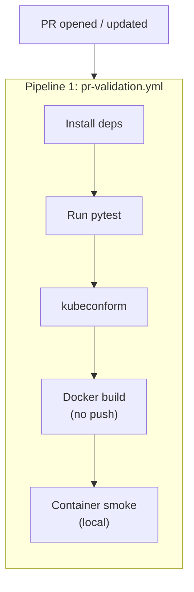
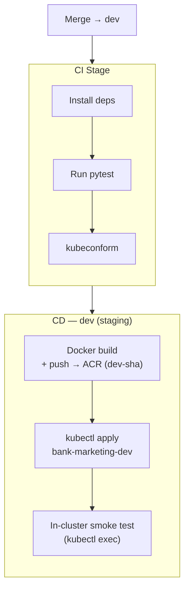
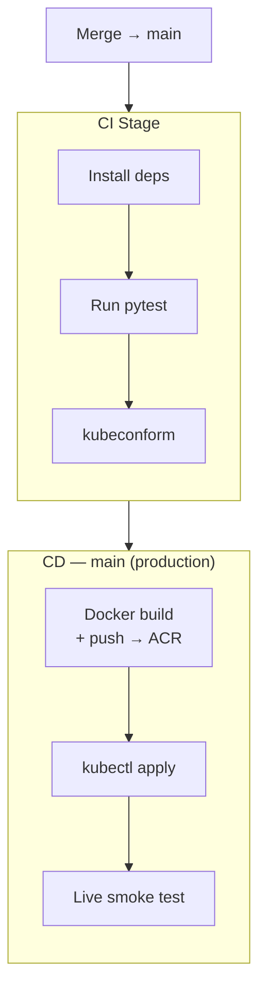
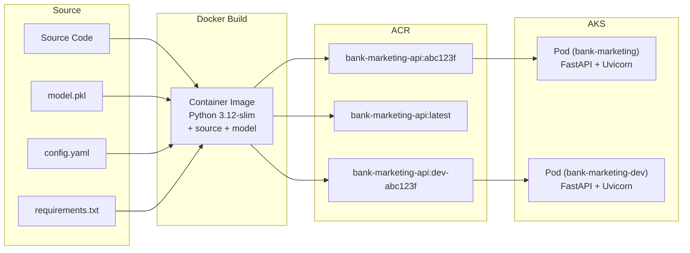

# CI/CD Pipeline

Two-pipeline architecture using Azure DevOps Pipelines — a dedicated PR validation pipeline and a push-triggered CI/CD pipeline with branch-conditional deployment.

---

## Pipeline Architecture

This project uses **two separate Azure DevOps pipelines** to enforce consistent PR validation while keeping deployment logic isolated:



<table>
<tr>
<th>Pipeline 2 — Merge → <code>dev</code> (staging deployment)</th>
<th>Pipeline 2 — Merge → <code>main</code> (production deployment)</th>
</tr>
<tr><td>



</td><td>



</td></tr>
<tr>
<td><strong>Differs:</strong> Image pushed as <code>dev-sha</code>. Real deployment to <code>bank-marketing-dev</code> namespace — in-cluster smoke test, no external traffic.</td>
<td><strong>Differs:</strong> Image pushed to ACR. Real deployment to AKS + live smoke test against external endpoint.</td>
</tr>
</table>

### Why Two Pipelines?

| Concern | Single pipeline | Two pipelines (this project) |
|---|---|---|
| PR validation consistency | Requires `Build.Reason != 'PullRequest'` guards on every CD stage | Guaranteed identical — Pipeline 1 has no conditions |
| CD logic isolation | CD stages must check `Build.Reason` to avoid running on PRs | CD logic only exists in Pipeline 2 |
| Branch policy config | Complex — one YAML handles PR, dev push, and main push | Clean — Branch Policy points at Pipeline 1; `trigger:` drives Pipeline 2 |
| Failure diagnosis | Unclear whether a failure is a validation or deployment issue | Pipeline 1 = validation; Pipeline 2 = build/deploy |

This follows Microsoft's [validation builds](https://learn.microsoft.com/en-us/azure/architecture/microservices/ci-cd-kubernetes#validation-builds) pattern: *"Once the feature is ready to merge into main, the developer opens a PR. This triggers another CI build that performs additional checks: build the code, run unit tests, build the runtime container image."* The validation build (Pipeline 1) is separate from the full CI/CD build (Pipeline 2).

---

## Pipeline 1: PR Validation (`pr-validation.yml`)

The PR validation pipeline runs **identical steps** for PRs targeting `dev` and PRs targeting `main`. No conditions, no branching logic — every PR is held to the same standard before merge.

### Azure Repos Git: Branch Policy, Not `pr:`

In Azure Repos Git, PR validation triggers **must be configured through branch policies**, not the `pr:` YAML keyword. The `pr:` trigger [only works with GitHub repositories](https://learn.microsoft.com/en-us/azure/devops/pipelines/repos/azure-repos-git#pr-triggers).

To configure Pipeline 1 as a PR gate:

1. Navigate to **Project Settings → Repos → Branch Policies**
2. Select the `dev` branch → **Build Validation** → **Add build policy**
3. Select `pr-validation` as the build pipeline
4. Set **Trigger** to "Automatic" and **Policy requirement** to "Required"
5. Repeat for the `main` branch with identical settings

Both branches point at the same pipeline definition. The steps are identical.

### Pipeline Definition

> <span style="color:red">**@TODO:** Remove this YAML insert once `pr-validation.yml` is created in the repository root.</span>

```yaml
# pr-validation.yml — PR validation pipeline
# Configured via Build Validation branch policy on dev and main
# NOT triggered by pr: — Azure Repos Git uses branch policies
trigger: none  # Only triggered by branch policies, not pushes

pool:
  vmImage: ubuntu-latest

stages:
  - stage: Validate
    displayName: 'PR Validation'
    jobs:
      - job: TestAndValidate
        displayName: 'Test, validate manifests, and smoke test container'
        steps:
          - task: UsePythonVersion@0
            inputs:
              versionSpec: '3.12'

          - script: pip install -r requirements.txt
            displayName: 'Install dependencies'

          - script: python -m pytest tests/ -v --tb=short
            displayName: 'Run tests'

          - script: |
              curl -sLO https://github.com/yannh/kubeconform/releases/latest/download/kubeconform-linux-amd64.tar.gz
              tar xzf kubeconform-linux-amd64.tar.gz
              ./kubeconform -strict k8s/deployment.yaml k8s/service.yaml
            displayName: 'Validate K8s manifests (kubeconform)'

          - script: docker build -t bank-marketing-api:pr-validation .
            displayName: 'Docker build (no push)'

          - script: |
              docker run -d --name pr-smoke -p 8000:8000 bank-marketing-api:pr-validation
              sleep 5
              curl -f http://localhost:8000/health
              docker stop pr-smoke && docker rm pr-smoke
            displayName: 'Ephemeral container smoke test'
```

### What This Validates

| Check | What it catches | Why it matters at PR stage |
|---|---|---|
| `pytest` | Logic errors, API contract changes, config mistakes | Fastest feedback loop — developer fixes before review |
| `kubeconform` | K8s manifest schema errors, invalid resource specs | Catches YAML issues before they enter the integration branch |
| Docker build | Dockerfile errors, missing deps at image build time | Build failures caught before merge, not after |
| Container smoke test | Model loading failures, startup crashes, port issues | Runtime errors caught locally, not after AKS deployment |

---

## Pipeline 2: CI/CD (`azure-pipelines.yml`)

The CI/CD pipeline is triggered by **pushes** (merges) to `dev` and `main`. It runs a shared CI stage followed by a **branch-conditional CD stage**:

- **Merge → `dev`**: Staging deployment — builds and pushes the image to ACR, deploys to the `bank-marketing-dev` namespace, and runs an in-cluster smoke test against the `ClusterIP` service
- **Merge → `main`**: Production deployment — builds, pushes to ACR, deploys to AKS `bank-marketing` namespace, and runs a live smoke test against the external endpoint

### CI Stage — Test & Validate

The CI stage runs on every push to both branches. It repeats the test and manifest validation steps from Pipeline 1 because the merge commit differs from the PR head commit — re-validation confirms nothing broke during the merge.

> <span style="color:red">**@TODO:** Remove the YAML inserts in this section (CI Stage, CD_Dev, CD_Main) once `azure-pipelines.yml` is created in the repository root.</span>

```yaml
# azure-pipelines.yml — CI/CD pipeline
trigger:
  branches:
    include:
      - main
      - dev

variables:
  isMain: $[eq(variables['Build.SourceBranch'], 'refs/heads/main')]
  isDev: $[eq(variables['Build.SourceBranch'], 'refs/heads/dev')]

stages:
  - stage: CI
    displayName: 'CI — Test & Validate'
    jobs:
      - job: TestAndValidate
        pool:
          vmImage: ubuntu-latest
        steps:
          - task: UsePythonVersion@0
            inputs:
              versionSpec: '3.12'

          - script: pip install -r requirements.txt
            displayName: 'Install dependencies'

          - script: python -m pytest tests/ -v --tb=short
            displayName: 'Run tests'

          - script: |
              curl -sLO https://github.com/yannh/kubeconform/releases/latest/download/kubeconform-linux-amd64.tar.gz
              tar xzf kubeconform-linux-amd64.tar.gz
              ./kubeconform -strict k8s/deployment.yaml k8s/service.yaml
            displayName: 'Validate K8s manifests (kubeconform)'
```

### CD Stage — Staging Deployment (Merge → `dev`)

On merge to `dev`, the CD stage builds and pushes a staging image to ACR tagged `dev-<sha>`, deploys to the `bank-marketing-dev` namespace, and runs an in-cluster smoke test against the internal `ClusterIP` service. The `bank-marketing` production namespace is untouched.

```yaml
  - stage: CD_Dev
    displayName: 'CD — Staging Deployment (dev)'
    dependsOn: CI
    condition: and(succeeded(), eq(variables.isDev, true))
    jobs:
      - job: StagingDeploy
        pool:
          vmImage: ubuntu-latest
        steps:
          - task: Docker@2
            displayName: 'Build and push staging image to ACR'
            inputs:
              containerRegistry: '$(ACR_SERVICE_CONNECTION)'
              repository: 'bank-marketing-api'
              command: buildAndPush
              Dockerfile: '**/Dockerfile'
              tags: |
                dev-$(Build.SourceVersion)

          - task: KubernetesManifest@1
            displayName: 'Deploy to staging namespace (bank-marketing-dev)'
            inputs:
              action: deploy
              connectionType: azureResourceManager
              azureSubscriptionConnection: '$(AZURE_SUBSCRIPTION)'
              azureResourceGroup: '$(RESOURCE_GROUP)'
              kubernetesCluster: '$(AKS_CLUSTER)'
              namespace: bank-marketing-dev
              manifests: |
                k8s/deployment-dev.yaml
                k8s/service-dev.yaml
              containers: |
                $(ACR_NAME).azurecr.io/bank-marketing-api:dev-$(Build.SourceVersion)

          - script: |
              kubectl wait --for=condition=ready pod \
                -l app=bank-marketing-api \
                -n bank-marketing-dev \
                --timeout=120s
              kubectl exec -n bank-marketing-dev \
                deploy/bank-marketing-api -- \
                curl -sf http://localhost:8000/health
            displayName: 'In-cluster smoke test — GET /health'
```

**What the staging deployment validates:**

| Check | `--dry-run=server` (former approach) | Staging deploy to `bank-marketing-dev` (current) |
|---|---|---|
| YAML schema compliance | Yes | Yes |
| Admission controller policies | Yes | Yes |
| Resource quota violations | Yes | Yes |
| Namespace existence | Yes | Yes |
| Image pull from ACR succeeds | No | Yes |
| Pod scheduling on real nodes | No | Yes |
| Container startup (model loads) | No | Yes |
| Health probe passes in-cluster | No | Yes |
| K8s service routing works | No | Yes |

### CD Stage — Production Deployment (Merge → `main`)

On merge to `main`, the CD stage builds and pushes the production image to ACR, deploys to AKS, and runs a live smoke test against the external endpoint.

```yaml
  - stage: CD_Main
    displayName: 'CD — Production Deployment (main)'
    dependsOn: CI
    condition: and(succeeded(), eq(variables.isMain, true))
    jobs:
      - deployment: DeployToAKS
        environment: 'production'
        pool:
          vmImage: ubuntu-latest
        strategy:
          runOnce:
            deploy:
              steps:
                - task: Docker@2
                  displayName: 'Build and push to ACR'
                  inputs:
                    containerRegistry: '$(ACR_SERVICE_CONNECTION)'
                    repository: 'bank-marketing-api'
                    command: buildAndPush
                    Dockerfile: '**/Dockerfile'
                    tags: |
                      $(Build.SourceVersion)
                      latest

                - task: KubernetesManifest@1
                  displayName: 'Deploy to AKS'
                  inputs:
                    action: deploy
                    connectionType: azureResourceManager
                    azureSubscriptionConnection: '$(AZURE_SUBSCRIPTION)'
                    azureResourceGroup: '$(RESOURCE_GROUP)'
                    kubernetesCluster: '$(AKS_CLUSTER)'
                    manifests: |
                      k8s/deployment.yaml
                      k8s/service.yaml
                    containers: |
                      $(ACR_NAME).azurecr.io/bank-marketing-api:$(Build.SourceVersion)

                - script: |
                    API_URL=$(kubectl get svc bank-marketing-api \
                      -o jsonpath='{.status.loadBalancer.ingress[0].ip}')
                    curl -f http://$API_URL/health
                  displayName: 'Live smoke test — GET /health'
```

| Step | Purpose |
|---|---|
| Docker build + push | Build production image, push to ACR with commit SHA + `latest` tags |
| Deploy to AKS | Apply K8s manifests with the new image tag via `KubernetesManifest@1` |
| Environment gate | `production` environment can enforce manual approval before deploy |
| Live smoke test | Validate the deployed service responds on its external LoadBalancer IP |

### Branch Toggle Mechanism

Both CD stages use [runtime expressions](https://learn.microsoft.com/en-us/azure/devops/pipelines/process/conditions#variables-in-conditions) (`$[ ]`) with `Build.SourceBranch` to select which stage runs:

```yaml
variables:
  isMain: $[eq(variables['Build.SourceBranch'], 'refs/heads/main')]
  isDev: $[eq(variables['Build.SourceBranch'], 'refs/heads/dev')]
```

Only one CD stage executes per pipeline run — they are mutually exclusive. The CI stage always runs regardless of branch.

---

## Artifact Flow



### What goes into the Docker image

| Content | Purpose |
|---|---|
| `src/` | ML pipeline source + API serving code |
| `config.yaml` | Runtime configuration |
| `artifacts/model.pkl` | Trained model artifact (preprocessor + classifier) |
| `requirements.txt` | Pinned Python dependencies |

### What stays outside the image

| Content | Reason |
|---|---|
| `data/raw/` | Training data not needed at inference time |
| `notebooks/` | Exploration only — not production code |
| `tests/` | Run in CI, not in production container |
| `artifacts/metrics.json` | Evaluation record — tracked in Git, not needed at runtime |

---

## Pipeline Variables

| Variable | Description | Example |
|---|---|---|
| `ACR_SERVICE_CONNECTION` | Azure DevOps service connection to ACR | `acr-connection` |
| `ACR_NAME` | ACR registry name | `bankmarketingacr` |
| `AKS_CLUSTER` | AKS cluster name | `bank-marketing-aks` |
| `RESOURCE_GROUP` | Azure resource group | `rg-bank-marketing` |
| `AZURE_SUBSCRIPTION` | Azure subscription service connection | `azure-sub-connection` |

---

## Pipeline Conditions

This project uses **namespace-based environment isolation** — two Kubernetes namespaces within the same AKS cluster (`bank-marketing` for production, `bank-marketing-dev` for staging) — combined with a two-pipeline CI/CD architecture. Pre-merge checks are identical for both target branches; only the post-merge CD stage differs.

### Pipeline 1: `pr-validation.yml` (Branch Policy)

| Trigger | Tests | K8s Validation | Docker Build | Container Smoke | Push to ACR | Deploy to AKS |
|---|---|---|---|---|---|---|
| PR → `dev` | Yes | Yes (kubeconform) | Yes (no push) | Yes (local) | No | No |
| PR → `main` | Yes | Yes (kubeconform) | Yes (no push) | Yes (local) | No | No |

PR validation is **identical** for both target branches — no conditions, no branching logic.

### Pipeline 2: `azure-pipelines.yml` (Push trigger)

| Trigger | Tests | K8s Validation | Docker Build | Push to ACR | Deploy to AKS | Smoke Test |
|---|---|---|---|---|---|---|
| Merge → `dev` | Yes | Yes (kubeconform) | Yes | Yes (`dev-<sha>`) | Yes (`bank-marketing-dev`) | In-cluster (`kubectl exec`) |
| Merge → `main` | Yes | Yes (kubeconform) | Yes | Yes (`<sha>` + `latest`) | Yes (`bank-marketing`) | Live (external IP) |

The only branching logic in the CI/CD pipeline is the `condition:` on the two mutually exclusive CD stages. The CI stage always runs on both branches.

---

## Future Enhancements

Ephemeral per-PR Review Apps and other planned improvements beyond the current namespace-isolation model are documented in [docs/future-enhancements.md](future-enhancements.md).

---

## Key References

> Reference numbers correspond to [REFERENCES.md](../REFERENCES.md).

- **[11]** Microsoft. [Build and deploy to Azure Kubernetes Service with Azure Pipelines](https://learn.microsoft.com/en-us/azure/aks/devops-pipeline). Step-by-step walkthrough for the AKS DevOps pipeline pattern this project implements — covers Docker@2 build task, ACR push, and KubernetesManifest@1 deploy task.
- **[12]** Microsoft. [Build a CI/CD pipeline for microservices on Kubernetes with Azure DevOps and Helm](https://learn.microsoft.com/en-us/azure/architecture/microservices/ci-cd-kubernetes). Architecture-level guide covering validation builds, full CI/CD flow, environment isolation, and container best practices — the design model for this two-pipeline architecture.
- **[26]** Microsoft. [Pipeline conditions](https://learn.microsoft.com/en-us/azure/devops/pipelines/process/conditions). `Build.SourceBranch` and `Build.Reason` condition expressions used for branch-conditional CD stages.
- **[27]** Microsoft. [YAML templates in pipelines](https://learn.microsoft.com/en-us/azure/devops/pipelines/process/templates). Parameterised template includes and `${{ if }}` expressions — alternative approach for DRY conditional deployment steps.
- **[28]** Microsoft. [Build Azure Repos Git repositories — PR triggers](https://learn.microsoft.com/en-us/azure/devops/pipelines/repos/azure-repos-git#pr-triggers). Documents that Azure Repos Git PR validation requires Branch Policies, not `pr:` in YAML.
- **[20]** Microsoft. [Create your first pipeline — Azure DevOps](https://learn.microsoft.com/en-us/azure/devops/pipelines/create-first-pipeline?view=azure-devops&tabs=python%2Cbrowser). Official quickstart for Azure Pipelines YAML structure — triggers, stages, jobs, and service connections.
- **[23]** Microsoft/Azure. [MLOps v2 — Azure DevOps Deployment Guide](https://github.com/Azure/mlops-v2/blob/main/documentation/deployguides/deployguide_ado.md). Covers service connections, variable groups, and multi-stage pipeline structure for ACR → AKS deployment in the MLOps v2 pattern.
