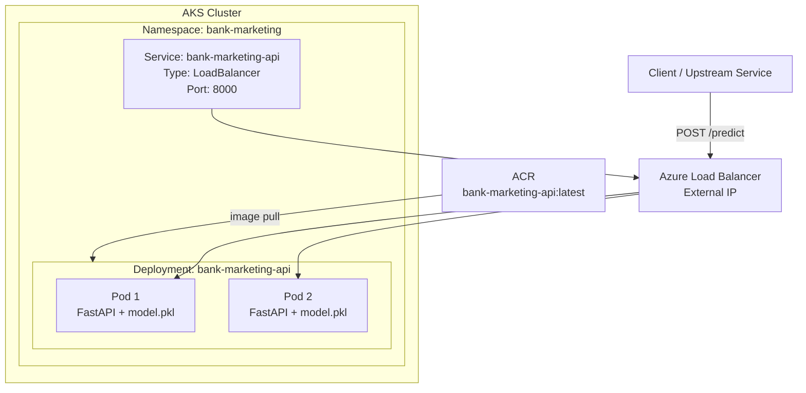
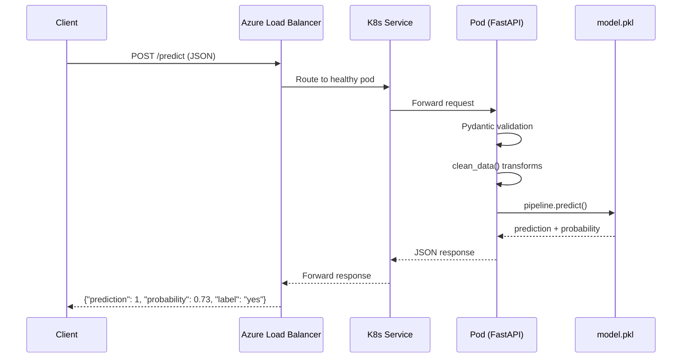
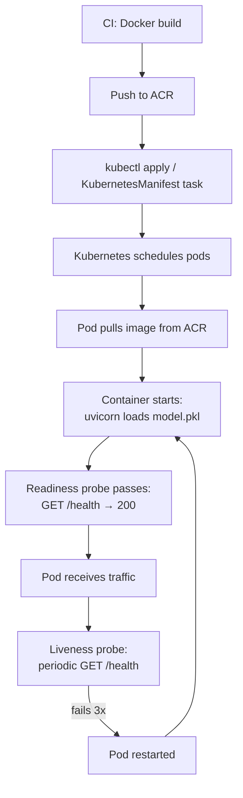

# Deployment Architecture

AKS deployment structure, API exposure, and container lifecycle for the Bank Marketing prediction service.

---

## AKS Cluster Layout



---

## Kubernetes Resources

### Deployment

```yaml
# k8s/deployment.yaml
apiVersion: apps/v1
kind: Deployment
metadata:
  name: bank-marketing-api
  namespace: bank-marketing
  labels:
    app: bank-marketing-api
spec:
  replicas: 2
  selector:
    matchLabels:
      app: bank-marketing-api
  template:
    metadata:
      labels:
        app: bank-marketing-api
    spec:
      containers:
        - name: api
          image: bankmarketingacr.azurecr.io/bank-marketing-api:latest
          ports:
            - containerPort: 8000
          resources:
            requests:
              cpu: "250m"
              memory: "256Mi"
            limits:
              cpu: "500m"
              memory: "512Mi"
          livenessProbe:
            httpGet:
              path: /health
              port: 8000
            initialDelaySeconds: 10
            periodSeconds: 15
          readinessProbe:
            httpGet:
              path: /health
              port: 8000
            initialDelaySeconds: 5
            periodSeconds: 10
          env:
            - name: UVICORN_WORKERS
              value: "1"
      imagePullSecrets:
        - name: acr-secret
```

| Field | Value | Rationale |
|---|---|---|
| `replicas: 2` | Two pods for basic availability | Single pod = downtime during restarts |
| `containerPort: 8000` | Matches `config.yaml` API port | Consistent with `uvicorn` default in config |
| CPU request: 250m | Quarter-core baseline | Logistic regression inference is lightweight |
| Memory request: 256Mi | Sufficient for sklearn model in memory | `model.pkl` is small (< 10MB) |
| CPU limit: 500m | Cap burst CPU usage | Prevents noisy-neighbour issues |
| Memory limit: 512Mi | Hard ceiling | Prevents OOM from affecting other pods |

### Service

```yaml
# k8s/service.yaml
apiVersion: v1
kind: Service
metadata:
  name: bank-marketing-api
  namespace: bank-marketing
spec:
  type: LoadBalancer
  selector:
    app: bank-marketing-api
  ports:
    - protocol: TCP
      port: 80
      targetPort: 8000
```

| Field | Value | Rationale |
|---|---|---|
| `type: LoadBalancer` | Provisions Azure Load Balancer with external IP | Simplest external access for a single service |
| `port: 80` | External-facing port | Standard HTTP port for consumers |
| `targetPort: 8000` | Pod's container port | Maps to FastAPI/Uvicorn listening port |

---

## API Exposure



### Endpoints

| Method | Path | Purpose | Used By |
|---|---|---|---|
| `POST` | `/predict` | Score a single customer record | Upstream services, batch callers |
| `GET` | `/health` | Liveness/readiness probe | Kubernetes, CI smoke tests |
| `GET` | `/docs` | Auto-generated OpenAPI documentation | Developers (FastAPI built-in) |

---

## Container Lifecycle



### Startup Sequence

1. **Image pull**: Kubernetes pulls the container image from ACR using `imagePullSecrets`
2. **Container start**: Uvicorn starts, FastAPI lifespan handler loads `model.pkl` into memory
3. **Readiness probe**: Kubernetes polls `GET /health` — pod only receives traffic once it returns 200
4. **Live traffic**: Service routes requests to the pod
5. **Liveness monitoring**: Kubernetes periodically checks `/health` — restarts the pod if 3 consecutive probes fail

### Rolling Update Strategy

When a new image is deployed:

1. Kubernetes creates new pods with the updated image
2. New pods must pass readiness probes before receiving traffic
3. Old pods are drained (stop receiving new requests, finish in-flight)
4. Old pods are terminated
5. Zero-downtime deployment with `replicas >= 2`

---

## Resource Sizing Rationale

This is a lightweight inference workload:

- **Model**: Logistic Regression with sklearn preprocessing (small memory footprint)
- **Throughput**: Single-record predictions, not batch — low CPU per request
- **Latency target**: < 100ms per prediction (measured in `app.py`)
- **Scale**: 2 replicas handle moderate traffic; HPA can be added for auto-scaling

---

## Key References

- Microsoft. [Build and deploy to Azure Kubernetes Service with Azure Pipelines](https://learn.microsoft.com/en-us/azure/aks/devops-pipeline). Full two-stage pipeline walkthrough (Build → Deploy) with Docker@2 and KubernetesManifest@1 tasks — the CI/CD pattern this deployment configuration is designed to receive.
- Microsoft. [Core concepts for Azure Kubernetes Service (AKS)](https://learn.microsoft.com/en-us/azure/aks/concepts-clusters-workloads). Foundational reference for AKS `Deployment` and `Service` resources, pod scheduling, node pools, and the Kubernetes primitives used throughout this document.
- Microsoft. [Deploy a machine learning model to Azure Kubernetes Service (v1)](https://learn.microsoft.com/en-us/azure/machine-learning/how-to-deploy-azure-kubernetes-service?view=azureml-api-1&tabs=python). Reference for AKS inference configuration — health probe setup, resource limits, and deployment configuration patterns applicable to the serving layer.
- Microsoft. [Quickstart: Create an Azure Container Registry using Terraform](https://learn.microsoft.com/en-us/azure/container-registry/container-registry-get-started-terraform?tabs=azure-cli). ACR provisioning reference covering SKU selection, admin user configuration, and AKS integration via `imagePullSecrets` — the mechanism used in `k8s/deployment.yaml`.

For this case study, fixed replicas are sufficient. A `HorizontalPodAutoscaler` would be the next step for production scale.
