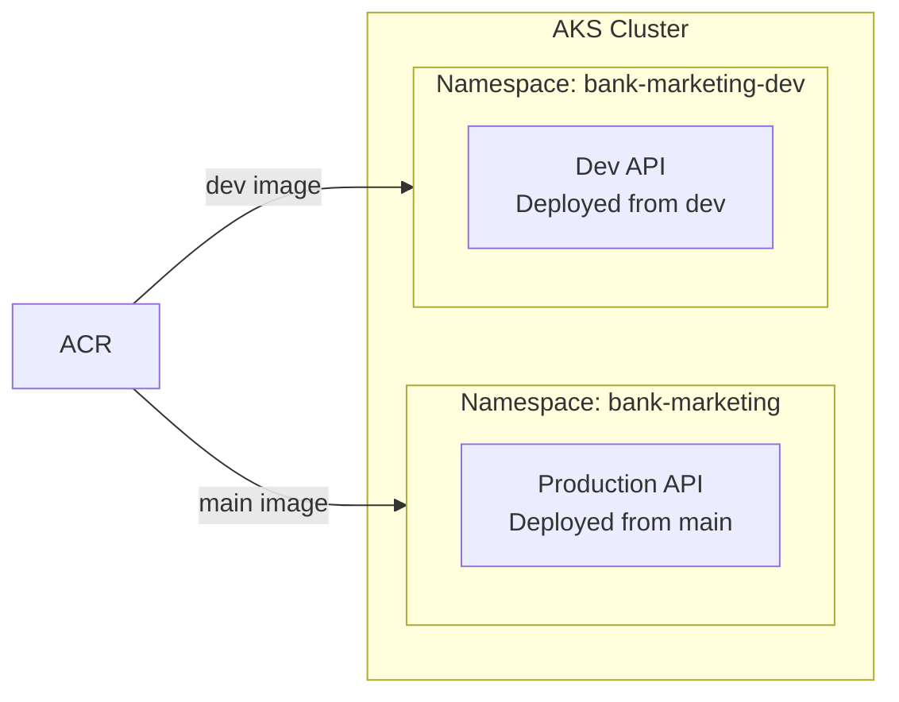
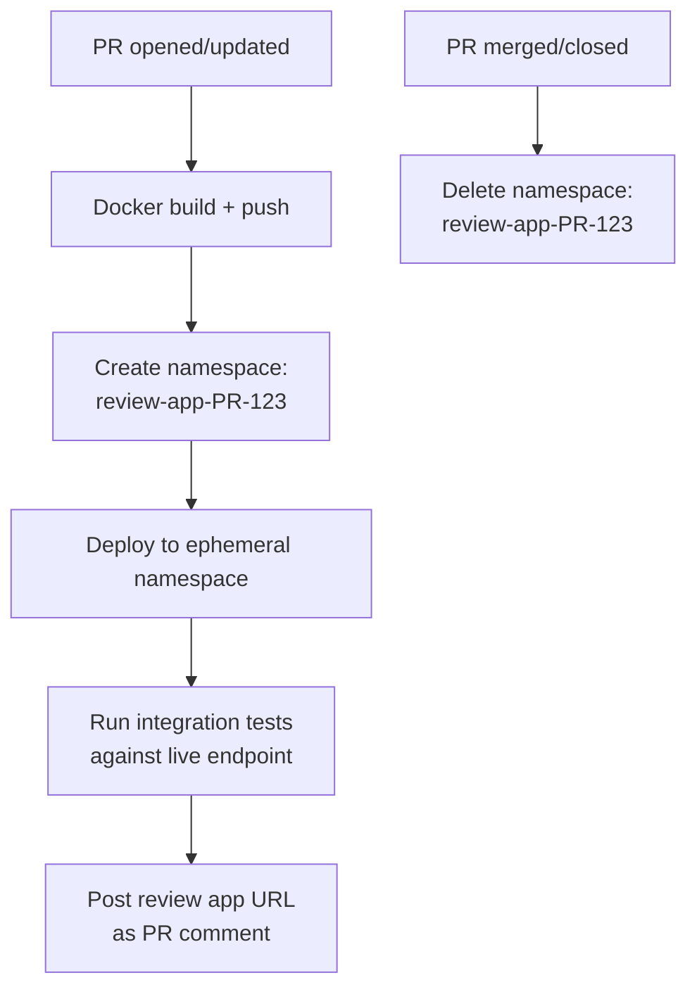
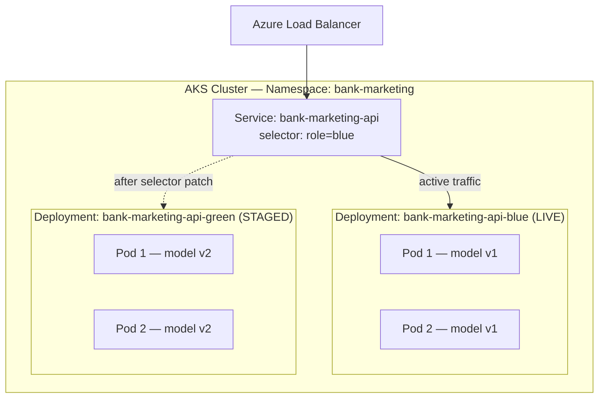

# Future Enhancements

Documented improvements and architectural patterns that are **not implemented in the current project** but are worth considering if the case study were formalised into an enterprise-grade production system.

Each section identifies the relevant MLOps maturity level and provides official references to support implementation.

---

## Table of Contents

1. [Deployment Simulation Strategies](#deployment-simulation-strategies)
2. [Blue-Green Deployment](#blue-green-deployment)

---

## Deployment Simulation Strategies

*Relevant to: CI/CD pipeline — `dev` branch validation and per-PR testing*
*MLOps maturity level: 2–3 and above*

The current pipeline uses a single AKS environment (production) and simulates deployment on `dev` using a local Docker container smoke test (no cluster required). The strategies below provide progressively stronger deployment simulation by using the actual AKS cluster without touching the production namespace.

### Namespace-Based Isolation (Same AKS Cluster)

Deploy `dev` branch changes to a separate Kubernetes namespace within the same AKS cluster. This provides a real deployment environment without provisioning a second cluster.



**How it works:**

1. On `dev` push, the CI pipeline builds the Docker image and pushes to ACR with a `dev-<sha>` tag
2. CD deploys to the `bank-marketing-dev` namespace using the same K8s manifests but with a `ClusterIP` service (internal only, no external LoadBalancer)
3. Smoke tests run against the internal service endpoint
4. The `bank-marketing` (production) namespace remains untouched

**Implementation requirements:**

- Duplicate K8s manifests (or parameterise with Helm/Kustomize) for the dev namespace
- `ResourceQuota` on the dev namespace to cap resource consumption
- Kubernetes RBAC to isolate namespace access
- ACR tag strategy distinguishing dev vs. production images

| Advantage | Disadvantage |
|---|---|
| Real Kubernetes deployment — catches scheduling, networking, and probe issues | Consumes cluster resources (CPU, memory) even for validation |
| Tests against actual K8s service routing and DNS | Requires ACR push on `dev`, increasing registry storage |
| No additional infrastructure cost (same cluster) | Adds operational complexity: two namespaces to manage |
| Internal-only service avoids external exposure | Needs parameterised manifests (Helm/Kustomize) |

**When to adopt:** When the project has multiple contributors, the model is serving real traffic, and deployment-related failures become a recurring risk. Microsoft's [AKS cluster isolation best practices](https://learn.microsoft.com/en-us/azure/aks/operator-best-practices-cluster-isolation) recommends logical (namespace) isolation over physical (multi-cluster) isolation: *"Separate teams and projects using logical isolation. Minimize the number of physical AKS clusters you deploy."*

**Key references** — numbers correspond to [REFERENCES.md](../REFERENCES.md):

- **[38]** Microsoft. [Best practices for cluster isolation in AKS](https://learn.microsoft.com/en-us/azure/aks/operator-best-practices-cluster-isolation). Covers logical vs. physical isolation, namespace-based multi-tenancy, RBAC, network policies, and resource quotas.
- **[12]** Microsoft. [Isolation of environments](https://learn.microsoft.com/en-us/azure/architecture/microservices/ci-cd-kubernetes#isolation-of-environments). Recommends a dedicated production cluster with a separate dev/test cluster using logical (namespace) isolation within the dev/test cluster.
- **[40]** Kubernetes. [Namespaces](https://kubernetes.io/docs/concepts/overview/working-with-objects/namespaces/). Official documentation on namespace scoping, DNS behaviour (`<service>.<namespace>.svc.cluster.local`), and resource quota integration.

---

### Ephemeral Per-PR Environments (Review Apps)

The most sophisticated option: spin up a temporary Kubernetes namespace for each pull request, deploy the PR's container image, run end-to-end tests, and tear down the namespace on merge or PR close.



**How it works:**

1. A PR triggers the CI pipeline, which builds and pushes a container image tagged with the PR ID
2. The CD pipeline creates a new namespace (`review-app-$(System.PullRequest.PullRequestId)`)
3. K8s manifests are deployed into the ephemeral namespace
4. A comment is posted to the PR with the review app URL
5. Reviewers can test the PR's changes against a live endpoint before approving
6. On merge or PR close, the namespace and all its resources are deleted

Azure DevOps natively supports this pattern through **Review Apps** — a built-in feature of Kubernetes environment resources in Azure Pipelines.

**Implementation requirements:**

- Azure DevOps environment with Kubernetes resource configured
- Service connection with permissions to create/delete namespaces
- Pipeline YAML using `reviewApp` step and conditional deployment jobs
- Cleanup automation (namespace deletion on PR close)
- ACR tag strategy for PR images (e.g., `pr-<id>-<sha>`)

| Advantage | Disadvantage |
|---|---|
| Full end-to-end validation per PR | Significant infrastructure complexity |
| Reviewers can interact with a live endpoint | Each PR consumes cluster resources while open |
| Catches integration issues before merge | Requires robust cleanup to avoid namespace sprawl |
| Azure DevOps has built-in Review App support | PR images accumulate in ACR without a retention policy |

**When to adopt:** When the project has a larger team, PRs frequently introduce deployment regressions, or the service is customer-facing with low tolerance for downtime. This pattern aligns with MLOps maturity level 3+ (automated model deployment with full CI/CD).

**Key references** — numbers correspond to [REFERENCES.md](../REFERENCES.md):

- **[39]** Microsoft. [Kubernetes resources in environments](https://learn.microsoft.com/en-us/azure/devops/pipelines/process/environments-kubernetes). Official documentation for Azure DevOps Review Apps — includes a complete YAML pipeline example showing `DeployPullRequest` jobs, dynamic namespace creation (`review-app-$(System.PullRequest.PullRequestId)`), and PR comment automation.
- **[33]** Microsoft. [GitOps for Azure Kubernetes Service](https://learn.microsoft.com/en-us/azure/architecture/example-scenario/gitops-aks/gitops-blueprint-aks). Covers pull-based deployment models using Flux and Argo CD with AKS. Relevant for ephemeral environments because GitOps operators can manage per-PR namespaces through declarative configuration in a Git repository.
- **[12]** Microsoft. [Isolation of environments](https://learn.microsoft.com/en-us/azure/architecture/microservices/ci-cd-kubernetes#isolation-of-environments). Recommends separate dev/test clusters with logical namespace isolation — ephemeral PR environments are a specialisation of this pattern.

---

## Blue-Green Deployment

*Relevant to: Production CD pipeline — model version rollout and rollback*
*MLOps maturity level: 3–4*

### What It Is

Blue-green deployment is a release strategy that maintains **two identical production environments** — one active (blue), one staged (green). The Kubernetes `Service` selector is atomically patched to point from blue to green when the new version is verified. At no point does production traffic split across both versions. The previous environment is held live temporarily to enable instant rollback before being scaled down.

The mechanism is native to Kubernetes: two `Deployment` objects share the same namespace, distinguished by a `role:` label. The `Service` routes exclusively to whichever label is current:



### How It Would Work in This Project

The CD pipeline would follow this sequence on each deployment:

1. Identify the inactive slot (green if blue is live, vice versa)
2. Deploy the new container image (`bank-marketing-api:<sha>`) to the inactive `Deployment`
3. Wait for all pods in the inactive slot to pass their `/health` readiness probes
4. Run smoke tests against a dedicated `ClusterIP` test `Service` pointing at the inactive slot — validating predictions against a known input/output pair before any public traffic is affected
5. Patch the `LoadBalancer` `Service` selector from `role: blue` to `role: green` (or vice versa) — this is the cutover, and it is near-instantaneous
6. Hold the previous slot live for a soak period (e.g., 10 minutes), monitoring error rates
7. If no alerts fire, scale the previous slot to 0 replicas to recover node resources; keep the `Deployment` object for rapid scale-back if needed

Rollback at any point before step 7 is a single command:

```bash
kubectl patch service bank-marketing-api \
  -p '{"spec":{"selector":{"role":"blue"}}}'
```

### Why It Is Not Included in the Current Project

The current project uses Kubernetes **rolling updates** (`strategy.type: RollingUpdate`), which is already zero-downtime. The table below captures why blue-green is deferred:

| Factor | Current (Rolling Update) | Blue-Green |
|---|---|---|
| **Zero-downtime?** | Yes — pods replaced one at a time | Yes — hard cutover, no mixed traffic |
| **Mixed model version traffic** | Briefly possible during rollout | Impossible — all-or-nothing switch |
| **Rollback mechanism** | `kubectl rollout undo` (~30s) | Patch Service selector (~1s) |
| **Pod resource cost** | `replicas: 2` + 1 surge = ~3 pods | 4 pods (2 blue + 2 green) while both slots are live |
| **Pre-cutover smoke test** | Not possible against live cluster | Yes — test against inactive slot before switch |
| **Pipeline complexity** | Low — single `Deployment`, `kubectl apply` | Higher — two named `Deployment`s, test `Service`, selector-patch step, scale-down job |
| **Schema drift risk** | Short window where v1 and v2 serve concurrently | No window — traffic is fully on one version at all times |

**Specific reasons this is deferred for this project:**

1. **Single environment, single cluster**: The AKS cluster is sized for production load (`250m–500m` CPU, `256–512Mi` memory per pod). Blue-green would require 4 pods during every deployment window rather than 3 — a 33% resource overhead increase on a single-environment setup.

2. **Rolling updates are already safe here**: The `/health` readiness probe (`initialDelaySeconds: 5`) blocks traffic from reaching a pod before `model.pkl` is loaded. The practical mixed-version window with `replicas: 2` and `maxSurge: 1` is on the order of 10–20 seconds — negligible for a batch-scoring use case.

3. **Low deployment frequency**: This is a bank marketing case study with a single model, not a high-frequency production system. The risk profile that justifies blue-green — frequent retraining, multiple concurrent model versions, customer-facing SLA — is not present.

4. **Model is baked into the image**: Because `model.pkl` is packaged inside the Docker image (not loaded from Azure ML Registry or Blob Storage at runtime), every model update is already a full image rebuild and CD cycle. The blue-green benefit of decoupling model version from infra version is not available until model storage is externalised.

5. **MLOps maturity prerequisite**: The Microsoft MLOps maturity model places automated blue-green deployment at level 3–4. The project is currently at level 2 (automated CI/CD, basic monitoring). Strengthening model versioning, multi-environment promotion, and metric-gated rollouts should come before blue-green.

### Prerequisites Before Adopting

Before implementing blue-green, the following capabilities should be in place:

- **External model storage**: Move `model.pkl` out of the Docker image into Azure ML Registry or Azure Blob Storage. This decouples model versioning from container versioning and makes blue-green semantics meaningful at the model level.
- **Metric-gated cutover**: The selector patch should only be allowed if the staged slot passes a performance threshold (e.g., AUC ≥ 0.80 on a held-out sample) — not just a `/health` check.
- **Automated soak monitoring**: Application Insights alerts should gate the decision to scale down the previous slot, not a hardcoded timer.
- **Parameterised manifests**: Use Helm or Kustomize to template the `role:` label into both `Deployment` definitions, avoiding manifest duplication.

**Key references** — numbers correspond to [REFERENCES.md](../REFERENCES.md):

- **[41]** Kubernetes. [Zero-downtime Deployment in Kubernetes with Jenkins](https://kubernetes.io/blog/2018/04/30/zero-downtime-deployment-kubernetes-jenkins/). Documents the blue/green selector-switching pattern on AKS, including both `Deployment` definitions, the public `Service`, and a separate test `Service` for pre-cutover validation.
- **[12]** Microsoft. [Build a CI/CD pipeline for microservices on Kubernetes](https://learn.microsoft.com/en-us/azure/architecture/microservices/ci-cd-kubernetes). States as a CI/CD goal: *"A new version of a service can be deployed side by side with the previous version"* — blue-green is one of the primary patterns that satisfies this.
- **[9]** Microsoft. [MLOps maturity model](https://learn.microsoft.com/en-us/azure/architecture/ai-ml/guide/mlops-maturity-model). Levels 3–4 describe automated model deployment with full CI/CD including canary and blue-green strategies.
