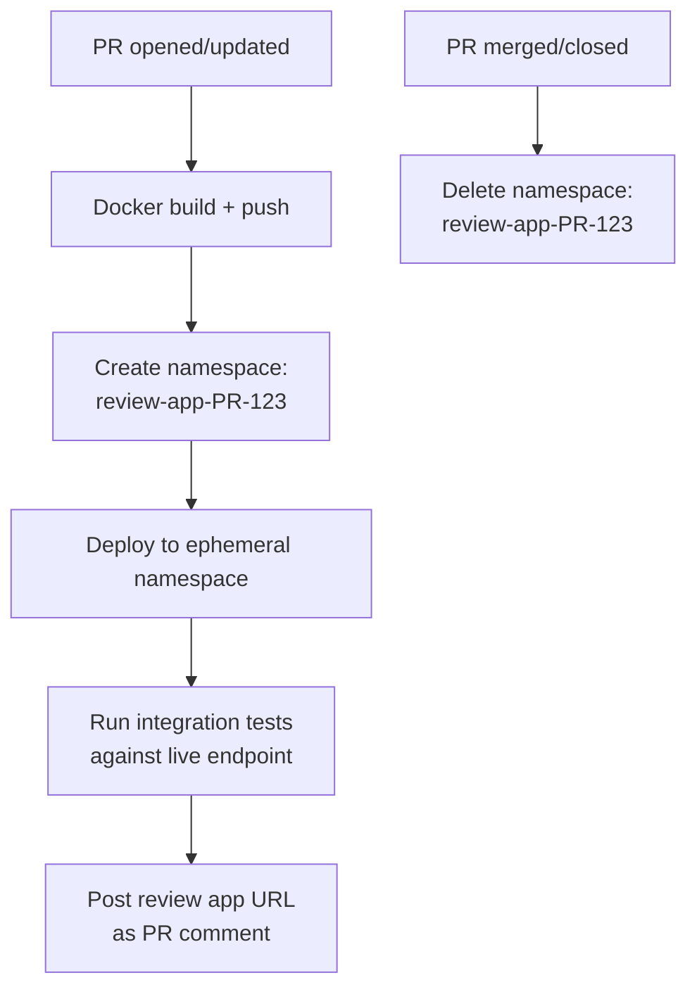
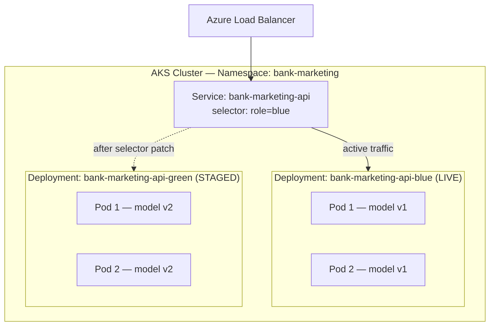
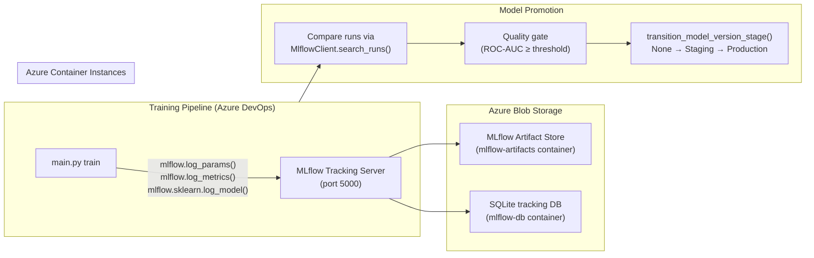
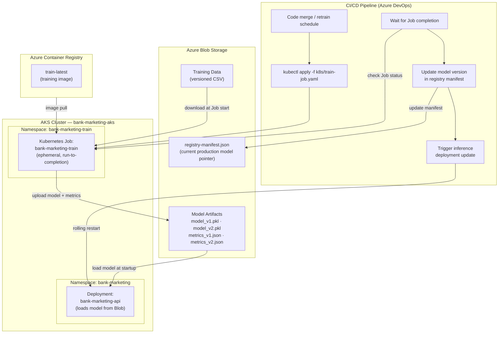

# Future Enhancements

Documented improvements and architectural patterns beyond the current project implementation.

The project already uses namespace-based environment isolation (`bank-marketing` for production, `bank-marketing-dev` for staging) within a single AKS cluster. The patterns below represent the next tiers of deployment maturity above that baseline.

Each section identifies the relevant MLOps maturity level and provides official references to support implementation.

---

## Table of Contents

1. [Ephemeral Per-PR Environments (Review Apps)](#ephemeral-per-pr-environments-review-apps)
2. [Blue-Green Deployment](#blue-green-deployment)
3. [Drift Detection & Automated Retraining](#drift-detection--automated-retraining)
4. [Blob Storage Registry Manifest](#blob-storage-registry-manifest)
5. [MLflow on ACI — Model Registry Upgrade](#mlflow-on-aci--model-registry-upgrade)
6. [AKS-Based Model Training (Kubernetes Job)](#aks-based-model-training-kubernetes-job)

---

## Ephemeral Per-PR Environments (Review Apps)

*Relevant to: CI/CD pipeline — per-PR validation against a live Kubernetes endpoint*
*MLOps maturity level: 3 and above*

Spin up a temporary Kubernetes namespace for each pull request, deploy the PR's container image, run end-to-end tests, and tear down the namespace on merge or PR close.



**How it works:**

1. A PR triggers the CI pipeline, which builds and pushes a container image tagged with the PR ID
2. The CD pipeline creates a new namespace (`review-app-$(System.PullRequest.PullRequestId)`)
3. K8s manifests are deployed into the ephemeral namespace
4. A comment is posted to the PR with the review app URL
5. Reviewers can test the PR's changes against a live endpoint before approving
6. On merge or PR close, the namespace and all its resources are deleted

Azure DevOps natively supports this pattern through **Review Apps** — a built-in feature of Kubernetes environment resources in Azure Pipelines.

**Implementation requirements:**

- Azure DevOps environment with Kubernetes resource configured
- Service connection with permissions to create/delete namespaces
- Pipeline YAML using `reviewApp` step and conditional deployment jobs
- Cleanup automation (namespace deletion on PR close)
- ACR tag strategy for PR images (e.g., `pr-<id>-<sha>`)

| Advantage | Disadvantage |
|---|---|
| Full end-to-end validation per PR | Significant infrastructure complexity |
| Reviewers can interact with a live endpoint | Each PR consumes cluster resources while open |
| Catches integration issues before merge | Requires robust cleanup to avoid namespace sprawl |
| Azure DevOps has built-in Review App support | PR images accumulate in ACR without a retention policy |

**When to adopt:** When the project has a larger team, PRs frequently introduce deployment regressions, or the service is customer-facing with low tolerance for downtime. This pattern aligns with MLOps maturity level 3+ (automated model deployment with full CI/CD).

**Key references** — numbers correspond to [REFERENCES.md](../REFERENCES.md):

- **[39]** Microsoft. [Kubernetes resources in environments](https://learn.microsoft.com/en-us/azure/devops/pipelines/process/environments-kubernetes). Official documentation for Azure DevOps Review Apps — includes a complete YAML pipeline example showing `DeployPullRequest` jobs, dynamic namespace creation (`review-app-$(System.PullRequest.PullRequestId)`), and PR comment automation.
- **[33]** Microsoft. [GitOps for Azure Kubernetes Service](https://learn.microsoft.com/en-us/azure/architecture/example-scenario/gitops-aks/gitops-blueprint-aks). Covers pull-based deployment models using Flux and Argo CD with AKS. Relevant for ephemeral environments because GitOps operators can manage per-PR namespaces through declarative configuration in a Git repository.
- **[12]** Microsoft. [Isolation of environments](https://learn.microsoft.com/en-us/azure/architecture/microservices/ci-cd-kubernetes#isolation-of-environments). Recommends separate dev/test clusters with logical namespace isolation — ephemeral PR environments are a specialisation of this pattern.

---

## Blue-Green Deployment

*Relevant to: Production CD pipeline — model version rollout and rollback*
*MLOps maturity level: 3–4*

### What It Is

Blue-green deployment is a release strategy that maintains **two identical production environments** — one active (blue), one staged (green). The Kubernetes `Service` selector is atomically patched to point from blue to green when the new version is verified. At no point does production traffic split across both versions. The previous environment is held live temporarily to enable instant rollback before being scaled down.

The mechanism is native to Kubernetes: two `Deployment` objects share the same namespace, distinguished by a `role:` label. The `Service` routes exclusively to whichever label is current:



### How It Would Work in This Project

The CD pipeline would follow this sequence on each deployment:

1. Identify the inactive slot (green if blue is live, vice versa)
2. Deploy the new container image (`bank-marketing-api:<sha>`) to the inactive `Deployment`
3. Wait for all pods in the inactive slot to pass their `/health` readiness probes
4. Run smoke tests against a dedicated `ClusterIP` test `Service` pointing at the inactive slot — validating predictions against a known input/output pair before any public traffic is affected
5. Patch the `LoadBalancer` `Service` selector from `role: blue` to `role: green` (or vice versa) — this is the cutover, and it is near-instantaneous
6. Hold the previous slot live for a soak period (e.g., 10 minutes), monitoring error rates
7. If no alerts fire, scale the previous slot to 0 replicas to recover node resources; keep the `Deployment` object for rapid scale-back if needed

Rollback at any point before step 7 is a single command:

```bash
kubectl patch service bank-marketing-api \
  -p '{"spec":{"selector":{"role":"blue"}}}'
```

### Why It Is Not Included in the Current Project

The current project uses Kubernetes **rolling updates** (`strategy.type: RollingUpdate`), which is already zero-downtime. The table below captures why blue-green is deferred:

| Factor | Current (Rolling Update) | Blue-Green |
|---|---|---|
| **Zero-downtime?** | Yes — pods replaced one at a time | Yes — hard cutover, no mixed traffic |
| **Mixed model version traffic** | Briefly possible during rollout | Impossible — all-or-nothing switch |
| **Rollback mechanism** | `kubectl rollout undo` (~30s) | Patch Service selector (~1s) |
| **Pod resource cost** | `replicas: 2` + 1 surge = ~3 pods | 4 pods (2 blue + 2 green) while both slots are live |
| **Pre-cutover smoke test** | Not possible against live cluster | Yes — test against inactive slot before switch |
| **Pipeline complexity** | Low — single `Deployment`, `kubectl apply` | Higher — two named `Deployment`s, test `Service`, selector-patch step, scale-down job |
| **Schema drift risk** | Short window where v1 and v2 serve concurrently | No window — traffic is fully on one version at all times |

**Specific reasons this is deferred for this project:**

1. **Namespace-per-slot overhead**: The production namespace (`bank-marketing`) runs 2 replicas. Blue-green would require 4 pods (2 blue + 2 green) during every deployment window — a 100% pod count increase in the production namespace during cutover — compared to the 3 pods needed during a rolling update (`replicas: 2` + `maxSurge: 1`).

2. **Rolling updates are already safe here**: The `/health` readiness probe (`initialDelaySeconds: 5`) blocks traffic from reaching a pod before `model.pkl` is loaded. The practical mixed-version window with `replicas: 2` and `maxSurge: 1` is on the order of 10–20 seconds — negligible for a batch-scoring use case.

3. **Low deployment frequency**: This is a bank marketing case study with a single model, not a high-frequency production system. The risk profile that justifies blue-green — frequent retraining, multiple concurrent model versions, customer-facing SLA — is not present.

4. **Model is already loaded from Blob Storage at runtime**: Because `model.pkl` is loaded from Azure Blob Storage at pod startup (not baked into the Docker image), model updates only require a pod restart (`kubectl rollout restart`) — not a full image rebuild. Blue-green's benefit of decoupling model version from infra version is already achieved by the current architecture.

5. **MLOps maturity prerequisite**: The Microsoft MLOps maturity model places automated blue-green deployment at level 3–4. The project is currently at level 2 (automated CI/CD, basic monitoring). Strengthening model versioning, multi-environment promotion, and metric-gated rollouts should come before blue-green.

### Prerequisites Before Adopting

Before implementing blue-green, the following capabilities should be in place:

- **Metric-gated cutover**: The selector patch should only be allowed if the staged slot passes a performance threshold (e.g., AUC ≥ 0.80 on a held-out sample) — not just a `/health` check.
- **Automated soak monitoring**: Application Insights alerts should gate the decision to scale down the previous slot, not a hardcoded timer.
- **Parameterised manifests**: Use Helm or Kustomize to template the `role:` label into both `Deployment` definitions, avoiding manifest duplication.

**Key references** — numbers correspond to [REFERENCES.md](../REFERENCES.md):

- **[41]** Kubernetes. [Zero-downtime Deployment in Kubernetes with Jenkins](https://kubernetes.io/blog/2018/04/30/zero-downtime-deployment-kubernetes-jenkins/). Documents the blue/green selector-switching pattern on AKS, including both `Deployment` definitions, the public `Service`, and a separate test `Service` for pre-cutover validation.
- **[12]** Microsoft. [Build a CI/CD pipeline for microservices on Kubernetes](https://learn.microsoft.com/en-us/azure/architecture/microservices/ci-cd-kubernetes). States as a CI/CD goal: *"A new version of a service can be deployed side by side with the previous version"* — blue-green is one of the primary patterns that satisfies this.
- **[9]** Microsoft. [MLOps maturity model](https://learn.microsoft.com/en-us/azure/architecture/ai-ml/guide/mlops-maturity-model). Levels 3–4 describe automated model deployment with full CI/CD including canary and blue-green strategies.

---

## Drift Detection & Automated Retraining

*Relevant to: Retraining pipeline — event-driven triggering from production model monitoring*
*MLOps maturity level: 3–4*

### What It Is

Drift detection continuously monitors inference-time data distributions against a training baseline to identify when a model's inputs (data drift) or outputs (prediction drift) have shifted enough to degrade prediction quality. When drift exceeds a configured threshold, an automated trigger chain invokes the retraining pipeline — removing the need for manual intervention or reliance on a fixed weekly schedule alone.

### Current State

The project's retraining pipeline ([`.azure/retrain.yml`](../.azure/retrain.yml)) already supports three trigger modes:

| Mode | Status | How |
|---|---|---|
| **Manual** | Implemented | ADO UI → Pipelines → retrain → Run pipeline |
| **Scheduled** | Implemented | Cron: `0 2 * * 0` (weekly, Sunday 02:00 UTC) |
| **Event-driven** | Future | Drift alert → Azure Function → ADO Pipelines REST API |

The event-driven path is the subject of this section.

### Proposed Trigger Chain

```mermaid
flowchart LR
    INFER["Inference Service<br/>(AKS)"] -->|"log predictions +<br/>input features"| AI["Application Insights /<br/>Azure ML Data Collection"]
    AI -->|"production data"| MONITOR["Azure ML Model Monitor<br/>(scheduled signal evaluation)"]
    MONITOR -->|"drift exceeds threshold"| EG["Azure Event Grid<br/>(monitoring run completed event)"]
    EG -->|"trigger"| FUNC["Azure Function /<br/>Logic App"]
    FUNC -->|"POST /pipelines/{id}/runs"| ADO["Azure DevOps<br/>Pipelines REST API"]
    ADO -->|"run"| RETRAIN[".azure/retrain.yml<br/>(Retrain → Validate → Deploy)"]
```



**Step-by-step:**

1. **Collect production data** — The inference service logs prediction inputs and outputs to Application Insights or uses Azure ML data collection to store production inference data in Blob Storage.
2. **Monitor for drift** — Azure ML Model Monitor runs on a recurring schedule (e.g., daily) and evaluates monitoring signals against a reference dataset (training data). Supported metrics include Population Stability Index (PSI), Jensen-Shannon Distance, Normalized Wasserstein Distance, and Pearson's Chi-Squared Test.
3. **Fire drift event** — When any signal exceeds its configured threshold, Azure ML emits a monitoring run completed event to Azure Event Grid.
4. **Trigger retraining** — An Azure Function (or Logic App) subscribed to the Event Grid topic inspects the event payload. If the drift severity warrants retraining, it calls the Azure DevOps Pipelines REST API:
   ```
   POST https://dev.azure.com/{org}/{project}/_apis/pipelines/{id}/runs?api-version=7.1
   ```
   This triggers `retrain.yml` with the appropriate `dataBlob` parameter pointing to the latest versioned training data in Azure Blob Storage.
5. **Quality gate + deploy** — The retraining pipeline's existing `ValidateModel` stage (ROC-AUC regression gate) and staged deployment (staging → production with manual approval) ensure that a drift-triggered retrain does not deploy a worse model.

### Why It Is Not Included in the Current Project

| Factor | Rationale |
|---|---|
| **MLOps maturity** | Event-driven retraining is an MLOps level 3–4 capability. The project is currently at level 2 with manual + scheduled retraining. |
| **Requires Azure ML workspace** | Model Monitor depends on an Azure ML workspace for compute, data collection, and signal evaluation — infrastructure not yet provisioned. |
| **Production data collection** | The inference service does not yet log prediction inputs/outputs to a data store. Adding this requires either Application Insights custom events or Azure ML data collection middleware. |
| **Drift threshold calibration** | Effective thresholds (e.g., PSI > 0.2) require a baseline period of production data to establish normal variance. Setting thresholds prematurely leads to alert fatigue or missed drift. |
| **Weekly schedule is sufficient** | For a bank marketing classification model with low-frequency data changes, the existing weekly cron trigger provides adequate freshness. Event-driven retraining adds value when data distributions shift unpredictably or at high frequency. |

### Prerequisites Before Adopting

Before implementing event-driven retraining, the following capabilities should be in place:

- **Production inference logging**: Instrument the FastAPI inference service to log prediction inputs and outputs — either via Application Insights custom telemetry or Azure ML data collection on the AKS endpoint.
- **Azure ML workspace**: Provision an Azure ML workspace and configure a Model Monitor schedule with appropriate signals (data drift + prediction drift at minimum) and reference data (training dataset).
- **Event Grid subscription**: Create an Azure Event Grid system topic for the Azure ML workspace and subscribe an Azure Function to monitoring run completed events.
- **Azure Function**: Implement a lightweight function that parses the drift event payload, evaluates severity, and conditionally calls the ADO Pipelines REST API with the correct pipeline ID and `dataBlob` parameter.
- **Service principal permissions**: The Azure Function's managed identity needs permission to trigger pipeline runs via the ADO REST API (PAT or OAuth with `Build.Queue` scope).
- **Drift threshold baseline**: Collect 4–8 weeks of production inference data to establish normal feature distribution variance before setting alert thresholds.

### Drift Metrics Reference

Azure ML Model Monitor supports the following drift signals relevant to this project:

| Signal | Metrics | Use Case |
|---|---|---|
| **Data drift** | Jensen-Shannon Distance, PSI, Normalized Wasserstein Distance, Two-Sample Kolmogorov-Smirnov Test, Pearson's Chi-Squared Test | Detect shifts in model input feature distributions (e.g., `age`, `balance`, `duration` distributions changing over time) |
| **Prediction drift** | Jensen-Shannon Distance, PSI, Chebyshev Distance | Detect shifts in model output distribution (e.g., predicted probability distribution skewing) |
| **Data quality** | Null value rate, data type error rate, out-of-bounds rate | Detect upstream data pipeline issues before they cause silent model degradation |

For this project's bank marketing classification model, **data drift on input features** is the primary signal — particularly on high-importance features like `duration`, `balance`, and `poutcome` — combined with **prediction drift** as a secondary confirmation signal.

**Key references** — numbers correspond to [REFERENCES.md](../REFERENCES.md):

- **[68]** Microsoft. [Azure Machine Learning model monitoring](https://learn.microsoft.com/en-us/azure/machine-learning/concept-model-monitoring). Official documentation for Azure ML Model Monitor (v2) — covers built-in monitoring signals (data drift, prediction drift, data quality, feature attribution drift), supported metrics (PSI, Jensen-Shannon Distance, Wasserstein Distance), Event Grid integration for event-driven actions, and best practices for threshold calibration and monitoring frequency.
- **[69]** Microsoft. [Azure Monitor alerts overview](https://learn.microsoft.com/en-us/azure/azure-monitor/alerts/alerts-overview). Comprehensive reference for Azure Monitor alert types (metric, log search, activity log), action groups (email, webhook, Azure Function, Logic App), and stateful vs stateless alert behaviour — the alerting layer that connects drift detection to automated responses.
- **[70]** Microsoft. [Azure Machine Learning — Use Event Grid](https://learn.microsoft.com/en-us/azure/machine-learning/how-to-use-event-grid). Documents how to subscribe to Azure ML workspace events (including model monitoring run completed events) via Azure Event Grid — the integration point that enables the drift alert → Azure Function → ADO pipeline trigger chain.

---

## Blob Storage Registry Manifest

*Relevant to: Model promotion workflow — traceability and auditability*
*MLOps maturity level: 1–2*
*Prerequisite: Blob versioning enabled (I14)*

### Context

The current model registry uses [prefix-based Azure Blob Storage promotion](design-tradeoffs.md#prefix-based-azure-blob-storage-over-mlflow-on-aci-for-model-registry) — artifacts flow from `builds/<buildId>/` → `staging/artifacts/` → `production/artifacts/`. This works well at case study scale, but does not record *which* build produced the current production model, what its evaluation metrics were, or when promotion occurred.

A **registry manifest file** (`artifacts/registry-manifest.json`) would sit alongside the existing prefix-based promotion and capture this metadata — providing richer traceability without introducing new infrastructure.

### Manifest Schema

```json
{
  "git_commit": "a3f5e21",
  "blob_version_id": "01D8A3F5E21B4C7D...",
  "promoted_at": "2026-03-24T12:00:00Z",
  "roc_auc": 0.912,
  "accuracy": 0.899
}
```

### What It Enables

- **Audit trail** — answer "which commit and build produced the current production model?" without inspecting pipeline logs
- **Metric comparison** — compare the current production model's metrics against a candidate before promotion
- **Rollback targeting** — identify the previous production model's `blob_version_id` to restore, rather than guessing which build prefix to re-copy
- **Blob versioning integration** — when Blob versioning is enabled (I14), the `blob_version_id` field provides an immutable pointer to the exact artifact version

### Implementation

After the existing `joblib.dump()` call in `main.py train`, write the manifest:

```python
import json, datetime

manifest = {
    "git_commit": os.environ.get("BUILD_SOURCEVERSION", "local"),
    "blob_version_id": blob_version_id,  # from Blob upload response
    "promoted_at": datetime.datetime.utcnow().isoformat() + "Z",
    "roc_auc": metrics["roc_auc"],
    "accuracy": metrics["accuracy"],
}
with open("artifacts/registry-manifest.json", "w") as f:
    json.dump(manifest, f, indent=2)
```

The manifest file is uploaded alongside `model.pkl` and `metrics.json` during the existing Blob upload step. The CI/CD pipeline's promotion stage copies it along with the other artifacts.

### When to Adopt

Adopt when the project needs to answer promotion audit questions programmatically — e.g., "what model is in production, when was it promoted, and what were its metrics?" — without relying on pipeline run history alone.

---

## MLflow on ACI — Model Registry Upgrade

*Relevant to: Training pipeline and model promotion workflow*
*MLOps maturity level: 2–3*

### Context

The current model registry uses [prefix-based Azure Blob Storage promotion](design-tradeoffs.md#prefix-based-azure-blob-storage-over-mlflow-on-aci-for-model-registry) — chosen because it introduces zero new infrastructure, uses the existing Blob Storage account, and proportionately fits a case study with a single model type and weekly retraining. The tradeoff accepted is that cross-run experiment comparison and a formal stage lifecycle are not available.

MLflow on ACI becomes the right upgrade when the project outgrows the prefix-based approach — specifically when:

- More than a handful of experimental runs need to be compared simultaneously (e.g., hyperparameter search, feature engineering variants)
- A formal `Staging → Production` promotion workflow with team approval is needed
- Downstream tooling (e.g., an A/B testing framework or multi-model serving layer) needs to query a model registry API rather than read from Blob prefixes

### Architecture



### Implementation Plan

**1. Provision the MLflow container on ACI**

```bash
# Build and push the MLflow image to ACR
docker build -t bankmarketingacr.azurecr.io/mlflow-server:latest -f Dockerfile.mlflow .
az acr login --name bankmarketingacr
docker push bankmarketingacr.azurecr.io/mlflow-server:latest

# Deploy to ACI with Blob Storage backend
az container create \
  --resource-group rg-bank-marketing \
  --name mlflow-server \
  --image bankmarketingacr.azurecr.io/mlflow-server:latest \
  --ports 5000 \
  --environment-variables \
    MLFLOW_BACKEND_STORE_URI=sqlite:///mlflow.db \
    MLFLOW_DEFAULT_ARTIFACT_ROOT=wasbs://mlflow-artifacts@<storage-account>.blob.core.windows.net/ \
  --dns-name-label bank-marketing-mlflow \
  --cpu 0.5 --memory 1
```

**2. Instrument `src/train.py` and `src/evaluate.py`**

Replace the current `joblib.dump()` + `metrics.json` write sequence with MLflow logging:

```python
import mlflow
import mlflow.sklearn

mlflow.set_tracking_uri(os.environ["MLFLOW_TRACKING_URI"])
mlflow.set_experiment("bank-marketing-classifier")

with mlflow.start_run():
    mlflow.log_params(config["model"])
    # ... train pipeline ...
    mlflow.log_metric("roc_auc", roc_auc)
    mlflow.log_metric("accuracy", accuracy)
    mlflow.sklearn.log_model(pipeline, "model", registered_model_name="bank-marketing-pipeline")
```

**3. Update the retraining quality gate**

Replace the current `metrics.json` regression check with an `MlflowClient.search_runs()` query that compares the new run against the last Production-stage model:

```python
client = MlflowClient()
production_versions = client.get_latest_versions("bank-marketing-pipeline", stages=["Production"])
baseline_auc = float(client.get_run(production_versions[0].run_id).data.metrics["roc_auc"])
if new_auc < baseline_auc - 0.02:
    raise ValueError(f"ROC-AUC regression: {new_auc:.3f} vs baseline {baseline_auc:.3f}")
client.transition_model_version_stage("bank-marketing-pipeline", new_version, "Production")
```

### Cost

| Resource | SKU | Estimated monthly cost |
|---|---|---|
| ACI container (0.5 vCPU, 1 GB) | Standard | ~£3–5 |
| Blob Storage (MLflow artifacts + SQLite DB) | LRS, hot tier | Negligible (<£1 for small model files) |
| **Total** | | **~£4–6/month** |

### Prerequisites Before Adopting

- **Blob Storage versioning enabled** (I14) — the Blob container used as the MLflow artifact store needs versioning for immutable artifact history
- **ACR access from ACI** — the ACI instance needs an ACR pull identity or admin credentials to pull the MLflow image
- **`MLFLOW_TRACKING_URI` as a pipeline secret** — store the ACI FQDN as an Azure DevOps variable group secret; inject into training and evaluation pipeline stages
- **Network policy review** — if the ACI instance is on the same VNet as AKS, ensure the MLflow port (5000) is reachable from ADO agents

### Why It Is Not Included in the Current Project

| Factor | Rationale |
|---|---|
| **No multi-run comparison need** | One model type, one hyperparameter set, weekly retraining — there is no queue of experimental runs to compare |
| **Existing approach is sufficient** | Prefix-based Blob promotion captures the necessary artifacts per environment; a [registry manifest](future-enhancements.md#blob-storage-registry-manifest) can add richer traceability without new infrastructure |
| **New operational surface** | MLflow on ACI is a service that can go down, need restart, and accrue a failure mode. Adding it before the baseline is production-stable increases operational risk |
| **Cost proportionality** | £3–5/month is low, but the operational overhead is disproportionate to the value delivered at case study scale |

**Key references** — numbers correspond to [REFERENCES.md](../REFERENCES.md):

- **[71]** MLflow. [MLflow Tracking](https://mlflow.org/docs/latest/tracking.html). Official documentation for the MLflow Tracking API — covers `mlflow.log_params()`, `mlflow.log_metrics()`, `mlflow.sklearn.log_model()`, and the backend store / artifact store configuration options used when deploying on ACI.
- **[72]** MLflow. [MLflow Model Registry](https://mlflow.org/docs/latest/model-registry.html). Documents the `MlflowClient` API for model registration, version management, and stage transitions (`None → Staging → Production → Archived`) — the promotion workflow that replaces the current prefix-based approach when upgrading.
- **[73]** Microsoft. [Azure Container Instances documentation](https://learn.microsoft.com/en-us/azure/container-instances/). Official ACI reference covering container group deployment, environment variable configuration, DNS label setup, and VNet integration — the deployment target for the MLflow server.

---

## AKS-Based Model Training (Kubernetes Job)

*Relevant to: Training pipeline — moving model training from CI agent to AKS cluster*
*MLOps maturity level: 3–4*
*Prerequisite maturity: Monitoring, Security, Governance, Operational Readiness*

### Context

The current architecture runs model training as a **Docker container on the CI agent** (Azure DevOps Microsoft-hosted agent). The training container (`Dockerfile.train`) executes `python main.py train`, writes `model.pkl` + `metrics.json` to the agent's file system (or uploads to Azure Blob Storage via the existing `STORAGE_BACKEND` env vars), and the CI pipeline hands the artifacts to the inference image build step. The training image is also pushed to ACR for reuse by the retraining pipeline.

This is the right choice for the project's current scale — single model, small dataset (< 10 MB), training completes in seconds, and no GPU is required. A separate Kubernetes deployment for training adds operational complexity disproportionate to the benefit at this stage.

AKS-based training becomes the right upgrade when training workloads outgrow the CI agent's constraints — specifically when training requires GPU access, takes longer than the pipeline timeout allows, or needs to be decoupled from the CI/CD agent lifecycle entirely.

### What Changes

Training moves from a `docker run` step on the CI agent to a **Kubernetes Job** submitted to the AKS cluster. The training container remains identical (same `Dockerfile.train`, same `python main.py train` entrypoint) — only the execution environment changes.

| Concern | Current (CI agent) | AKS Job (this enhancement) |
|---|---|---|
| **Execution environment** | Docker on Microsoft-hosted agent | Kubernetes Job on AKS node pool |
| **Data input** | Volume mount from agent file system | Azure Blob Storage (direct download or Blob FUSE) |
| **Artifact output** | Volume mount → agent file system → pipeline artifact | Azure Blob Storage (versioned, durable) |
| **Model handoff to inference** | Inference pods load model from Blob Storage at runtime via `MODEL_BLOB_PREFIX` | Inference service loads model from Blob Storage at startup or redeploy |
| **GPU access** | Not available on standard agents | Available via GPU node pool on AKS |
| **Training duration** | Constrained by pipeline job timeout (default 60 min) | Constrained only by Job `activeDeadlineSeconds` |
| **Reproducibility** | Depends on agent image version | Fixed container image from ACR (`train-latest`) |
| **Cost** | Included in ADO agent minutes | AKS node pool compute (can use spot instances) |

### Architecture



### End-to-End Flow

**1. CI/CD pipeline triggers training**

The pipeline (either Pipeline 2 on code merge or Pipeline 3 on a retrain schedule) submits a Kubernetes Job manifest to the AKS cluster:

```bash
kubectl apply -f k8s/train-job.yaml -n bank-marketing-train
```

The Job manifest references the `train-latest` image from ACR — the same image already pushed by the current `TrainModel` stage. No new image build is required.

**2. Training Job executes on AKS**

The Job pod starts, downloads the versioned training CSV from Azure Blob Storage, runs `python main.py train`, and uploads the resulting `model.pkl` and `metrics.json` to a versioned path in Blob Storage:

```
models/
  model_v1.pkl
  model_v2.pkl        ← new
  metrics_v1.json
  metrics_v2.json     ← new
```

The Job is **stateless and ephemeral** — it reads from Blob, writes to Blob, and terminates. No local state persists after completion.

**3. Model validation and versioning**

The pipeline waits for Job completion (`kubectl wait --for=condition=complete`), then runs the existing quality gate — comparing the new model's ROC-AUC against the production baseline from `registry-manifest.json`. If the new model passes:

- The manifest is updated with the new model version, blob version ID, metrics, and promotion timestamp
- The updated manifest is uploaded to Blob Storage

**4. Inference deployment update**

With the new model promoted, the pipeline triggers an update to the inference Deployment. The current project already uses **runtime model loading** — inference pods download `model.pkl` from Azure Blob Storage at startup via `MODEL_BLOB_PREFIX`. A rolling restart (`kubectl rollout restart deployment/bank-marketing-api`) triggers all pods to reload the latest model. No image rebuild is needed for model-only updates.

**5. Verification**

The pipeline runs the existing smoke test against the inference endpoint to confirm the new model is serving correctly.

### Kubernetes Job Manifest

A representative `k8s/train-job.yaml` for the training Job:

```yaml
apiVersion: batch/v1
kind: Job
metadata:
  name: bank-marketing-train
  namespace: bank-marketing-train
spec:
  backoffLimit: 2
  activeDeadlineSeconds: 3600
  ttlSecondsAfterFinished: 600
  template:
    spec:
      restartPolicy: Never
      containers:
        - name: train
          image: bankmarketingacr.azurecr.io/bank-marketing-train:train-latest
          env:
            - name: BLOB_STORAGE_ACCOUNT
              valueFrom:
                secretKeyRef:
                  name: training-secrets
                  key: blob-storage-account
            - name: BLOB_CONTAINER
              valueFrom:
                secretKeyRef:
                  name: training-secrets
                  key: blob-container
            - name: MODEL_VERSION
              value: "v2"
          resources:
            requests:
              cpu: "500m"
              memory: "1Gi"
            limits:
              cpu: "1"
              memory: "2Gi"
```

| Field | Purpose |
|---|---|
| `backoffLimit: 2` | Retry up to 2 times on failure before marking the Job as failed |
| `activeDeadlineSeconds: 3600` | Hard timeout — kill the Job if training exceeds 1 hour |
| `ttlSecondsAfterFinished: 600` | Auto-cleanup — remove the completed Job after 10 minutes |
| `restartPolicy: Never` | Failed pods are not restarted — the Job controller handles retries via `backoffLimit` |

### Namespace Isolation

Training runs in a dedicated `bank-marketing-train` namespace, separate from both inference namespaces. This provides:

- **Resource isolation** — a `ResourceQuota` on the training namespace prevents a runaway training job from starving inference pods
- **RBAC isolation** — the CI/CD service principal can be scoped to create/delete Jobs in the training namespace only
- **Network isolation** — a `NetworkPolicy` can restrict the training pod's egress to Blob Storage only

### Model Versioning

Each training run produces a versioned model artifact in Blob Storage. The `registry-manifest.json` file serves as a lightweight model registry:

```json
{
  "current_production": "v2",
  "models": {
    "v1": {
      "blob_path": "models/model_v1.pkl",
      "blob_version_id": "01D8A3F5E21B4C7D...",
      "git_commit": "a3f5e21",
      "roc_auc": 0.908,
      "accuracy": 0.895,
      "trained_at": "2026-03-17T02:00:00Z",
      "promoted_at": "2026-03-17T02:15:00Z"
    },
    "v2": {
      "blob_path": "models/model_v2.pkl",
      "blob_version_id": "01D8B7F9A32E5D1F...",
      "git_commit": "b7f9a32",
      "roc_auc": 0.912,
      "accuracy": 0.899,
      "trained_at": "2026-03-24T02:00:00Z",
      "promoted_at": "2026-03-24T02:18:00Z"
    }
  }
}
```

This manifest is the single source of truth for which model is in production. The inference service reads it at startup to determine which artifact to load. The pattern extends naturally to MLflow (see [§4 — MLflow on ACI](#mlflow-on-aci--model-registry-upgrade)) when the project outgrows manifest-based tracking.

### CI/CD Integration

The pipeline changes are additive — the existing stages remain, with the `TrainModel` stage updated to submit a Kubernetes Job instead of running `docker run` on the agent:

| Pipeline | Current behaviour | With AKS training |
|---|---|---|
| **Pipeline 2** (CI/CD) | `TrainModel` runs `docker run` on agent → artifacts on agent file system | `TrainModel` submits K8s Job → artifacts in Blob Storage |
| **Pipeline 3** (retrain) | Pulls `train-latest` from ACR, runs on agent | Submits K8s Job using `train-latest` image |
| **Pipeline 1** (PR validation) | Builds and runs training locally on agent | **No change** — PR validation continues to run on the agent for fast feedback |

The pipeline's `TrainModel` stage becomes:

```yaml
# Submit training Job to AKS
- task: Kubernetes@1
  inputs:
    connectionType: 'Azure Resource Manager'
    azureSubscriptionEndpoint: '$(AZURE_SUB_CONNECTION)'
    azureResourceGroup: '$(RESOURCE_GROUP)'
    kubernetesCluster: '$(AKS_CLUSTER)'
    command: 'apply'
    arguments: '-f k8s/train-job.yaml -n bank-marketing-train'

# Wait for Job completion (timeout matches activeDeadlineSeconds)
- script: |
    kubectl wait --for=condition=complete \
      job/bank-marketing-train \
      -n bank-marketing-train \
      --timeout=3600s
  displayName: 'Wait for training Job to complete'

# Download model artifacts from Blob Storage
- task: AzureCLI@2
  inputs:
    azureSubscription: '$(AZURE_SUB_CONNECTION)'
    scriptType: 'bash'
    scriptLocation: 'inlineScript'
    inlineScript: |
      az storage blob download \
        --account-name $(BLOB_STORAGE_ACCOUNT) \
        --container-name $(BLOB_CONTAINER_TRAINING) \
        --name models/model_$(MODEL_VERSION).pkl \
        --file $(Build.ArtifactStagingDirectory)/model.pkl
```

### Why It Is Not Included in the Current Project

| Factor | Rationale |
|---|---|
| **CI agent is sufficient** | The training dataset is < 10 MB, model training completes in seconds, and no GPU is required. Running on the CI agent is simpler and free (included in ADO agent minutes). |
| **Operational maturity prerequisite** | AKS-based training adds a new failure surface (Job scheduling, Blob I/O, namespace management). The cluster must first have production-grade monitoring (I8/I9), security scanning (I2/I3), API authentication (I6), and operational runbooks (I13) before adding training workloads. |
| **MLOps maturity level** | AKS-based training is an MLOps level 3–4 capability. The project is currently targeting level 2 (automated CI/CD with quality gates). |
| **Model/inference decoupling not yet needed** | The current pattern of baking `model.pkl` into the inference image works for a single model with weekly retraining. Runtime model loading from Blob Storage introduces complexity (startup latency, Blob availability dependency, cache invalidation) that is unjustified at this scale. |
| **Cost** | Training on the CI agent is included in the ADO pipeline minutes. AKS-based training uses cluster node minutes, and may require a larger or GPU-enabled node pool — a cost increase with no benefit at current scale. |

### Prerequisites Before Adopting

The following capabilities should be in place before moving training to AKS:

- **Production monitoring and alerting** (I8, I9) — must be able to observe and alert on Job failures, pod resource usage, and training duration
- **Security scanning in CI/CD** (I2, I3) — training images must be scanned before they execute in the cluster
- **API authentication** (I6) — the inference endpoint must be secured before adding new workloads to the cluster
- **Blob Storage model registry** (I16) — model artifacts must already be stored in versioned Blob Storage with the manifest pattern
- **Operational runbook** (I13) — must include training Job failure diagnosis and recovery procedures
- **Network policies** (I7) — training namespace must be isolated from inference namespaces
- **Kubernetes RBAC** — CI/CD service principal scoped to create/manage Jobs in `bank-marketing-train` only

### When to Adopt

This enhancement becomes the right choice when any of the following conditions are met:

| Condition | Why AKS training helps |
|---|---|
| Training requires **GPU compute** | AKS supports GPU node pools; CI agents do not (without self-hosted agents) |
| Training takes **> 30 minutes** | Pipeline timeouts become a constraint; a Job can run independently |
| Training frequency increases to **daily or event-driven** | Decoupling training from the CI pipeline avoids blocking code deployments |
| Multiple models need **concurrent training** | Kubernetes Job parallelism handles this natively |
| **Regulatory requirements** mandate training within a controlled compute boundary | AKS with VNet integration and private endpoints satisfies compliance controls |

**Key references** — numbers correspond to [REFERENCES.md](../REFERENCES.md):

- **[74]** Kubernetes. [Jobs](https://kubernetes.io/docs/concepts/workloads/controllers/jobs-run-to-completion/). Official documentation for the Kubernetes Job controller — covers `backoffLimit`, `activeDeadlineSeconds`, `ttlSecondsAfterFinished`, `completions`, `parallelism`, and pod failure handling. The execution model for AKS-based training.
- **[75]** Microsoft. [Kubernetes workload management on AKS](https://learn.microsoft.com/en-us/azure/aks/concepts-clusters-workloads#jobs-and-cron-jobs). AKS-specific documentation for running Jobs and CronJobs — covers node pool selection, resource requests/limits, and integration with Azure Monitor for Job observability.
- **[76]** Microsoft. [Use GPUs for compute-intensive workloads on AKS](https://learn.microsoft.com/en-us/azure/aks/gpu-cluster). GPU node pool provisioning on AKS — the prerequisite for GPU-accelerated training Jobs when the project graduates to heavier models.
- **[77]** Microsoft. [Azure Blob Storage documentation](https://learn.microsoft.com/en-us/azure/storage/blobs/). Core reference for Blob Storage operations — upload, download, versioning, soft delete, and managed identity access. The artifact store for training inputs and outputs.
