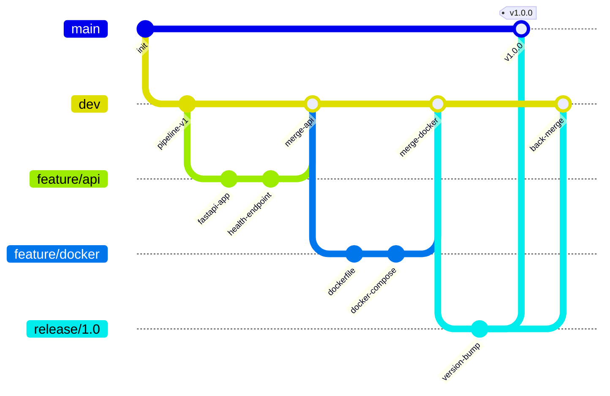
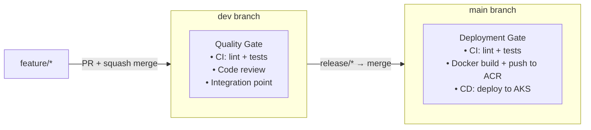
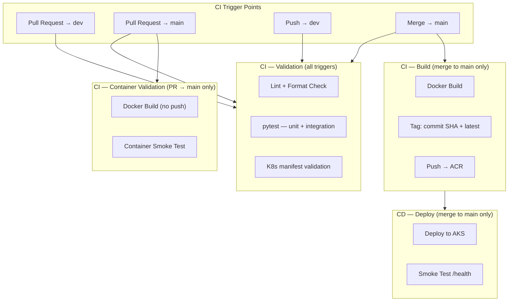
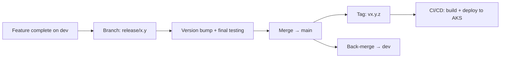

# Git Workflow

Branching strategy, CI trigger points, and release flow for the Bank Marketing MLOps project.

---

## Branching Strategy (GitFlow)

---

## Branch Roles

| Branch | Purpose | Lifetime | Protected |
|---|---|---|---|
| `main` | Production-ready code. Every commit is deployable. | Permanent | Yes |
| `dev` | Integration branch. Accumulates completed features. | Permanent | Yes |
| `feature/*` | Individual feature or fix work. Branches from `dev`. | Temporary | No |
| `release/*` | Stabilisation before production. Branches from `dev`. | Temporary | No |
| `hotfix/*` | Emergency production fixes. Branches from `main`. | Temporary | No |

---

## Single-Environment Strategy

This project deploys to **one AKS environment** (production). There is no separate dev/staging cluster.

The `dev` and `main` branches remain valuable — but as **quality gates**, not environment targets:

| Branch | Role in single-environment setup |
|---|---|
| `dev` | **Validation gate.** All feature work integrates here. CI runs tests on every PR and push. No images are built, no deployments happen. This is where you catch bugs before they reach `main`. |
| `main` | **Deployment gate.** Only release-ready code reaches here. Merging to `main` triggers the full pipeline: test → build → push to ACR → deploy to AKS. |
| `feature/*` | Short-lived branches. PR into `dev` triggers CI validation. |

### Why not skip `dev` and merge straight to `main`?

- **Integration buffer**: Multiple features can land on `dev` and be tested together before a release. If feature B breaks feature A, you find out on `dev` — not in production.
- **Release batching**: You control when a set of changes gets promoted. Not every merged feature needs to deploy immediately.
- **Hotfix isolation**: Emergency fixes go `hotfix/*` → `main` directly, without waiting for in-progress features on `dev`.

### Why not build Docker images on `dev` pushes?

With no dev environment to deploy to, building images on `dev` is waste. The CI pipeline on `dev` validates that tests pass and code is correct. The Docker build + push only happens when code reaches `main` — because that's the only branch that triggers a deployment.

---

## CI Trigger Points

| Trigger | Pipeline Stage | Description |
|---|---|---|
| PR opened/updated → `dev` | Validation | Run tests + K8s manifest validation. No build, no deploy. |
| PR opened/updated → `main` | Validation + Container Build | Run tests, K8s manifest validation, Docker build (no push) + container smoke test. No push, no deploy. |
| Push to `dev` | Validation + Container Smoke | Run tests + K8s manifest validation + local container smoke test. No push, no deploy. |
| Merge to `main` (release) | Validation + Build + Deploy | Run tests → K8s manifest validation → build image → push to ACR → deploy to AKS. |

---

## Merge Strategy

- **Feature → dev**: Squash merge. Keeps `dev` history clean.
- **Release → main**: Merge commit. Preserves the release boundary in history.
- **Release → dev**: Back-merge. Ensures `dev` includes any release-branch fixes.
- **Hotfix → main**: Merge commit. Then back-merge to `dev`.

### PR Requirements (Protected Branches)

For merges into `dev` or `main`:

- All CI checks must pass (tests green)
- At least one code review approval
- No unresolved comments
- Branch must be up to date with target

---

## Release Flow

### Steps

1. When `dev` is feature-complete for a release, branch `release/x.y` from `dev`
2. On the release branch: bump version, run final integration tests, fix release-only issues
3. Merge `release/x.y` → `main` (merge commit)
4. Tag `main` with `vx.y.z`
5. CI/CD triggers: build image, push to ACR with version tag, deploy to AKS
6. Back-merge `release/x.y` → `dev` to sync any release-branch fixes

---

## Naming Conventions

| Branch Type | Pattern | Example |
|---|---|---|
| Feature | `feature/<short-description>` | `feature/api-health-check` |
| Release | `release/<major.minor>` | `release/1.0` |
| Hotfix | `hotfix/<short-description>` | `hotfix/model-load-fix` |
| Tags | `v<major.minor.patch>` | `v1.0.0` |
