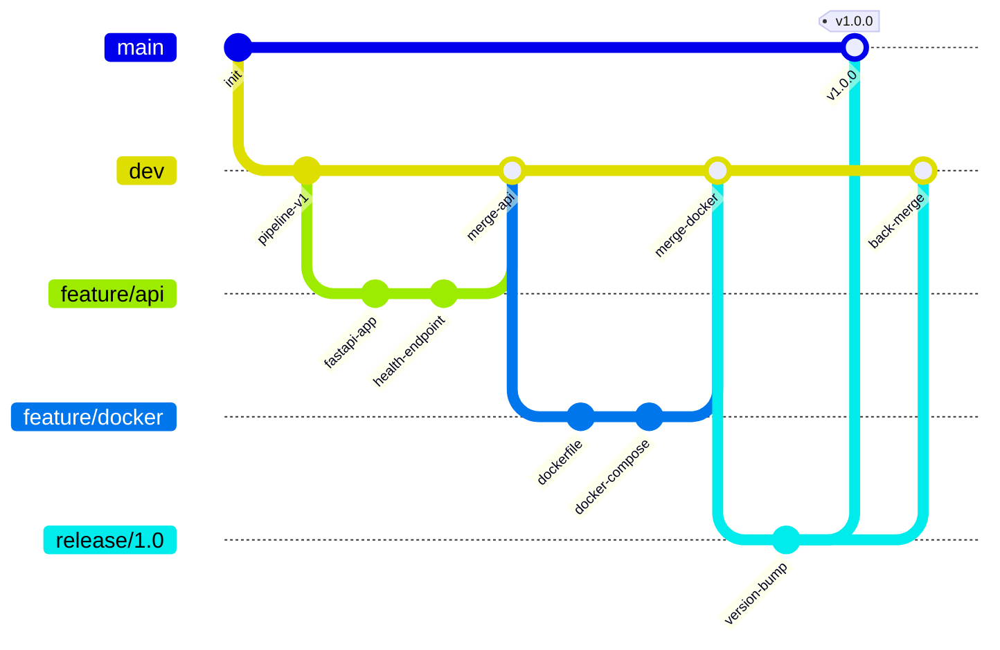
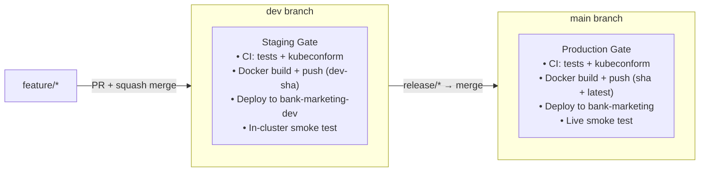
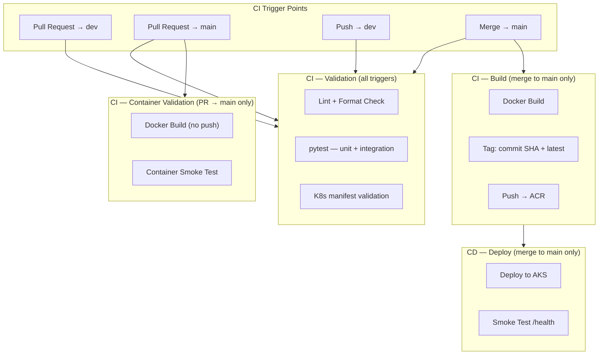
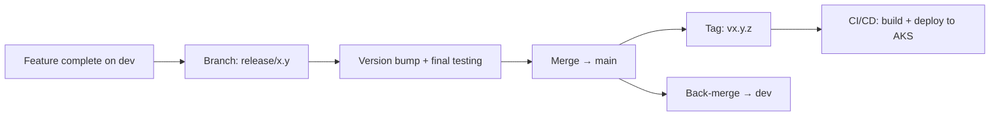

# Git Workflow

Branching strategy, CI trigger points, and release flow for the Bank Marketing MLOps project.

---

## Branching Strategy (GitFlow)

---

## Branch Roles

| Branch | Purpose | Lifetime | Protected |
|---|---|---|---|
| `main` | Production-ready code. Every commit is deployable. | Permanent | Yes |
| `dev` | Integration branch. Accumulates completed features. | Permanent | Yes |
| `feature/*` | Individual feature or fix work. Branches from `dev`. | Temporary | No |
| `release/*` | Stabilisation before production. Branches from `dev`. | Temporary | No |
| `hotfix/*` | Emergency production fixes. Branches from `main`. | Temporary | No |

---

## Environment Strategy

This project deploys to **two Kubernetes namespaces within the same AKS cluster** — `bank-marketing-dev` (staging) and `bank-marketing` (production). There is no separate dev/staging cluster; namespace isolation keeps infrastructure cost flat while providing a real deployment gate on the `dev` branch.

| Branch | Role in namespace-isolated setup |
|---|---|
| `dev` | **Staging gate.** All feature work integrates here. On merge, a `dev-<sha>` image is pushed to ACR and deployed to `bank-marketing-dev`. In-cluster smoke tests run against the `ClusterIP` service. Catches scheduling failures, image pull errors, and model loading crashes before `main`. |
| `main` | **Production gate.** Only release-ready code reaches here. Merging to `main` triggers the full pipeline: test → build → push to ACR (`<sha>` + `latest`) → deploy to `bank-marketing` → live smoke test. |
| `feature/*` | Short-lived branches. PR into `dev` triggers CI validation and a local container smoke test. |

### Why namespace isolation instead of a second cluster?

- **Cost**: A second AKS cluster adds fixed node-pool costs even when idle. Namespace isolation reuses existing nodes with a `ResourceQuota` cap to protect production pods.
- **Operational simplicity**: One cluster to monitor, one ACR, one set of access credentials. Microsoft's [AKS isolation best practices](https://learn.microsoft.com/en-us/azure/aks/operator-best-practices-cluster-isolation) explicitly recommends logical isolation over physical: *"Minimize the number of physical AKS clusters you deploy."*
- **Gate quality**: Deploying to the same real AKS cluster (different namespace) catches ACR pull failures, pod scheduling issues, health probe timing, and K8s network behaviour that `--dry-run=server` never exercises.

---

## CI Trigger Points

| Trigger | Pipeline Stage | Description |
|---|---|---|
| PR opened/updated → `dev` | Validation | Run tests + K8s manifest validation + local container smoke test. No push, no deploy. |
| PR opened/updated → `main` | Validation + Container Build | Run tests, K8s manifest validation, Docker build (no push) + container smoke test. No push, no deploy. |
| Push to `dev` | Validation + Staging Deploy | Run tests + kubeconform → build image → push `dev-<sha>` to ACR → deploy to `bank-marketing-dev` → in-cluster smoke test. |
| Merge to `main` (release) | Validation + Build + Deploy | Run tests → kubeconform → build image → push `<sha>` + `latest` to ACR → deploy to `bank-marketing` → live smoke test. |

---

## Merge Strategy

- **Feature → dev**: Squash merge. Keeps `dev` history clean.
- **Release → main**: Merge commit. Preserves the release boundary in history.
- **Release → dev**: Back-merge. Ensures `dev` includes any release-branch fixes.
- **Hotfix → main**: Merge commit. Then back-merge to `dev`.

### PR Requirements (Protected Branches)

For merges into `dev` or `main`:

- All CI checks must pass (tests green)
- At least one code review approval
- No unresolved comments
- Branch must be up to date with target

---

## Release Flow

### Steps

1. When `dev` is feature-complete for a release, branch `release/x.y` from `dev`
2. On the release branch: bump version, run final integration tests, fix release-only issues
3. Merge `release/x.y` → `main` (merge commit)
4. Tag `main` with `vx.y.z`
5. CI/CD triggers: build image, push to ACR with version tag, deploy to AKS
6. Back-merge `release/x.y` → `dev` to sync any release-branch fixes

---

## Naming Conventions

| Branch Type | Pattern | Example |
|---|---|---|
| Feature | `feature/<short-description>` | `feature/api-health-check` |
| Release | `release/<major.minor>` | `release/1.0` |
| Hotfix | `hotfix/<short-description>` | `hotfix/model-load-fix` |
| Tags | `v<major.minor.patch>` | `v1.0.0` |
