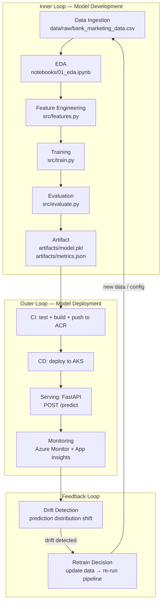
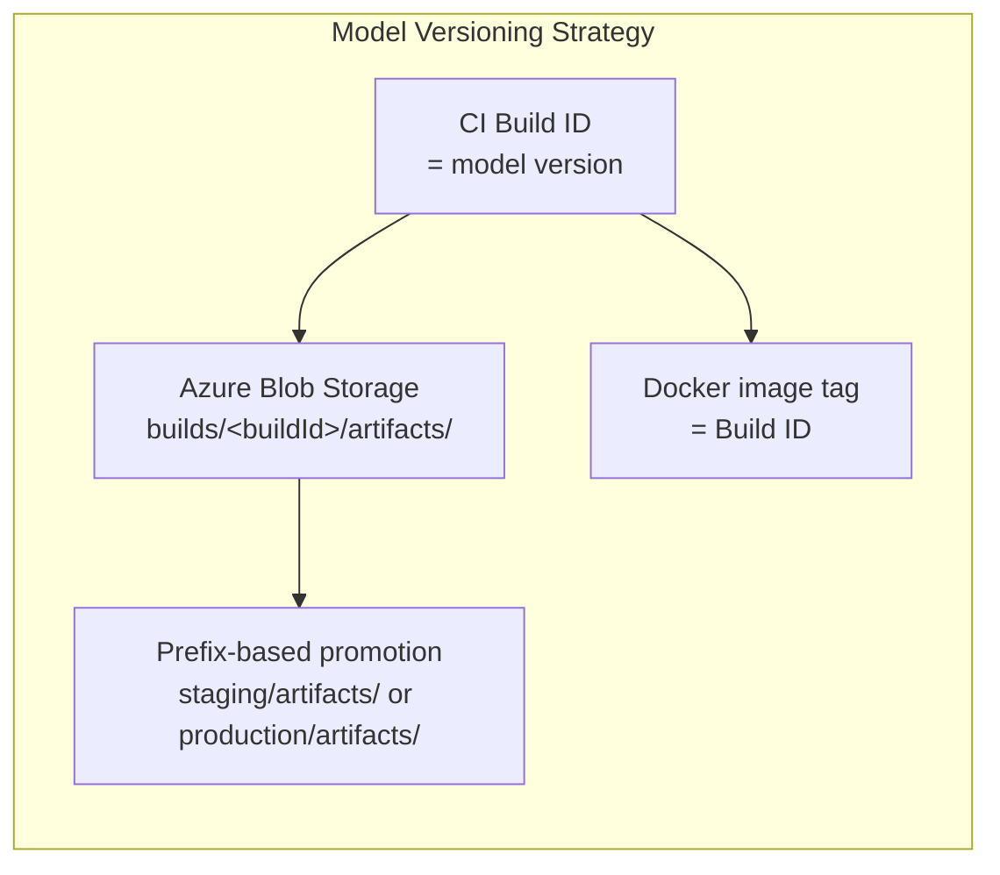
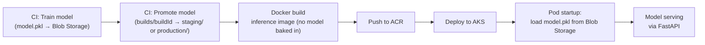
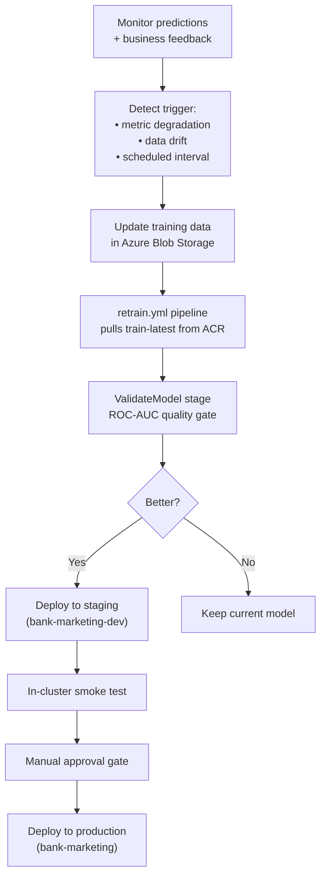

# MLOps Lifecycle

Training, deployment, monitoring, and retraining lifecycle for the Bank Marketing prediction model.

---

## Lifecycle Overview



---

## Inner Loop — Model Development

The inner loop is where data scientists and ML engineers iterate on the model.

### Pipeline Stages

| Stage | Module | Input | Output |
|---|---|---|---|
| Load data | `src/data.py` | `config.yaml` → `data/raw/*.csv` | Raw DataFrame |
| Clean & engineer | `src/features.py` | Raw DataFrame + config | Cleaned DataFrame |
| Split | `src/features.py` | Cleaned DataFrame | Train/test sets (stratified) |
| Build preprocessor | `src/features.py` | Training features | Unfitted `ColumnTransformer` |
| Train | `src/train.py` | Train set + preprocessor + config | Fitted `sklearn.Pipeline` |
| Evaluate | `src/evaluate.py` | Fitted pipeline + test set | Metrics dict |
| Save | `src/train.py` + `src/evaluate.py` | Pipeline + metrics | `model.pkl` + `metrics.json` |

### Execution

```bash
python main.py train
```

All behaviour is controlled by `config.yaml`. Changing the model type, test size, or feature configuration requires only a config change — no code modification.

---

## Model Versioning

This project uses Azure Blob Storage as a lightweight model registry with prefix-based promotion:



| Approach | How |
|---|---|
| **Model identity** | Tied to CI Build ID — each training run produces a versioned blob prefix (`builds/<buildId>/artifacts/`) |
| **Metrics tracking** | `metrics.json` uploaded alongside `model.pkl` to the same Blob Storage prefix — metrics and model always in sync |
| **Model promotion** | Blob copy from `builds/<buildId>/` → `staging/artifacts/` or `production/artifacts/` — controlled by pipeline stage |
| **Container traceability** | Docker images tagged with Build ID — the running container maps back to exact build + model |
| **Runtime loading** | Inference pods read `MODEL_BLOB_PREFIX` env var to load the correct model from Blob Storage at startup |
| **Reproducibility** | Fixed random seed + pinned dependencies + config-driven pipeline = deterministic output |

### Why not MLflow / Model Registry?

For this case study, Blob Storage prefix-based versioning is sufficient and avoids introducing infrastructure complexity. In a production system at scale, a model registry (MLflow, Azure ML Model Registry) would provide:

- Centralised model catalogue with metadata
- Stage transitions (staging → production)
- A/B deployment support
- Automated lineage tracking

This is a deliberate simplification — the architecture supports upgrading to a registry without structural changes.

---

## Outer Loop — Model Deployment

Once a model is trained and uploaded to Blob Storage, the outer loop deploys it to production.



### Deployment Trigger

A model is deployed when:

1. Training runs in CI (either from code changes or the retrain pipeline) and uploads `model.pkl` to Blob Storage
2. The CI/CD pipeline promotes the model blob to the target prefix (`staging/artifacts/` or `production/artifacts/`)
3. The inference image is built and pushed to ACR (model is NOT baked in)
4. AKS deployment is updated and pods are restarted — each pod loads `model.pkl` from Blob Storage at startup via `MODEL_BLOB_PREFIX`

For code changes, human review at the PR stage acts as the approval gate. For scheduled retraining, the pipeline runs automatically with optional environment gates.

---

## Monitoring

### What to Monitor

| Signal | Source | Purpose |
|---|---|---|
| Request latency | Application Insights | Detect serving degradation |
| Error rate | Application Insights | Catch model failures (input schema changes, data issues) |
| Prediction distribution | Custom logging in `app.py` | Detect input/output drift |
| Pod health | Azure Monitor / AKS | Infrastructure availability |
| Resource usage | Azure Monitor | Capacity planning (CPU, memory) |

### Prediction Logging

The FastAPI app already logs per-request prediction details:

```python
logger.info("Prediction: %d (prob=%.4f) — %.1fms", pred, prob, latency_ms)
```

This enables:

- Tracking prediction distribution over time
- Detecting shifts in input patterns
- Measuring p99 latency

---

## Retraining Strategy



### Retraining Triggers

| Trigger | Description |
|---|---|
| **Metric degradation** | ROC-AUC or F1 drops below acceptable threshold on live data |
| **Data drift** | Input feature distributions shift significantly from training data |
| **Scheduled** | Periodic retraining (e.g., monthly) to incorporate new campaign data |
| **Business request** | New campaign types, product changes, or market shifts |

### Retraining Process

1. Obtain updated training data → upload to Azure Blob Storage (`training-data` container)
2. The retrain pipeline (`retrain.yml`) pulls `train-latest` from ACR and runs training against the new data
3. `ValidateModel` stage compares new ROC-AUC against the production baseline — fails if regression > 2 percentage points
4. If improved: model is promoted through Blob Storage (`builds/<buildId>/` → `staging/artifacts/` → `production/artifacts/`) with staged deployment and manual approval gate
5. Pods are restarted to load the new model from Blob Storage at runtime

---

## MLOps Maturity Assessment

Using the Microsoft MLOps Maturity Model **[[9]](../REFERENCES.md)** — https://learn.microsoft.com/en-us/azure/architecture/ai-ml/guide/mlops-maturity-model:

| Level | Capability | This Project |
|---|---|---|
| 0 — No MLOps | Manual everything | -- |
| 1 — DevOps, no MLOps | CI/CD for code, manual model | -- |
| **2 — Automated Training** | **Automated pipeline, manual deploy** | **Partial** — pipeline is automated, deployment is CI/CD-driven |
| 3 — Automated Deployment | Full CI/CD for model + code | Target state — achieved with current architecture |
| 4 — Full MLOps | Automated retraining + monitoring + feedback loops | Future — requires drift detection automation |

**Current state**: Level 2–3. The training pipeline is fully automated and config-driven. Deployment is automated via CI/CD. Monitoring and automated retraining (Level 4) are designed but not yet fully automated.
