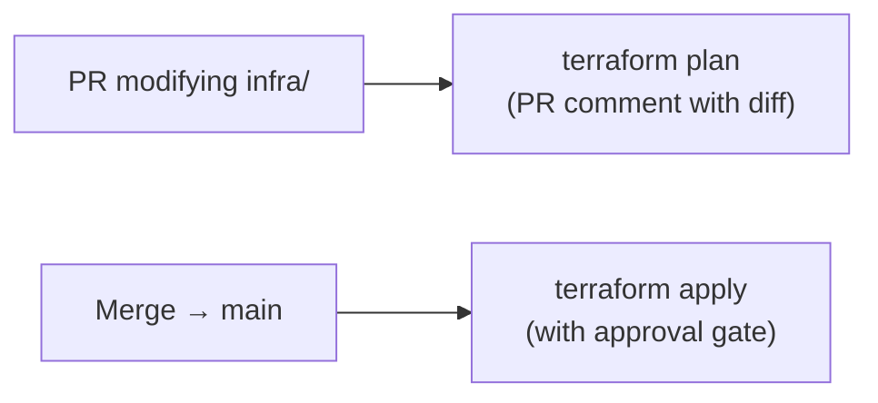

# Project TODOs

Ordered checklist of remaining work — from local development readiness through to production deployment on AKS. Each phase lists its prerequisites and the artifacts it produces.

Infrastructure is provisioned via **Azure CLI** (console-first approach). Migration to Terraform is tracked as a future consideration.

---

## Table of Contents

1. [Local Development & Testing Prerequisites](#1-local-development--testing-prerequisites)
2. [Azure Infrastructure Setup (Console)](#2-azure-infrastructure-setup-console)
3. [Repository Artifacts — Files to Create](#3-repository-artifacts--files-to-create)
4. [Initial PR → `dev` Prerequisites](#4-initial-pr--dev-prerequisites)
5. [Merge → `dev` Prerequisites](#5-merge--dev-prerequisites)
6. [PR → `main` Prerequisites](#6-pr--main-prerequisites)
7. [Merge → `main` Prerequisites](#7-merge--main-prerequisites)
8. [Future Considerations — Infrastructure as Code](#8-future-considerations--infrastructure-as-code)

---

## 1. Local Development & Testing Prerequisites

Everything needed before any code changes or PRs. See [docs/local-development.md](local-development.md) for detailed commands.

### Environment Setup

- [x] Install Docker Desktop on host machine
- [x] Install VS Code + Dev Containers extension (`ms-vscode-remote.remote-containers`)
- [x] Open repo in Dev Container (dependencies install automatically via `postCreateCommand`)
- [x] Verify Python 3.12: `python --version`
- [x] Verify Docker access from inside Dev Container: `docker info`

### ML Pipeline Validation

- [x] Run training pipeline: `python main.py train`
- [x] Confirm `artifacts/model.pkl` is created
- [x] Confirm `artifacts/metrics.json` is created
- [x] Run batch predict: `python main.py predict --input data/raw/bank_marketing_data.csv`

### Test Suite

- [x] Run full test suite: `python -m pytest tests/ -v --tb=short`
- [x] Confirm all tests pass: `test_config.py`, `test_data.py`, `test_features.py`, `test_api.py`

### Container Build & Smoke Test

- [ ] Create `Dockerfile` at repo root (see [Section 3](#3-repository-artifacts--files-to-create))
- [ ] Create `.dockerignore` at repo root
- [ ] Build image locally: `docker build -t bank-marketing-api:local .`
- [ ] Run container: `docker run -d --name smoke-test -p 8000:8000 bank-marketing-api:local`
- [ ] Health check: `curl -s http://localhost:8000/health` → `{"status":"healthy"}`
- [ ] Prediction test: `curl -s -X POST http://localhost:8000/predict -H "Content-Type: application/json" -d '{"age":35,"job":"management","marital":"married","education":"tertiary","default":"no","balance":1500.0,"housing":"yes","loan":"no","contact":"cellular","day":15,"month":"may","duration":250.0,"campaign":1,"pdays":-1,"previous":0,"poutcome":"unknown"}'`
- [ ] Clean up: `docker stop smoke-test && docker rm smoke-test`

### Kubernetes Manifest Validation (Local)

- [ ] Create `k8s/deployment.yaml` (see [Section 3](#3-repository-artifacts--files-to-create))
- [ ] Create `k8s/service.yaml`
- [ ] Install kubeconform locally (see [local-development.md § 6](local-development.md#6-run-kubeconform-locally))
- [ ] Validate manifests: `kubeconform -summary -strict k8s/`

### Local Kubernetes Deployment (Optional)

- [ ] Install kubectl
- [ ] Install and start minikube: `minikube start --driver=docker`
- [ ] Load image: `minikube image load bank-marketing-api:local`
- [ ] Create namespace: `kubectl create namespace bank-marketing`
- [ ] Apply manifests: `kubectl apply -f k8s/ -n bank-marketing` (with local image override)
- [ ] Verify pods running: `kubectl get pods -n bank-marketing`
- [ ] Access service: `minikube service bank-marketing-api -n bank-marketing --url`
- [ ] Clean up: `minikube delete`

---

## 2. Azure Infrastructure Setup (Console)

Provision all Azure resources via Azure CLI before configuring Azure DevOps. Run these commands from the Dev Container (Azure CLI is pre-installed).

### 2.1 Azure Account & Subscription

- [ ] Log in: `az login`
- [ ] Set subscription: `az account set --subscription <subscription-id>`
- [ ] Confirm: `az account show`

### 2.2 Resource Group

- [ ] Create resource group:
  ```bash
  az group create \
    --name rg-bank-marketing \
    --location southafricanorth
  ```

### 2.3 Azure Container Registry (ACR)

- [ ] Create ACR:
  ```bash
  az acr create \
    --resource-group rg-bank-marketing \
    --name bankmarketingacr \
    --sku Basic
  ```
- [ ] Verify login: `az acr login --name bankmarketingacr`
- [ ] Test push (after Docker build):
  ```bash
  docker tag bank-marketing-api:local bankmarketingacr.azurecr.io/bank-marketing-api:test
  docker push bankmarketingacr.azurecr.io/bank-marketing-api:test
  ```
- [ ] Verify image in registry: `az acr repository list --name bankmarketingacr`
- [ ] Clean up test image: `az acr repository delete --name bankmarketingacr --image bank-marketing-api:test --yes`

### 2.4 Azure Kubernetes Service (AKS)

- [ ] Create AKS cluster:
  ```bash
  az aks create \
    --resource-group rg-bank-marketing \
    --name bank-marketing-aks \
    --node-count 2 \
    --node-vm-size Standard_B2s \
    --generate-ssh-keys \
    --attach-acr bankmarketingacr
  ```
  > `--attach-acr` grants AKS the `AcrPull` role on the ACR — no separate `imagePullSecrets` needed when using this method.
- [ ] Get credentials: `az aks get-credentials --resource-group rg-bank-marketing --name bank-marketing-aks`
- [ ] Verify cluster: `kubectl get nodes`
- [ ] Create namespace: `kubectl create namespace bank-marketing`

### 2.5 ACR–AKS Integration Verification

- [ ] Push a test image to ACR
- [ ] Deploy a simple test pod that pulls from ACR:
  ```bash
  kubectl run acr-test \
    --image=bankmarketingacr.azurecr.io/bank-marketing-api:test \
    -n bank-marketing \
    --command -- sleep 3600
  ```
- [ ] Confirm pod starts (image pull succeeds): `kubectl get pod acr-test -n bank-marketing`
- [ ] Clean up: `kubectl delete pod acr-test -n bank-marketing`

### 2.6 Azure DevOps — Organisation & Project

#### Create Organisation (if needed)

- [ ] Go to [dev.azure.com](https://dev.azure.com) and sign in with your Azure AD / Microsoft account
- [ ] If you don't have an organisation: click **New organization** → choose a name (e.g., `your-org-name`) → select region → **Create**
- [ ] Confirm organisation is accessible at `https://dev.azure.com/your-org-name`

#### Create Project

- [ ] In the organisation, click **New project**
  - Name: `bank-marketing-mlops` (or similar)
  - Visibility: **Private**
  - Version control: **Git**
  - Work item process: **Agile** (or your preference — not critical for pipelines)
- [ ] Confirm project dashboard loads at `https://dev.azure.com/your-org-name/bank-marketing-mlops`

### 2.7 Azure DevOps — GitHub Repository Connection

The source code lives on **GitHub**. Azure DevOps Pipelines connects to GitHub via a service connection to access the repo and trigger builds.

> The GitHub repository already exists — no repo creation needed.

#### Create GitHub Service Connection

- [ ] In ADO, go to Project Settings → Service connections → **New service connection**
- [ ] Select **GitHub** → choose authentication method:
  - **OAuth** (recommended): click **Authorize** → sign in to GitHub → grant access to your org/repos
  - **PAT** alternative: generate a GitHub [Personal Access Token](https://github.com/settings/tokens) with `repo` scope → paste into the connection form
- [ ] Service connection name: `github-connection`
- [ ] Check **Grant access permission to all pipelines**
- [ ] Verify the connection shows your repository in the dropdown when creating a new pipeline

#### Disable Azure Repos (Optional — Reduces Confusion)

Since source control is on GitHub, the default Azure Repos Git repo in the ADO project is unused:

- [ ] (Optional) Navigate to Project Settings → Repos → Repositories → select the default repo → **Disable** or leave empty
  - This avoids confusion between the GitHub repo and the empty Azure Repos Git repo

### 2.8 GitHub — Branch Setup

- [ ] Ensure `main` branch exists on GitHub (this is typically the default branch)
- [ ] Ensure `dev` branch exists on GitHub:
  ```bash
  git checkout -b dev main    # if dev doesn't exist yet
  git push origin dev
  ```
- [ ] Confirm `main` is the **default branch** on GitHub:
  - GitHub → repository → Settings → General → Default branch → `main`

### 2.9 Azure DevOps — Service Connections

Service connections allow pipelines to authenticate with Azure resources. All created under:
**Project Settings → Service connections → New service connection**

#### Azure Resource Manager (for AKS + general Azure access)

- [ ] Type: **Azure Resource Manager**
- [ ] Authentication: **Service principal (automatic)** — lets ADO create and manage the service principal
- [ ] Scope level: **Subscription** or **Resource Group** (`rg-bank-marketing`)
- [ ] Service connection name: `azure-sub-connection`
- [ ] Check **Grant access permission to all pipelines**
- [ ] Click **Save** → confirm the service principal is created in Azure AD

#### Docker Registry (for ACR push/pull)

- [ ] Type: **Docker Registry**
- [ ] Registry type: **Azure Container Registry**
- [ ] Subscription: select your subscription
- [ ] Azure Container Registry: select `bankmarketingacr`
- [ ] Service connection name: `acr-connection`
- [ ] Check **Grant access permission to all pipelines**

#### Verify Service Connections

- [ ] All three connections appear in Project Settings → Service connections:
  - `github-connection` (GitHub)
  - `azure-sub-connection` (Azure Resource Manager)
  - `acr-connection` (Docker Registry / ACR)
- [ ] (Optional) Run a one-off test pipeline to validate Azure connections:
  ```yaml
  # test-connections.yml (temporary — delete after verification)
  trigger: none
  pool:
    vmImage: ubuntu-latest
  steps:
    - task: AzureCLI@2
      inputs:
        azureSubscription: 'azure-sub-connection'
        scriptType: bash
        scriptLocation: inlineScript
        inlineScript: |
          az acr repository list --name bankmarketingacr
          az aks show --resource-group rg-bank-marketing --name bank-marketing-aks --query name
  ```

### 2.10 Azure DevOps — Pipeline Registration

Register both pipeline YAML files. The files must exist in the GitHub repo before registering.

#### Pipeline 1: PR Validation

- [ ] Navigate to Pipelines → **New pipeline**
- [ ] Select: **GitHub**
- [ ] Authenticate / select the `github-connection` service connection
- [ ] Select repository from the list
- [ ] Select: **Existing Azure Pipelines YAML file**
- [ ] Branch: `dev` → Path: `/pr-validation.yml`
- [ ] Click **Run** to validate the first run (or **Save** without running)
- [ ] Rename the pipeline to `pr-validation` for clarity:
  - Pipelines → select the pipeline → "..." menu → **Rename/move** → `pr-validation`

> **GitHub webhook**: When you register a GitHub-sourced pipeline, Azure DevOps automatically installs a webhook on the GitHub repo. This webhook triggers the pipeline on push and PR events — no manual webhook configuration needed.

#### Pipeline 2: CI/CD

- [ ] Navigate to Pipelines → **New pipeline**
- [ ] Select: **GitHub** → select repository
- [ ] Select: **Existing Azure Pipelines YAML file**
- [ ] Branch: `dev` → Path: `/azure-pipelines.yml`
- [ ] Click **Save** (do not run yet — `main` branch triggers production deploy)
- [ ] Rename to `ci-cd` for clarity

### 2.11 Azure DevOps — Pipeline Variables

- [ ] Create a **variable group** for shared variables:
  - Pipelines → Library → **+ Variable group**
  - Name: `bank-marketing-vars`
  - Add variables:

    | Variable | Value | Secret? |
    |---|---|---|
    | `ACR_SERVICE_CONNECTION` | `acr-connection` | No |
    | `ACR_NAME` | `bankmarketingacr` | No |
    | `AKS_CLUSTER` | `bank-marketing-aks` | No |
    | `RESOURCE_GROUP` | `rg-bank-marketing` | No |
    | `AZURE_SUBSCRIPTION` | `azure-sub-connection` | No |

  - Pipeline permissions: allow access to both `pr-validation` and `ci-cd` pipelines
- [ ] Reference the variable group in `azure-pipelines.yml`:
  ```yaml
  variables:
    - group: bank-marketing-vars
    - name: isMain
      value: $[eq(variables['Build.SourceBranch'], 'refs/heads/main')]
    - name: isDev
      value: $[eq(variables['Build.SourceBranch'], 'refs/heads/dev')]
  ```

### 2.12 Branch Protection — GitHub & ADO PR Triggers

With a **GitHub repository**, branch protection is configured in two places:
- **GitHub**: Branch protection rules enforce reviewer requirements and restrict merge methods
- **ADO Pipeline YAML**: The `pr:` trigger in `pr-validation.yml` controls which PRs trigger the validation pipeline (unlike Azure Repos Git, the `pr:` keyword [works with GitHub repos](https://learn.microsoft.com/en-us/azure/devops/pipelines/repos/github#pr-triggers))

#### GitHub Branch Protection Rules

Configure on GitHub under: repository → **Settings → Branches → Branch protection rules → Add rule**

##### `dev` Branch Protection

- [ ] Branch name pattern: `dev`
- [ ] **Require a pull request before merging**: Enabled
  - Required approvals: **1** (optional for solo, recommended for teams)
  - **Dismiss stale pull request approvals when new commits are pushed**: Enabled
- [ ] **Require status checks to pass before merging**: Enabled
  - Search for and add the `pr-validation` status check (appears after the pipeline runs once)
  - **Require branches to be up to date before merging**: Enabled
- [ ] **Require conversation resolution before merging**: Enabled
- [ ] **Allow squash merging** only (in repository Settings → General → Pull Requests):
  - Enable: **Allow squash merging** ✓
  - Disable: Allow merge commits ✗, Allow rebase merging ✗
  - (This enforces the squash merge strategy for PRs → `dev` per [git-workflow.md](git-workflow.md#merge-strategy))
- [ ] **Do not allow bypassing the above settings**: Enabled (recommended)

> **Note on merge types**: GitHub configures allowed merge types at the **repository level** (Settings → General → Pull Requests), not per branch. If you need different merge strategies for `dev` (squash) and `main` (merge commit), you'll need to toggle the setting when doing release merges, or accept one strategy for both. A common pragmatic choice is to enable both squash and merge commits, and rely on team convention per [git-workflow.md](git-workflow.md#merge-strategy).

##### `main` Branch Protection

- [ ] Branch name pattern: `main`
- [ ] **Require a pull request before merging**: Enabled
  - Required approvals: **1** (recommended even for solo — forces intentional promotion)
  - **Dismiss stale pull request approvals when new commits are pushed**: Enabled
- [ ] **Require status checks to pass before merging**: Enabled
  - Add `pr-validation` status check
  - **Require branches to be up to date before merging**: Enabled
- [ ] **Require conversation resolution before merging**: Enabled
- [ ] **Do not allow bypassing the above settings**: Enabled

#### ADO Pipeline `pr:` Trigger

With GitHub repos, the `pr:` keyword in `pr-validation.yml` controls which PRs trigger the pipeline. Verify this is configured:

```yaml
# pr-validation.yml
pr:
  branches:
    include:
      - dev
      - main

trigger: none  # This pipeline is PR-only, not triggered by pushes
```

When a PR is opened or updated targeting `dev` or `main`, Azure DevOps automatically triggers the `pr-validation` pipeline via the GitHub webhook installed during pipeline registration.

### 2.13 Azure DevOps — Environments & Approval Gates

The `CD_Main` stage references `environment: 'production'`. Create this environment with an approval gate to prevent unreviewed deployments.

- [ ] Navigate to Pipelines → **Environments** → **New environment**
  - Name: `production`
  - Resource: **None** (Kubernetes resource can be added later)
- [ ] Add **approval check**:
  - Environments → `production` → "..." → **Approvals and checks** → **Approvals**
  - Add approver(s): your own account (for solo work) or team members
  - Approval policy: **Any one approver**
  - Timeout: 72 hours (default)
- [ ] (Optional) Add **exclusive lock** check to prevent concurrent deployments:
  - Approvals and checks → **Exclusive Lock**

### 2.14 Azure DevOps — Agent Pool Verification

The pipelines use `vmImage: ubuntu-latest` (Microsoft-hosted agents). Verify this works with your organisation.

- [ ] Confirm **Microsoft-hosted agents** are available:
  - Organization Settings → Pipelines → Agent pools → **Azure Pipelines**
  - Check that the pool shows `ubuntu-latest` as an available image
- [ ] If using a **free-tier organisation** (public project): hosted agents are included
- [ ] If using a **free-tier organisation** (private project): you get 1 free parallel job with 1,800 minutes/month
  - If you need more, request additional parallel jobs at [aka.ms/azpipelines-parallelism-request](https://aka.ms/azpipelines-parallelism-request)
  - Or set up a **self-hosted agent** as an alternative (not covered here)
- [ ] (Optional) Run a minimal "hello world" pipeline to confirm agents are operational:
  ```yaml
  trigger: none
  pool:
    vmImage: ubuntu-latest
  steps:
    - script: echo "Agent pool is working"
  ```

### 2.15 Azure Monitor & Application Insights (Optional — Production Readiness)

- [ ] Enable monitoring on AKS cluster:
  ```bash
  az aks enable-addons \
    --resource-group rg-bank-marketing \
    --name bank-marketing-aks \
    --addons monitoring
  ```
- [ ] Create Application Insights resource:
  ```bash
  az monitor app-insights component create \
    --app bank-marketing-insights \
    --location southafricanorth \
    --resource-group rg-bank-marketing
  ```
- [ ] Note the instrumentation key for future integration with the FastAPI app

---

## 3. Repository Artifacts — Files to Create

Files referenced in documentation but not yet present in the repository.

### Dockerfile

- [ ] Create `Dockerfile` at repo root
  ```dockerfile
  FROM python:3.12-slim

  WORKDIR /app

  COPY requirements.txt .
  RUN pip install --no-cache-dir -r requirements.txt

  COPY src/ src/
  COPY config.yaml .
  COPY artifacts/model.pkl artifacts/model.pkl

  EXPOSE 8000

  CMD ["uvicorn", "src.api.app:app", "--host", "0.0.0.0", "--port", "8000"]
  ```
  > Referenced in: [local-development.md § 8](local-development.md#8-docker-build), [ci-cd-pipeline.md](ci-cd-pipeline.md), [deployment.md](deployment.md)

### .dockerignore

- [ ] Create `.dockerignore` at repo root
  ```
  .git/
  .github/
  .devcontainer/
  .vscode/
  .pytest_cache/
  __pycache__/
  data/
  notebooks/
  tests/
  docs/
  artifacts/metrics.json
  *.md
  .gitignore
  .env
  ```

### Kubernetes Manifests

- [ ] Create `k8s/deployment.yaml` — as documented in [deployment.md](deployment.md#deployment)
- [ ] Create `k8s/service.yaml` — as documented in [deployment.md](deployment.md#service)

### Azure DevOps Pipeline Definitions

- [ ] Create `pr-validation.yml` at repo root — as documented in [ci-cd-pipeline.md § Pipeline 1](ci-cd-pipeline.md#pipeline-definition)
- [ ] Create `azure-pipelines.yml` at repo root — as documented in [ci-cd-pipeline.md § Pipeline 2](ci-cd-pipeline.md#ci-stage--test--validate)
- [ ] Remove `@TODO` notes from `ci-cd-pipeline.md` once pipeline files exist

### Git Configuration

- [ ] Update `.gitignore` — remove `.github/*` ignore once pipeline files are ready to commit
- [ ] Untrack `artifacts/model.pkl` if not already ignored (confirmed: `*.pkl` is in `.gitignore`)

---

## 4. Initial PR → `dev` Prerequisites

What must be in place before the **first PR** targeting `dev` can be validated by the pipeline.

### Repository State

- [ ] `dev` branch exists and is pushed to remote
- [ ] `Dockerfile` exists and builds successfully
- [ ] `.dockerignore` exists
- [ ] `k8s/deployment.yaml` and `k8s/service.yaml` exist and pass `kubeconform -strict`
- [ ] `pr-validation.yml` exists at repo root
- [ ] `artifacts/model.pkl` exists (committed or generated in CI)
- [ ] All tests pass locally: `python -m pytest tests/ -v --tb=short`

### Azure DevOps Configuration (Must Be Complete)

These steps are performed once in [Section 2](#2-azure-infrastructure-setup-console) — verify they are done:

- [ ] ADO project exists with GitHub service connection *(from [Section 2.6–2.7](#26-azure-devops--organisation--project))*
- [ ] `dev` branch exists on GitHub *(from [Section 2.8](#28-github--branch-setup))*
- [ ] Pipeline 1 (`pr-validation`) registered against GitHub repo *(from [Section 2.10](#210-azure-devops--pipeline-registration))*
- [ ] GitHub branch protection configured on `dev` with `pr-validation` status check *(from [Section 2.12](#212-branch-protection--github--ado-pr-triggers))*
- [ ] `pr:` trigger in `pr-validation.yml` includes `dev` *(from [Section 2.12](#212-branch-protection--github--ado-pr-triggers))*
- [ ] Microsoft-hosted agents verified *(from [Section 2.14](#214-azure-devops--agent-pool-verification))*

### Validation Checklist (First PR)

- [ ] Create a `feature/*` branch from `dev`
- [ ] Open PR targeting `dev`
- [ ] Confirm Pipeline 1 (`pr-validation`) triggers automatically
- [ ] Confirm all stages pass: install → pytest → kubeconform → Docker build → smoke test
- [ ] Verify build status appears on the PR

---

## 5. Merge → `dev` Prerequisites

What must be in place before merges to `dev` trigger the CI/CD pipeline (Pipeline 2) correctly.

### Repository State

- [ ] `azure-pipelines.yml` exists at repo root with `trigger: branches: include: [main, dev]`
- [ ] All files from [Section 3](#3-repository-artifacts--files-to-create) are committed to `dev`

### Azure DevOps Configuration (Must Be Complete)

These steps are performed once in [Section 2](#2-azure-infrastructure-setup-console) — verify they are done:

- [ ] Pipeline 2 (`ci-cd`) registered *(from [Section 2.10](#210-azure-devops--pipeline-registration))*
- [ ] Variable group `bank-marketing-vars` configured *(from [Section 2.11](#211-azure-devops--pipeline-variables))*
- [ ] Service connections exist: `azure-sub-connection` + `acr-connection` *(from [Section 2.9](#29-azure-devops--service-connections))*
  - `azure-sub-connection` is required for `--dry-run=server` in `CD_Dev` stage

### Validation Checklist (First Merge → `dev`)

- [ ] Merge a PR into `dev`
- [ ] Confirm Pipeline 2 (`azure-pipelines.yml`) triggers on push
- [ ] Confirm CI stage runs: install → pytest → kubeconform
- [ ] Confirm `CD_Dev` stage runs (not `CD_Main`):
  - Docker build (no push)
  - Container smoke test (local)
  - `--dry-run=server` against AKS
- [ ] Confirm `CD_Main` stage is **skipped** (condition: `isDev == true`)

---

## 6. PR → `main` Prerequisites

What must be in place before PRs targeting `main` are validated.

### GitHub Branch Protection (Must Be Complete)

These steps are performed once in [Section 2](#2-azure-infrastructure-setup-console) — verify they are done:

- [ ] `main` branch protection rule configured with `pr-validation` status check *(from [Section 2.12](#212-branch-protection--github--ado-pr-triggers))*
- [ ] Reviewer requirements set on `main` *(from [Section 2.12](#212-branch-protection--github--ado-pr-triggers))*
- [ ] `pr:` trigger in `pr-validation.yml` includes `main` *(from [Section 2.12](#212-branch-protection--github--ado-pr-triggers))*

### Prerequisite Steps Already Complete

These should already be done from earlier phases:

- [ ] Pipeline 1 (`pr-validation`) registered and tested *(from [Section 2.10](#210-azure-devops--pipeline-registration) + [Section 4](#4-initial-pr--dev-prerequisites))*
- [ ] All repo artifacts exist *(from [Section 3](#3-repository-artifacts--files-to-create))*
- [ ] Pipeline ran successfully on PR → `dev` *(from [Section 4](#4-initial-pr--dev-prerequisites))*

### Validation Checklist (First PR → `main`)

- [ ] Create a `release/*` branch from `dev`
- [ ] Open PR targeting `main`
- [ ] Confirm Pipeline 1 (`pr-validation`) triggers automatically
- [ ] Confirm identical validation stages run (same as PR → `dev`)
- [ ] Verify build status appears on the PR

---

## 7. Merge → `main` Prerequisites

What must be in place before the first production deployment via merge to `main`.

### Azure Infrastructure (Must Be Complete)

- [ ] ACR exists and is accessible *(from [Section 2.3](#23-azure-container-registry-acr))*
- [ ] AKS cluster exists with `bank-marketing` namespace *(from [Section 2.4](#24-azure-kubernetes-service-aks))*
- [ ] ACR–AKS integration verified (image pull works) *(from [Section 2.5](#25-acracks-integration-verification))*
- [ ] Service connections configured *(from [Section 2.9](#29-azure-devops--service-connections))*
  - Includes `github-connection`, `azure-sub-connection`, and `acr-connection`

### Azure DevOps Configuration (Must Be Complete)

These steps are performed once in [Section 2](#2-azure-infrastructure-setup-console) — verify they are done:

- [ ] Pipeline 2 (`ci-cd`) registered and tested on `dev` merges *(from [Section 2.10](#210-azure-devops--pipeline-registration) + [Section 5](#5-merge--dev-prerequisites))*
- [ ] Variable group configured *(from [Section 2.11](#211-azure-devops--pipeline-variables))*
- [ ] `production` environment with approval gate exists *(from [Section 2.13](#213-azure-devops--environments--approval-gates))*

### Validation Checklist (First Merge → `main`)

- [ ] Merge approved PR into `main` (via `release/*` branch)
- [ ] Confirm Pipeline 2 triggers on push to `main`
- [ ] Confirm CI stage passes: install → pytest → kubeconform
- [ ] Confirm `CD_Main` stage runs (not `CD_Dev`):
  - Docker build + push to ACR (verify image in `az acr repository show-tags --name bankmarketingacr --repository bank-marketing-api`)
  - `KubernetesManifest@1` deploys to AKS
  - Live smoke test: `GET /health` against LoadBalancer IP
- [ ] Confirm `CD_Dev` stage is **skipped** (condition: `isMain == true`)
- [ ] Verify pods are running: `kubectl get pods -n bank-marketing`
- [ ] Verify service has external IP: `kubectl get svc bank-marketing-api -n bank-marketing`
- [ ] Test production endpoint manually:
  ```bash
  API_IP=$(kubectl get svc bank-marketing-api -n bank-marketing -o jsonpath='{.status.loadBalancer.ingress[0].ip}')
  curl -s http://$API_IP/health
  curl -s -X POST http://$API_IP/predict \
    -H "Content-Type: application/json" \
    -d '{"age":35,"job":"management","marital":"married","education":"tertiary","default":"no","balance":1500.0,"housing":"yes","loan":"no","contact":"cellular","day":15,"month":"may","duration":250.0,"campaign":1,"pdays":-1,"previous":0,"poutcome":"unknown"}'
  ```

---

## 8. Future Considerations — Infrastructure as Code

The Azure infrastructure in [Section 2](#2-azure-infrastructure-setup-console) is provisioned manually via Azure CLI for initial setup speed. Migrating to **Terraform** is the planned next step for reproducibility, drift detection, and team collaboration.

### Terraform Scope

| Resource | Azure CLI (current) | Terraform (planned) |
|---|---|---|
| Resource Group | `az group create` | `azurerm_resource_group` |
| ACR | `az acr create` | `azurerm_container_registry` |
| AKS Cluster | `az aks create` | `azurerm_kubernetes_cluster` |
| ACR–AKS Role Assignment | `--attach-acr` flag | `azurerm_role_assignment` with `AcrPull` role |
| Kubernetes Namespace | `kubectl create namespace` | `kubernetes_namespace` (Kubernetes provider) |
| Application Insights | `az monitor app-insights component create` | `azurerm_application_insights` |
| Log Analytics Workspace | AKS monitoring addon | `azurerm_log_analytics_workspace` |

### Recommended Structure

```
infra/
├── main.tf              # Provider config, resource group
├── acr.tf               # Container registry
├── aks.tf               # Kubernetes cluster + node pool
├── monitoring.tf        # Application Insights + Log Analytics
├── variables.tf         # Input variables (region, SKU, names)
├── outputs.tf           # ACR login server, AKS FQDN, App Insights key
├── terraform.tfvars     # Environment-specific values (not committed)
└── backend.tf           # Remote state in Azure Storage Account
```

### State Management

- Store Terraform state remotely in an **Azure Storage Account** blob container
- Provision the storage account manually (bootstrap) before running `terraform init`:
  ```bash
  az storage account create \
    --name bankmarketingtfstate \
    --resource-group rg-bank-marketing \
    --sku Standard_LRS

  az storage container create \
    --name tfstate \
    --account-name bankmarketingtfstate
  ```

### Migration Path

1. Write Terraform configs matching the existing Azure CLI–provisioned resources
2. Use `terraform import` to bring existing resources under Terraform management without recreating them
3. Run `terraform plan` to confirm zero diff (state matches reality)
4. From this point forward, all infrastructure changes go through `terraform apply`

### IaC Pipeline Integration

Once Terraform is in place, a dedicated infrastructure pipeline can be added:



This is documented further in [docs/future-enhancements.md](future-enhancements.md). Detailed implementation is deferred until the core ML pipeline and CI/CD are operational.

---

## Progress Summary

| Phase | Status | Depends On |
|---|---|---|
| 1. Local Development & Testing | Not started | Docker Desktop, VS Code |
| 2. Azure Infrastructure (Console) | Not started | Azure subscription |
| 3. Repository Artifacts | Not started | Phase 1 validated |
| 4. First PR → `dev` | Not started | Phases 1–3 + Azure DevOps |
| 5. First Merge → `dev` | Not started | Phase 4 |
| 6. First PR → `main` | Not started | Phase 5 |
| 7. First Merge → `main` (Production) | Not started | Phases 2 + 6 |
| 8. Terraform Migration | Future | Phase 7 operational |

---

## Key References

### Azure Infrastructure

- Microsoft. [Quickstart: Deploy an AKS cluster using Azure CLI](https://learn.microsoft.com/en-us/azure/aks/learn/quick-kubernetes-deploy-cli). Step-by-step AKS provisioning with `az aks create`, credential retrieval, and basic deployment verification — the commands used in Section 2.4.
- Microsoft. [Authenticate with Azure Container Registry from AKS](https://learn.microsoft.com/en-us/azure/aks/cluster-container-registry-integration). Covers the `--attach-acr` integration method used in Section 2.4, plus alternative approaches (`imagePullSecrets`, managed identity) for ACR–AKS authentication.
- Microsoft. [Quickstart: Create an Azure Container Registry using the Azure CLI](https://learn.microsoft.com/en-us/azure/container-registry/container-registry-get-started-azure-cli). ACR creation, login, and image push/pull commands used in Section 2.3.

### Azure DevOps — Project & Organisation

- Microsoft. [Create a project in Azure DevOps](https://learn.microsoft.com/en-us/azure/devops/organizations/projects/create-project?view=azure-devops&tabs=browser). Project creation, visibility settings, and initial configuration — the steps in Section 2.6.
- Microsoft. [Create an organization](https://learn.microsoft.com/en-us/azure/devops/organizations/accounts/create-organization?view=azure-devops). Organisation creation for users new to Azure DevOps — prerequisite for Section 2.6.

### Azure DevOps — GitHub Integration

- Microsoft. [Build GitHub repositories](https://learn.microsoft.com/en-us/azure/devops/pipelines/repos/github?view=azure-devops&tabs=yaml). Comprehensive reference for connecting GitHub repos to Azure Pipelines — covers GitHub service connections, webhook installation, `pr:` and `trigger:` YAML syntax with GitHub, and checkout behaviour.
- Microsoft. [GitHub PR triggers in Azure Pipelines](https://learn.microsoft.com/en-us/azure/devops/pipelines/repos/github?view=azure-devops&tabs=yaml#pr-triggers). Documents that GitHub repos support the `pr:` YAML keyword for PR validation (unlike Azure Repos Git) — the trigger mechanism used in Section 2.12.
- GitHub. [Managing a branch protection rule](https://docs.github.com/en/repositories/configuring-branches-and-merges-in-your-repository/managing-a-branch-protection-rule/managing-a-branch-protection-rule). Creating and configuring branch protection rules, required status checks, reviewer requirements, and merge method restrictions — the GitHub-side configuration in Section 2.12.

### Azure DevOps — Pipelines & Service Connections

- Microsoft. [Create your first pipeline — Azure DevOps](https://learn.microsoft.com/en-us/azure/devops/pipelines/create-first-pipeline?view=azure-devops&tabs=python%2Cbrowser). Pipeline registration from existing YAML and first-run walkthrough — the steps in Section 2.10.
- Microsoft. [Service connections in Azure Pipelines](https://learn.microsoft.com/en-us/azure/devops/pipelines/library/service-endpoints?view=azure-devops). Creating and managing Azure Resource Manager and Docker Registry service connections — the setup in Section 2.9.
- Microsoft. [Add & use variable groups](https://learn.microsoft.com/en-us/azure/devops/pipelines/library/variable-groups?view=azure-devops&tabs=yaml). Variable group creation, pipeline permissions, and YAML `group:` reference syntax — the configuration in Section 2.11.
- Microsoft. [Azure Pipelines agents](https://learn.microsoft.com/en-us/azure/devops/pipelines/agents/agents?view=azure-devops&tabs=yaml%2Cbrowser). Microsoft-hosted vs. self-hosted agent pools, `vmImage` options, and free-tier parallel job limits — the verification in Section 2.14.
- Microsoft. [Configure and pay for parallel jobs](https://learn.microsoft.com/en-us/azure/devops/pipelines/licensing/concurrent-jobs?view=azure-devops&tabs=ms-hosted). Free-tier limits (1,800 minutes/month for private projects) and how to request additional capacity — referenced in Section 2.14.

### Azure DevOps — Branch Policies & Environments

- Microsoft. [Build GitHub repositories — PR triggers](https://learn.microsoft.com/en-us/azure/devops/pipelines/repos/github?view=azure-devops&tabs=yaml#pr-triggers). Documents that the `pr:` YAML keyword works with GitHub repos for PR validation — the trigger mechanism in Section 2.12.
- GitHub. [About protected branches](https://docs.github.com/en/repositories/configuring-branches-and-merges-in-your-repository/managing-a-branch-protection-rule/about-protected-branches). Branch protection rules, required status checks, and reviewer enforcement — the GitHub configuration in Section 2.12.
- Microsoft. [Define and target environments](https://learn.microsoft.com/en-us/azure/devops/pipelines/process/environments?view=azure-devops). Production environment creation with approval gates and exclusive locks — the `environment: 'production'` configuration in Section 2.13.
- Microsoft. [Define approvals and checks](https://learn.microsoft.com/en-us/azure/devops/pipelines/process/approvals?view=azure-devops&tabs=check-pass). Approval check types (approvals, exclusive locks, business hours) and configuration — the approval gate setup in Section 2.13.

### Terraform (Future)

- HashiCorp. [AzureRM Provider — Terraform Registry](https://registry.terraform.io/providers/hashicorp/azurerm/latest/docs). Provider documentation for all `azurerm_*` resources referenced in Section 8.
- HashiCorp. [Backend Type: azurerm — Terraform](https://developer.hashicorp.com/terraform/language/backend/azurerm). Remote state configuration in Azure Storage — the backend setup described in Section 8.
